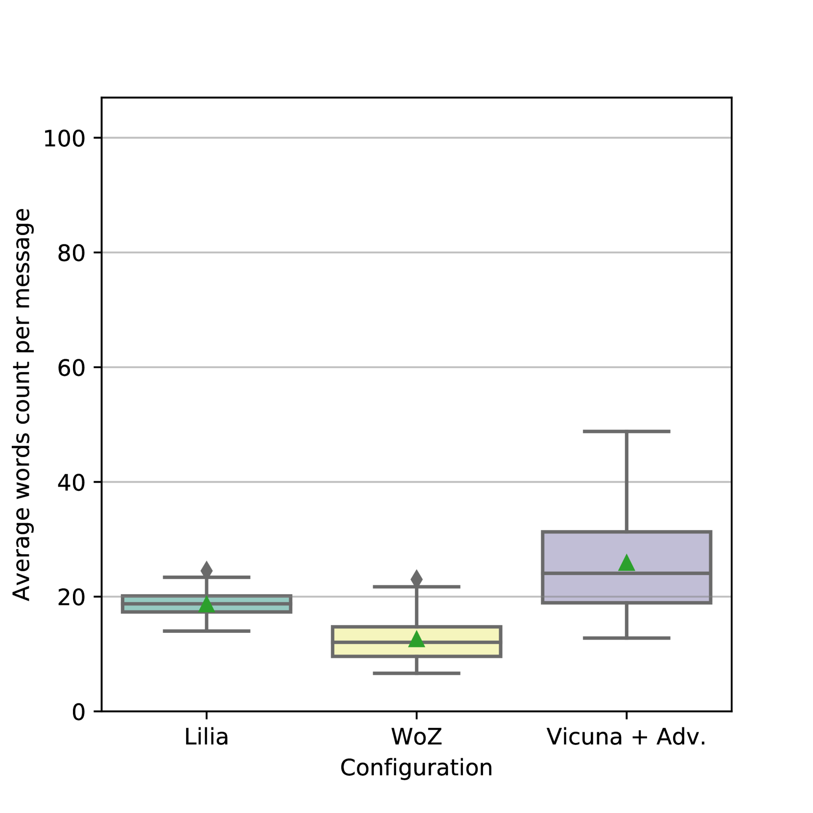

# 利用大型语言模型实现开放领域人机对话的角色扮演零-shot提示技术

发布时间：2024年06月26日

`Agent

理由：这篇论文主要探讨了如何利用大型语言模型（LLMs）来创建一个能够在开放领域进行对话的代理（Agent）。通过角色扮演零-shot提示策略和多语言LLMs，研究者们设计了一个对话系统，该系统能够在法语环境下进行有效的对话交流，并在人类评估中表现出色。这与Agent的定义相符，即一个能够代表用户执行任务或进行交互的系统。此外，论文中提到的“对话代理”直接表明了其Agent的属性。因此，这篇论文应归类为Agent。` `对话系统` `多语言交流`

> Role-Play Zero-Shot Prompting with Large Language Models for Open-Domain Human-Machine Conversation

# 摘要

> 近期，研究者们提出了多种方法，利用大型语言模型（LLMs）打造开放领域的对话系统。尽管这些模型能回应用户提问，但互动模式仍局限于单向问答，缺乏真正的对话交流。传统上，通过特定数据集的微调来提升模型的对话技巧，但此法成本高且适用语言有限。本研究中，我们采用角色扮演零-shot提示策略，结合遵循指令的多语言LLMs（Beeching等人，2023年），探索了一种高效经济的开放领域对话解决方案。我们设计的提示系统与Vicuna模型（Chiang等人，2023年）相结合，生成的对话代理在法语环境下的人类评估中，不仅与微调模型持平，甚至在两个不同任务上超越了它们。

> Recently, various methods have been proposed to create open-domain conversational agents with Large Language Models (LLMs). These models are able to answer user queries, but in a one-way Q&A format rather than a true conversation. Fine-tuning on particular datasets is the usual way to modify their style to increase conversational ability, but this is expensive and usually only available in a few languages. In this study, we explore role-play zero-shot prompting as an efficient and cost-effective solution for open-domain conversation, using capable multilingual LLMs (Beeching et al., 2023) trained to obey instructions. We design a prompting system that, when combined with an instruction-following model - here Vicuna (Chiang et al., 2023) - produces conversational agents that match and even surpass fine-tuned models in human evaluation in French in two different tasks.

[Arxiv](https://arxiv.org/abs/2406.18460)