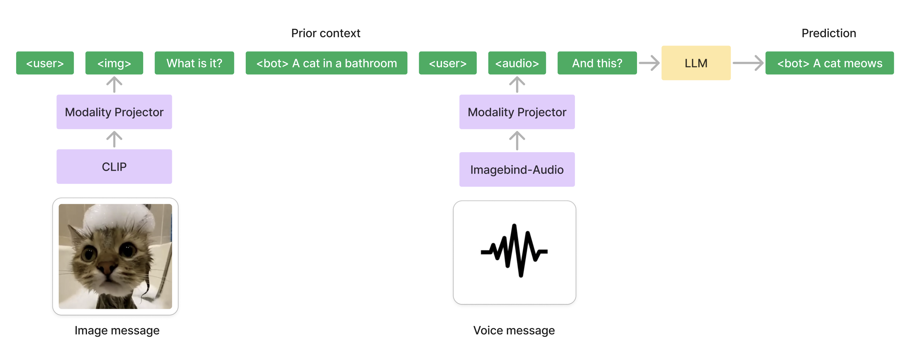
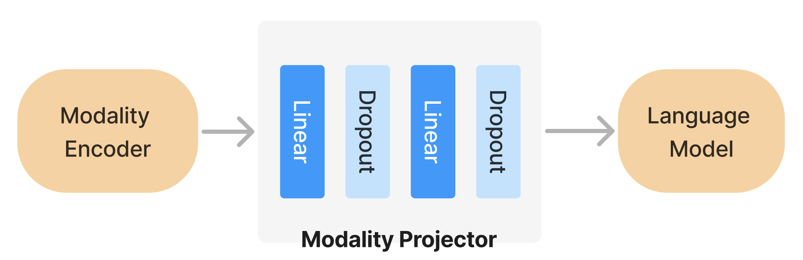
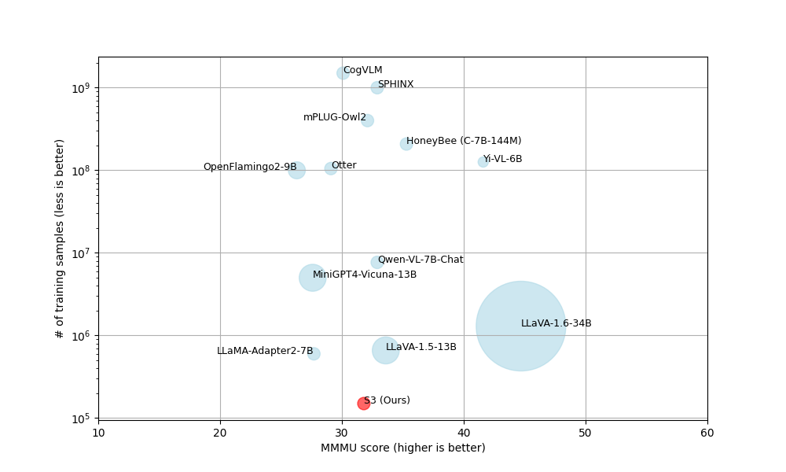

# S3：简洁高效的多模态对话系统，样本利用率极高

发布时间：2024年06月26日

`LLM应用

理由：该论文摘要描述了一种多模态对话基准模型S3，该模型整合了预训练的大型语言模型（LLM）、图像与音频的预训练编码器及可调模态投影器，并在多模态任务中表现出色。这表明该研究是关于如何应用LLM技术来提升多模态对话系统的性能，因此属于LLM的应用领域。` `对话系统` `多模态学习`

> S3: A Simple Strong Sample-effective Multimodal Dialog System

# 摘要

> 本研究介绍了一种简洁而强大的多模态对话基准模型S3，该模型在MMMU和AI Journey Contest 2023两大排行榜上表现卓越。该模型整合了预训练的大型语言模型、图像与音频的预训练编码器及可调模态投影器。实验证明，通过精心设计的数据混合训练，即使使用有限的多模态数据，基于强大语言模型的多模态系统也能在对话任务中展现出高效性能。

> In this work, we present a conceptually simple yet powerful baseline for the multimodal dialog task, an S3 model, that achieves near state-of-the-art results on two compelling leaderboards: MMMU and AI Journey Contest 2023. The system is based on a pre-trained large language model, pre-trained modality encoders for image and audio, and a trainable modality projector. The proposed effective data mixture for training such an architecture demonstrates that a multimodal model based on a strong language model and trained on a small amount of multimodal data can perform efficiently in the task of multimodal dialog.

[Arxiv](https://arxiv.org/abs/2406.18305)