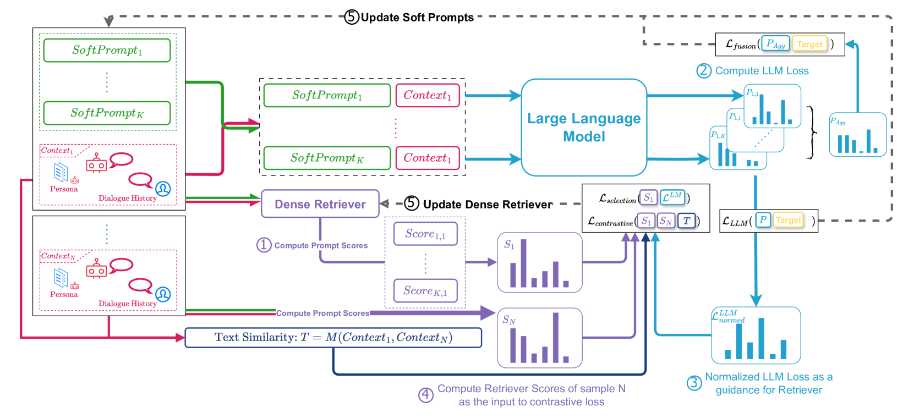
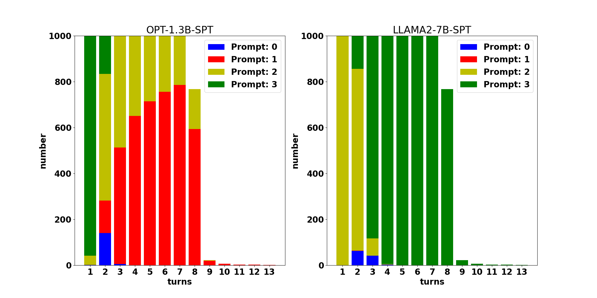
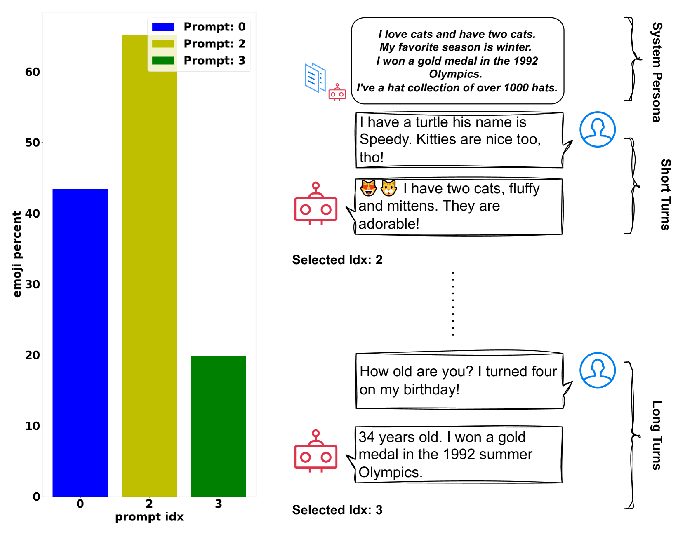
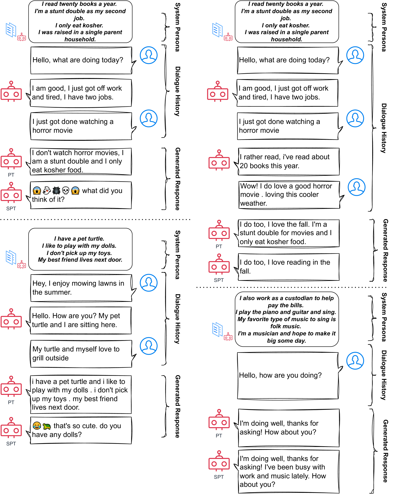

# 个性化对话：通过选择性提示调整优化与 LLMs 的交互

发布时间：2024年06月26日

`Agent

这篇论文主要探讨了在对话AI领域中如何通过个性化方法提升大型语言模型（LLMs）的性能，特别是在结合人物角色配置和上下文理解方面。研究中提出的选择性提示调优（SPT）方法，通过动态选择合适的软提示并利用LLMs的反馈进行优化，显著提升了个性化对话的多样性和质量。这种方法可以被视为一种智能Agent的行为，因为它涉及到对环境的感知（上下文理解）和适应性决策（选择和优化提示），以实现更有效的交互。因此，这篇论文更适合归类于Agent分类。` `对话系统` `人工智能`

> Selective Prompting Tuning for Personalized Conversations with LLMs

# 摘要

> 在对话AI领域，个性化对话的关键在于结合人物角色配置和上下文理解。尽管大型语言模型（LLMs）的响应连贯性有所提升，但如何有效融入人物角色仍是一大挑战。本研究探讨了两种个性化LLMs的常用方法：文本提示和直接微调。我们发现，文本提示难以生成与数据集真实情况相符的响应，而直接微调则易产生重复或过于泛化的回复。为此，我们提出了选择性提示调优（SPT），它通过选择性地使用软提示，引导LLMs进行个性化对话。具体而言，SPT初始化一组软提示，并利用可训练的密集检索器，根据输入上下文动态选择合适的软提示，并通过LLMs的反馈持续优化检索器。此外，我们还引入了上下文-提示对比学习和提示融合学习，以增强个性化对话的多样性。实验结果显示，SPT在CONVAI2数据集上显著提升了响应多样性，高达90%，并在其他关键性能指标上也有显著改进。这些成果凸显了SPT在推动吸引人和个性化对话生成方面的潜力。SPT模型代码已公开发布于GitHub（https://github.com/hqsiswiliam/SPT），供研究者深入探索。

> In conversational AI, personalizing dialogues with persona profiles and contextual understanding is essential. Despite large language models' (LLMs) improved response coherence, effective persona integration remains a challenge. In this work, we first study two common approaches for personalizing LLMs: textual prompting and direct fine-tuning. We observed that textual prompting often struggles to yield responses that are similar to the ground truths in datasets, while direct fine-tuning tends to produce repetitive or overly generic replies. To alleviate those issues, we propose \textbf{S}elective \textbf{P}rompt \textbf{T}uning (SPT), which softly prompts LLMs for personalized conversations in a selective way. Concretely, SPT initializes a set of soft prompts and uses a trainable dense retriever to adaptively select suitable soft prompts for LLMs according to different input contexts, where the prompt retriever is dynamically updated through feedback from the LLMs. Additionally, we propose context-prompt contrastive learning and prompt fusion learning to encourage the SPT to enhance the diversity of personalized conversations. Experiments on the CONVAI2 dataset demonstrate that SPT significantly enhances response diversity by up to 90\%, along with improvements in other critical performance indicators. Those results highlight the efficacy of SPT in fostering engaging and personalized dialogue generation. The SPT model code (https://github.com/hqsiswiliam/SPT) is publicly available for further exploration.

[Arxiv](https://arxiv.org/abs/2406.18187)