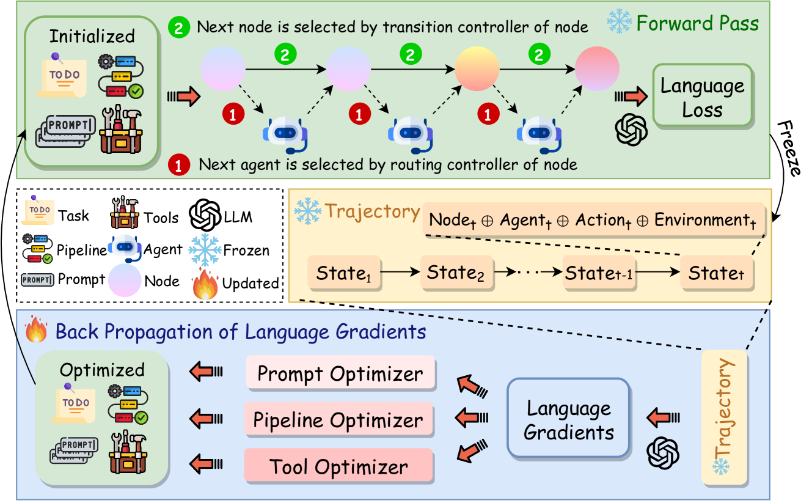
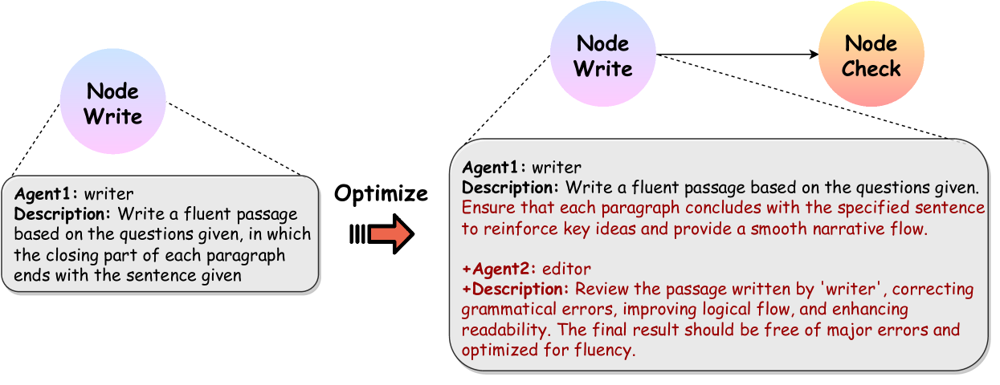

# 符号学习赋能自进化代理。

发布时间：2024年06月26日

`Agent

这篇论文主要探讨了如何通过开发“语言代理”这一复杂的大型语言模型（LLMs）管道来实现人工通用智能（AGI）。论文提出了一个代理符号学习框架，该框架允许语言代理以数据为中心的方式自我优化，从而实现自主学习和进化。这种方法将代理视为由提示、工具及其组合方式定义权重的符号网络，并通过模拟反向传播和梯度下降算法来优化这些网络。因此，这篇论文的内容更符合Agent分类，因为它专注于开发和优化能够自主学习和进化的语言代理。` `人工智能` `机器学习`

> Symbolic Learning Enables Self-Evolving Agents

# 摘要

> 人工智能领域正通过开发“语言代理”这一复杂的大型语言模型（LLMs）管道，探索通往人工通用智能（AGI）的道路。这些代理结合了提示技术和工具使用方法，展现出在多种实际任务中的强大能力。然而，当前的研究主要集中在模型或工程层面，依赖于专家的手动调整，而非自动从数据中学习。我们认为，要实现AGI，关键在于语言代理能够自主在环境中学习和进化，即从模型或工程驱动转向数据驱动。为此，我们提出了代理符号学习框架，它允许语言代理以数据为中心的方式自我优化。我们将代理视为由提示、工具及其组合方式定义权重的符号网络，并通过模拟反向传播和梯度下降算法来优化这些网络。与传统的数值权重处理不同，我们的方法使用自然语言来模拟权重、损失和梯度。通过在标准和复杂任务上的实验，我们证明了代理符号学习能够使语言代理在部署后自我进化，成为“自我进化的代理”。

> The AI community has been exploring a pathway to artificial general intelligence (AGI) by developing "language agents", which are complex large language models (LLMs) pipelines involving both prompting techniques and tool usage methods. While language agents have demonstrated impressive capabilities for many real-world tasks, a fundamental limitation of current language agents research is that they are model-centric, or engineering-centric. That's to say, the progress on prompts, tools, and pipelines of language agents requires substantial manual engineering efforts from human experts rather than automatically learning from data. We believe the transition from model-centric, or engineering-centric, to data-centric, i.e., the ability of language agents to autonomously learn and evolve in environments, is the key for them to possibly achieve AGI.
  In this work, we introduce agent symbolic learning, a systematic framework that enables language agents to optimize themselves on their own in a data-centric way using symbolic optimizers. Specifically, we consider agents as symbolic networks where learnable weights are defined by prompts, tools, and the way they are stacked together. Agent symbolic learning is designed to optimize the symbolic network within language agents by mimicking two fundamental algorithms in connectionist learning: back-propagation and gradient descent. Instead of dealing with numeric weights, agent symbolic learning works with natural language simulacrums of weights, loss, and gradients. We conduct proof-of-concept experiments on both standard benchmarks and complex real-world tasks and show that agent symbolic learning enables language agents to update themselves after being created and deployed in the wild, resulting in "self-evolving agents".

[Arxiv](https://arxiv.org/abs/2406.18532)