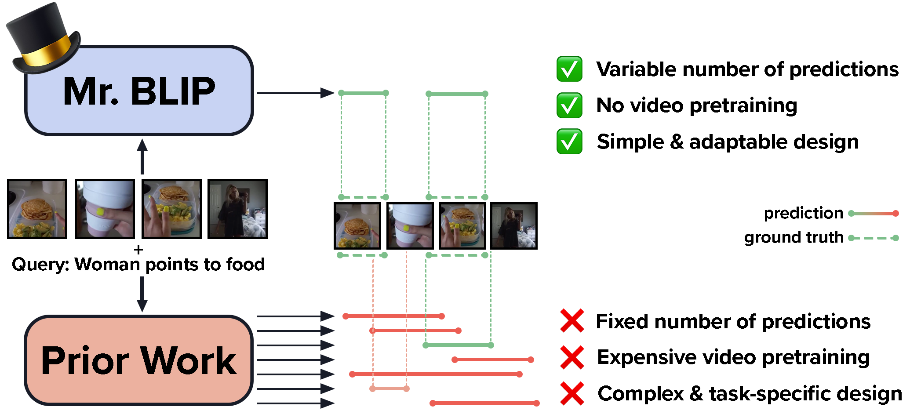
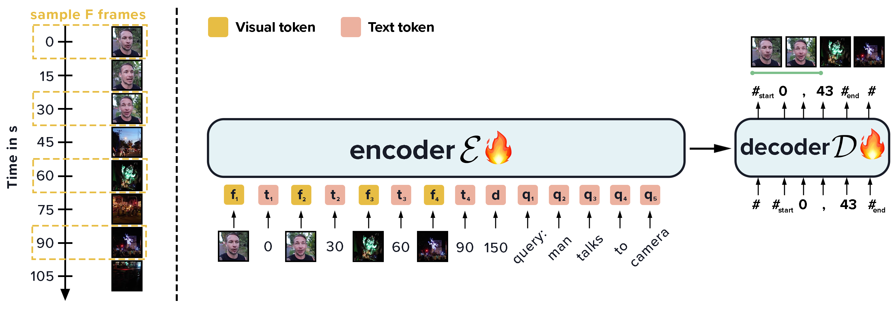
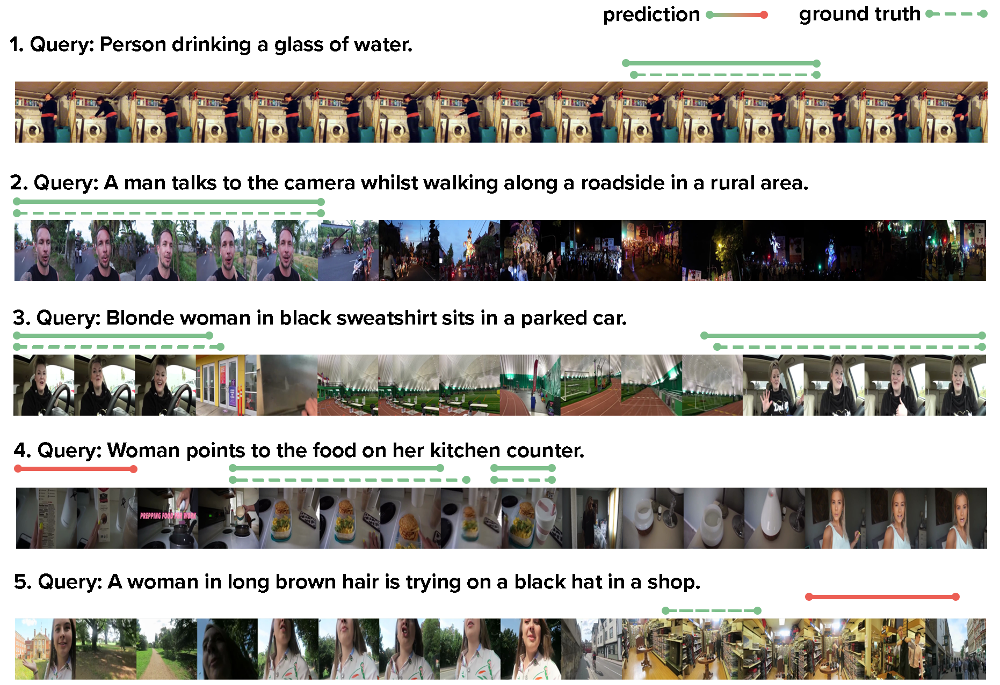
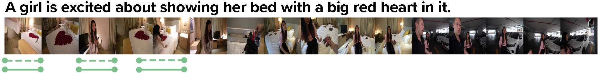
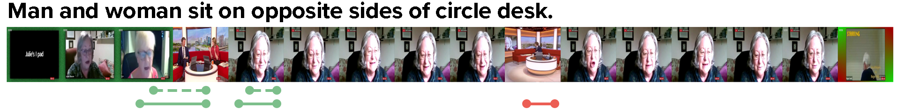
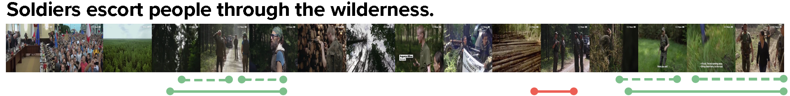
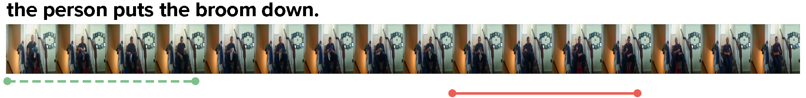
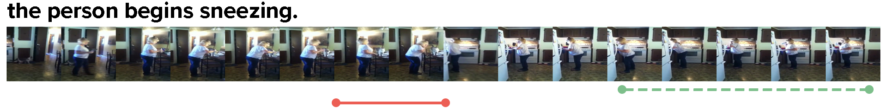

# 多模态大型语言模型在视频时刻检索中展现出令人惊讶的高效性

发布时间：2024年06月26日

`LLM应用

理由：这篇论文主要探讨了多模态大型语言模型（MLLMs）在视频时刻检索任务中的应用，特别是通过提出的Mr. BLIP模型，展示了MLLMs在处理视频语言任务中的有效性和效率。论文关注的是模型的实际应用效果，包括在多个基准测试上的性能提升，而不是模型的理论基础或Agent的设计与行为。因此，它更适合归类于LLM应用。` `视频处理` `计算机视觉`

> The Surprising Effectiveness of Multimodal Large Language Models for Video Moment Retrieval

# 摘要

> 近期研究显示，多模态大型语言模型（MLLMs）在物体检测和语义分割等计算机视觉任务中展现出巨大潜力。尽管如此，许多视频任务仍未被充分研究。视频语言任务对时空理解有高要求，且计算成本高昂。以往研究多采用复杂架构或依赖额外输入（如视频转录）来优化时空信息编码，这限制了其通用性和实用性。视频时刻检索尤为挑战，需精准定位时空上下文。本研究意外发现，图像文本预训练的MLLMs在时刻检索上效果显著。我们提出的Mr. BLIP（代表时刻检索）模型，为多模态单阶段设计，无需昂贵预训练和额外输入，设计简洁且通用性强。在Charades-STA、QVHighlights和ActivityNet Captions等基准上，我们刷新了时刻检索的记录，并在ActivityNet上实现了时间动作定位的新高。特别是在QVHighlights基准上，我们的Recall（在0.5和0.7 IoU时）提升了超过9%。代码已公开。

> Recent studies have shown promising results in utilizing multimodal large language models (MLLMs) for computer vision tasks such as object detection and semantic segmentation. However, many challenging video tasks remain under-explored. Video-language tasks necessitate spatial and temporal comprehension and require significant compute. Therefore, prior works have developed complex, highly specialized architectures or leveraged additional input signals such as video transcripts to best encode contextual and temporal information, which limits their generality and can be impractical. One particularly challenging task is video moment retrieval, which requires precise temporal and contextual grounding. This work demonstrates the surprising effectiveness of leveraging image-text pretrained MLLMs for moment retrieval. We introduce Mr. BLIP (Mr. as in Moment Retrieval), a multimodal, single-stage model that requires no expensive video-language pretraining, no additional input signal (e.g., no transcript or audio), and has a simpler and more versatile design than prior state-of-the-art methods. We achieve a new state-of-the-art in moment retrieval on the widely used benchmarks Charades-STA, QVHighlights, and ActivityNet Captions and illustrate our method's versatility with a new state-of-the-art in temporal action localization on ActivityNet. Notably, we attain over 9% (absolute) higher Recall (at 0.5 and 0.7 IoU) on the challenging long-video multi-moment QVHighlights benchmark. Our code is publicly available.

[Arxiv](https://arxiv.org/abs/2406.18113)