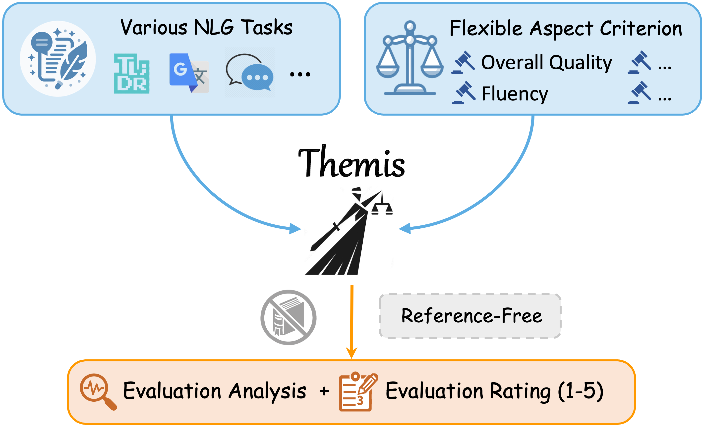
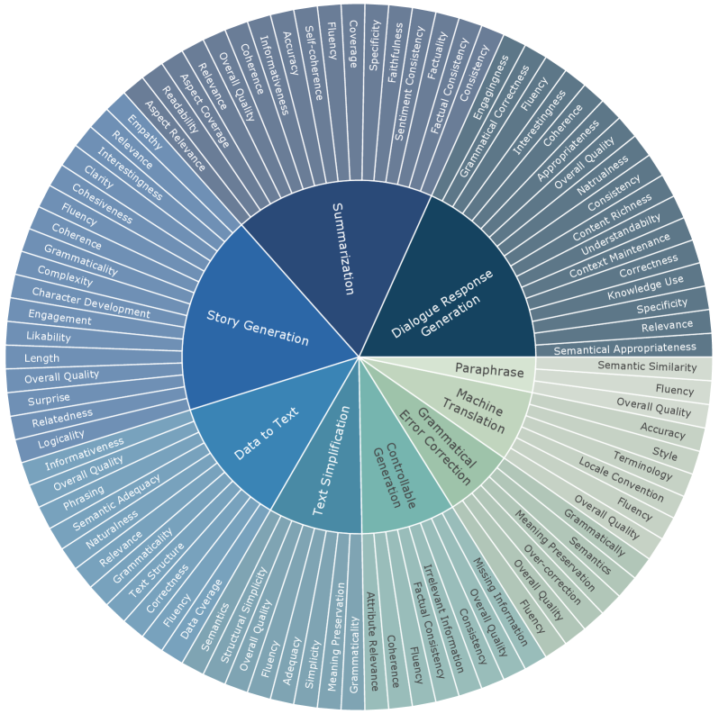

# Themis：探索灵活与可解释的自然语言生成评估之路

发布时间：2024年06月26日

`LLM应用

这篇论文主要讨论了自然语言生成（NLG）任务的评估问题，并提出了一种基于大型语言模型（LLMs）的新型自动评估方法。论文中介绍了NLG-Eval这一大规模评估语料库的构建，以及Themis这一专为NLG评估设计的LLM模型的开发。这些内容主要集中在LLM的应用层面，即如何利用LLM来改进和创新NLG任务的评估方法，因此应归类于LLM应用。` `评估工具`

> Themis: Towards Flexible and Interpretable NLG Evaluation

# 摘要

> 自然语言生成（NLG）任务的评估一直是研究的热点。随着大型语言模型（LLMs）的崛起，基于LLM的自动评估方法崭露头角，有望成为新一代评估标准。尽管这些方法性能有所提升，但仍受限于对参考文献的依赖和评估灵活性的不足。为此，本文精心打造了NLG-Eval这一大规模评估语料库，融合了人类与GPT-4的智慧，旨在填补数据空白。同时，我们推出了Themis，一款专为NLG评估量身定制的LLM，通过多视角一致性与评分偏好对齐训练，实现了无需参考文献的灵活且透明的评估。Themis在多项NLG任务中表现卓越，不仅适应新任务，还超越了包括GPT-4在内的其他评估模型。

> The evaluation of natural language generation (NLG) tasks is a significant and longstanding research issue. With the recent emergence of powerful large language models (LLMs), some studies have turned to LLM-based automatic evaluation methods, which demonstrate great potential to become a new evaluation paradigm following traditional string-based and model-based metrics. However, despite the improved performance of existing methods, they still possess some deficiencies, such as dependency on references and limited evaluation flexibility. Therefore, in this paper, we meticulously construct a large-scale NLG evaluation corpus NLG-Eval with human and GPT-4 annotations to alleviate the lack of relevant data in this field. Furthermore, we propose Themis, an LLM dedicated to NLG evaluation, which has been trained with our designed multi-perspective consistency and rating-oriented preference alignment methods. Themis can conduct flexible and interpretable evaluations without references, and it exhibits superior evaluation performance on various NLG tasks, simultaneously generalizing well to unseen tasks and surpassing other evaluation models, including GPT-4.

[Arxiv](https://arxiv.org/abs/2406.18365)