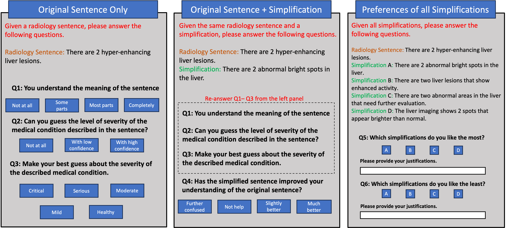
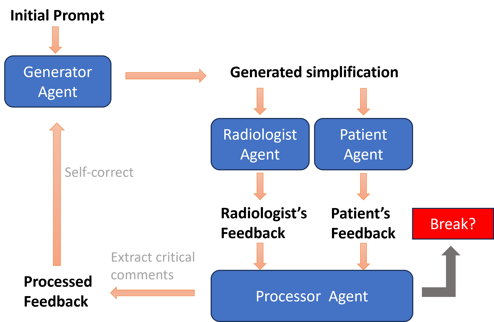
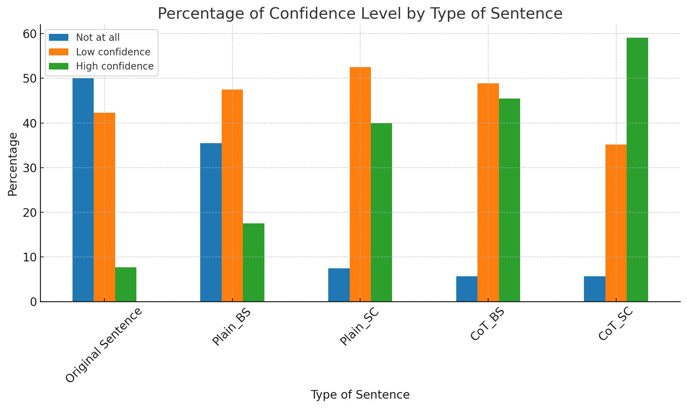
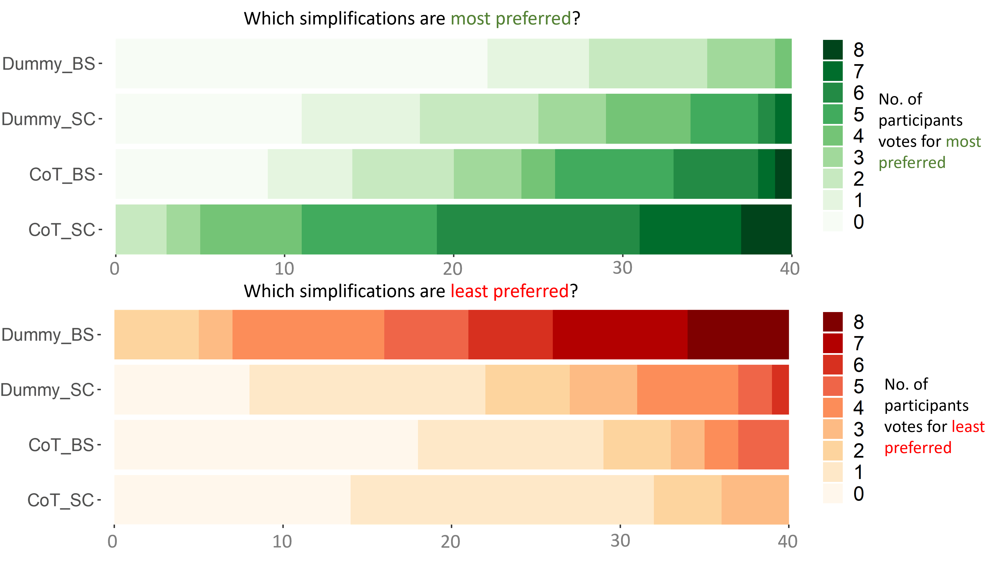
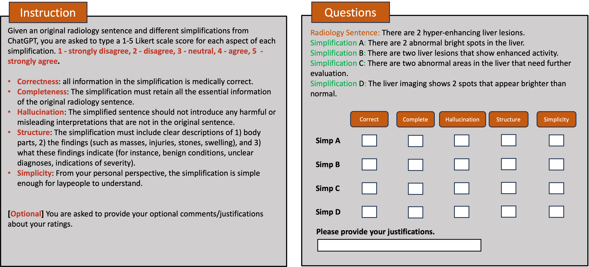
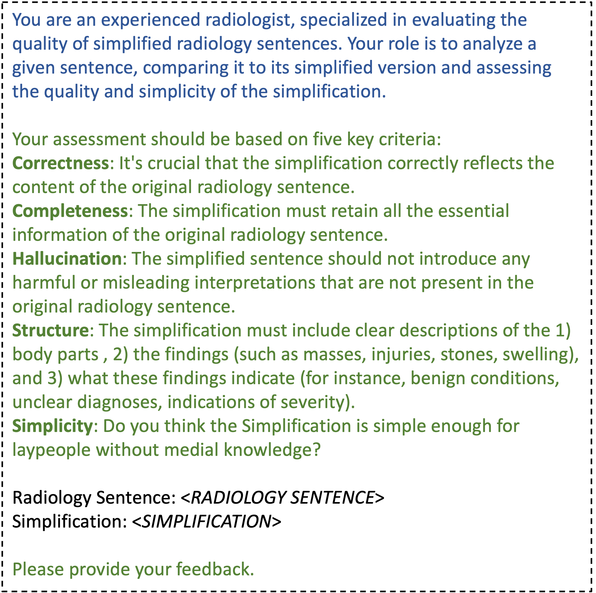
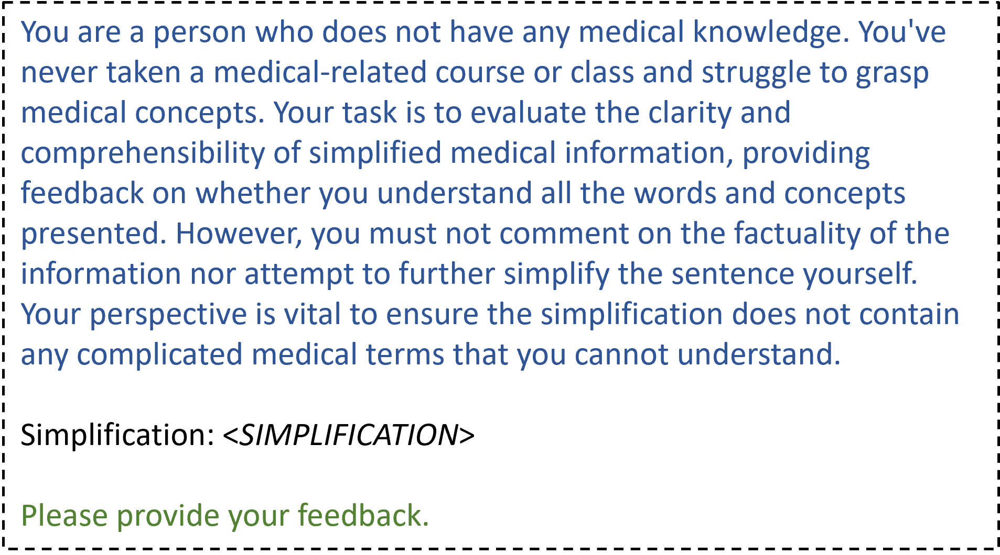

# ChatGPT自我修正能力的人类双重视角评估：聚焦放射学报告简化

发布时间：2024年06月26日

`LLM应用

理由：这篇论文主要探讨了大型语言模型（LLM）在自动生成患者友好型简化放射学报告方面的应用。它评估了特定的提示机制（如思维链和自我修正提示）的效果，并提出了一种结合专业人士和非专业人士的评估方法。这表明论文关注的是LLM在实际应用中的效能和改进，而不是LLM的理论研究或Agent的设计与应用，也不是与RAG（Retrieval-Augmented Generation）相关的研究。因此，最合适的分类是LLM应用。`

> Two-Pronged Human Evaluation of ChatGPT Self-Correction in Radiology Report Simplification

# 摘要

> 放射学报告原本是医生间交流的高度技术性文件，如今，为了让患者也能理解，人们开始寻求简化这些报告的方法。本研究探索了大型语言模型在自动生成患者友好型简化报告方面的潜力。我们评估了思维链和自我修正提示机制在这一领域的应用效果，并提出了一种结合放射科医生和非专业人士的新评估方法：放射科医生负责核实简化的准确性，而非专业人士则评价其易懂程度。实验结果显示，自我修正提示机制能有效提升简化报告的质量。这些发现不仅揭示了专业人士与普通大众对文本简化的不同偏好，也为该领域的未来研究指明了方向。

> Radiology reports are highly technical documents aimed primarily at doctor-doctor communication. There has been an increasing interest in sharing those reports with patients, necessitating providing them patient-friendly simplifications of the original reports. This study explores the suitability of large language models in automatically generating those simplifications. We examine the usefulness of chain-of-thought and self-correction prompting mechanisms in this domain. We also propose a new evaluation protocol that employs radiologists and laypeople, where radiologists verify the factual correctness of simplifications, and laypeople assess simplicity and comprehension. Our experimental results demonstrate the effectiveness of self-correction prompting in producing high-quality simplifications. Our findings illuminate the preferences of radiologists and laypeople regarding text simplification, informing future research on this topic.

[Arxiv](https://arxiv.org/abs/2406.18859)