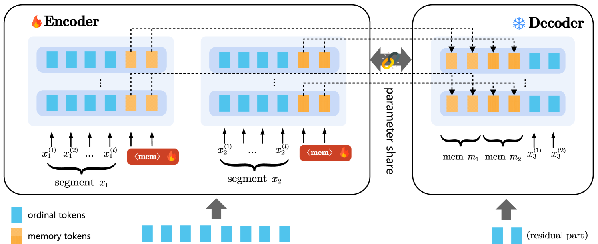
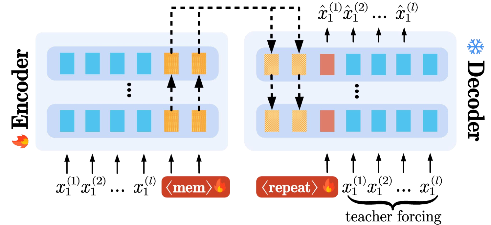

# UIO-LLMs：长上下文大型语言模型的无偏渐进优化

发布时间：2024年06月26日

`LLM理论

理由：这篇论文主要探讨了大型语言模型（LLMs）在处理长文本时的局限性，并提出了一种新的优化方法UIO-LLMs，旨在增强模型在长上下文环境下的表现。该研究涉及模型的内部机制和优化技术，如无偏增量优化方法和截断的反向传播通过时间（TBPTT）算法，这些都是对LLM理论层面的深入探讨。因此，这篇论文更适合归类于LLM理论。` `机器学习`

> UIO-LLMs: Unbiased Incremental Optimization for Long-Context LLMs

# 摘要

> 大型语言模型（LLMs）因上下文窗口有限而难以处理长文本。本研究提出的UIO-LLMs，是一种针对长上下文环境下增强记忆transformer的无偏增量优化方法。我们首先将此过程设想为一个精简的编码器-解码器框架，其中共享权重的编码器和解码器分别将上下文片段转化为记忆，并利用这些记忆预测后续片段的输出。接着，我们将这些增强记忆的transformer视为全连接循环神经网络（RNNs），并采用截断的反向传播通过时间（TBPTT）算法优化训练，引入了创新的增量优化技术，既降低了时间复杂度，又通过无偏优化过程纠正了梯度计算中的偏差。UIO-LLMs有效应对了长上下文挑战，例如将Llama2-7b-chat的上下文窗口从4K扩展至100K令牌，仅增加了2%的额外参数，且推理成本随上下文长度增加而几乎保持线性。

> Managing long texts is challenging for large language models (LLMs) due to limited context window sizes. This study introduces UIO-LLMs, an unbiased incremental optimization approach for memory-enhanced transformers under long-context settings. We initially conceptualize the process as a streamlined encoder-decoder framework where the weights-shared encoder and decoder respectively encapsulate a context segment into memories and leverage these memories to predict outputs of the subsequent segment. Subsequently, by treating our memory-enhanced transformers as fully-connected recurrent neural networks (RNNs), we refine the training process using the Truncated Backpropagation Through Time (TBPTT) algorithm, which incorporates innovative incremental optimization techniques. These techniques not only diminish time complexity but also address the bias in gradient computation through an unbiased optimization process. UIO-LLMs successfully handle long context, such as extending the context window of Llama2-7b-chat from 4K to 100K tokens with minimal 2% additional parameters, while keeping the inference cost nearly linear as context length increases.

[Arxiv](https://arxiv.org/abs/2406.18173)