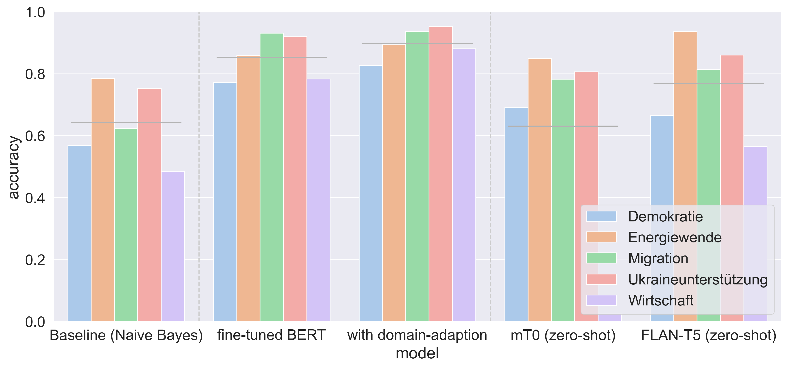

# 零-shot提示分类法：在基础模型盛行的当下，为德语推文贴上主题标签

发布时间：2024年06月26日

`LLM应用

这篇论文主要探讨了利用大型基础模型（LLM）进行文本数据的自动化过滤与注释，特别是在社交媒体和新闻分析领域的应用。论文通过实证研究评估了这些技术在实际应用中的效果，并与传统的人工注释和其他分类技术进行了比较。研究结果显示，基于提示的方法在无需预先标注的训练数据的情况下，能够与微调的BERT模型表现相当。这表明了NLP领域正在经历的范式转变，即减少对预标注训练数据的依赖，并整合下游任务。因此，这篇论文应归类为LLM应用。` `社交媒体分析` `新闻分析`

> Zero-shot prompt-based classification: topic labeling in times of foundation models in German Tweets

# 摘要

> 在社交媒体和新闻分析等领域，文本数据的过滤与注释是日常工作。自动化这些流程不仅能加快分析速度，拓宽内容覆盖面，还能大幅减少人工投入。得益于自然语言处理技术的进步，尤其是大型基础模型的成功，我们现在可以通过文本到文本的接口，依据书面指南自动执行注释任务，无需提供训练样本。本研究通过在德国Twitter上关于欧洲社会政治危机的数据进行注释任务，实证评估了这些技术在实际应用中的效果。我们将基于提示的方法与人工注释及之前的分类技术（如朴素贝叶斯和基于BERT的微调/领域适应流程）进行对比。结果表明，尽管受限于本地计算资源，基于提示的方法与微调的BERT表现相当，且无需预先标注的训练数据。这一发现凸显了NLP领域正在经历的范式转变，即下游任务的整合以及对预标注训练数据依赖的减少。

> Filtering and annotating textual data are routine tasks in many areas, like social media or news analytics. Automating these tasks allows to scale the analyses wrt. speed and breadth of content covered and decreases the manual effort required. Due to technical advancements in Natural Language Processing, specifically the success of large foundation models, a new tool for automating such annotation processes by using a text-to-text interface given written guidelines without providing training samples has become available.
  In this work, we assess these advancements in-the-wild by empirically testing them in an annotation task on German Twitter data about social and political European crises. We compare the prompt-based results with our human annotation and preceding classification approaches, including Naive Bayes and a BERT-based fine-tuning/domain adaptation pipeline. Our results show that the prompt-based approach - despite being limited by local computation resources during the model selection - is comparable with the fine-tuned BERT but without any annotated training data. Our findings emphasize the ongoing paradigm shift in the NLP landscape, i.e., the unification of downstream tasks and elimination of the need for pre-labeled training data.

[Arxiv](https://arxiv.org/abs/2406.18239)