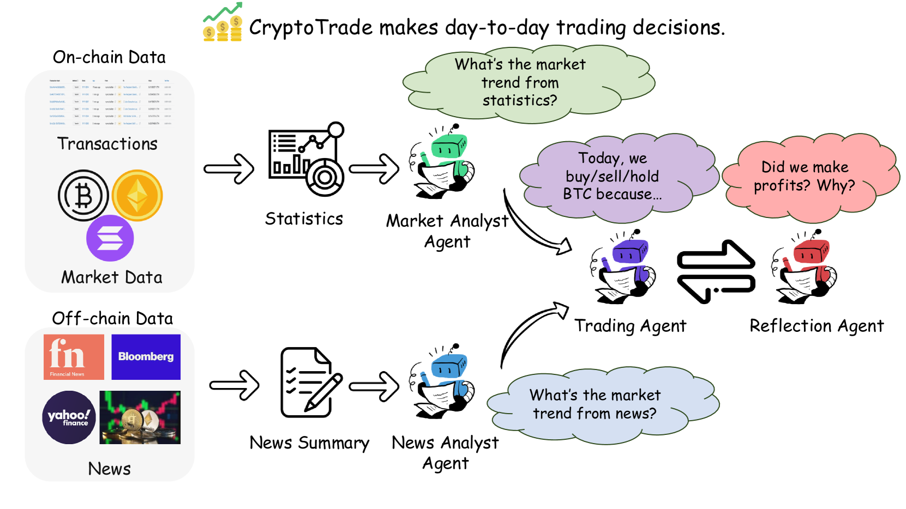
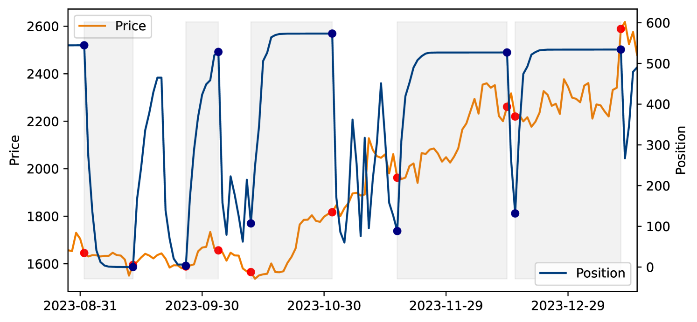
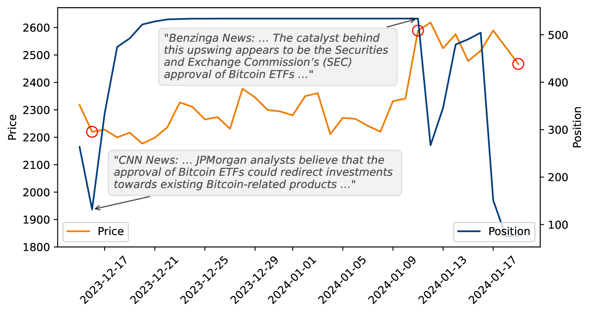
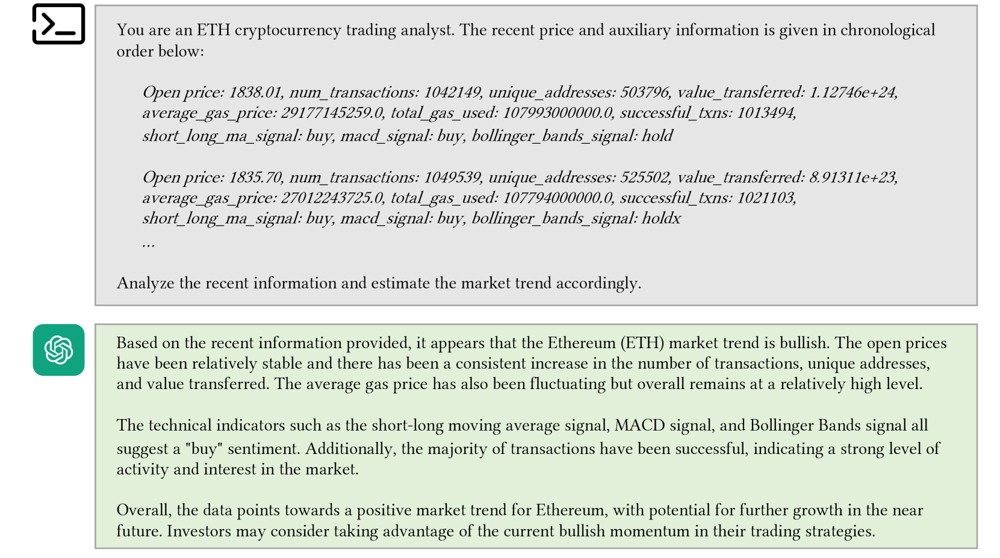
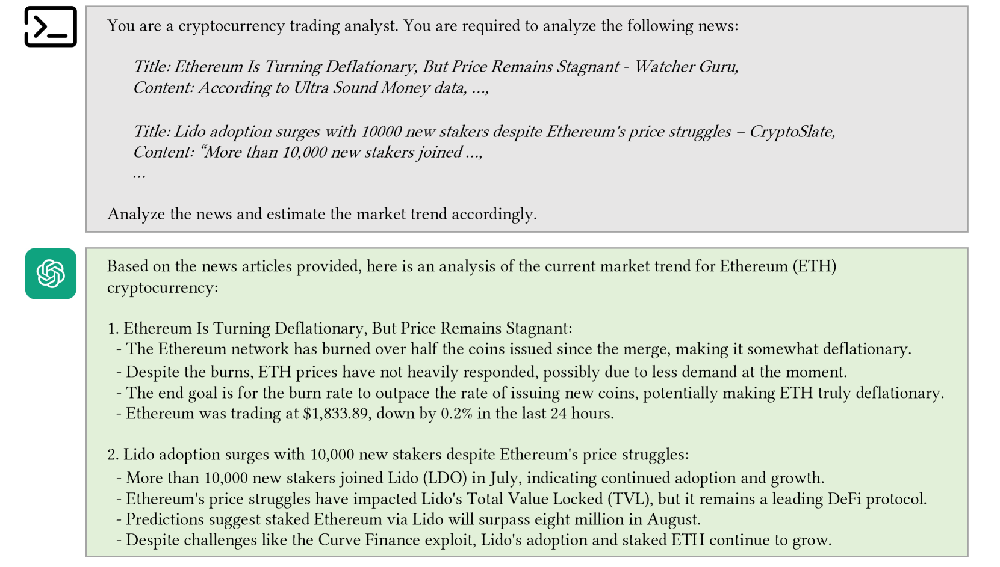
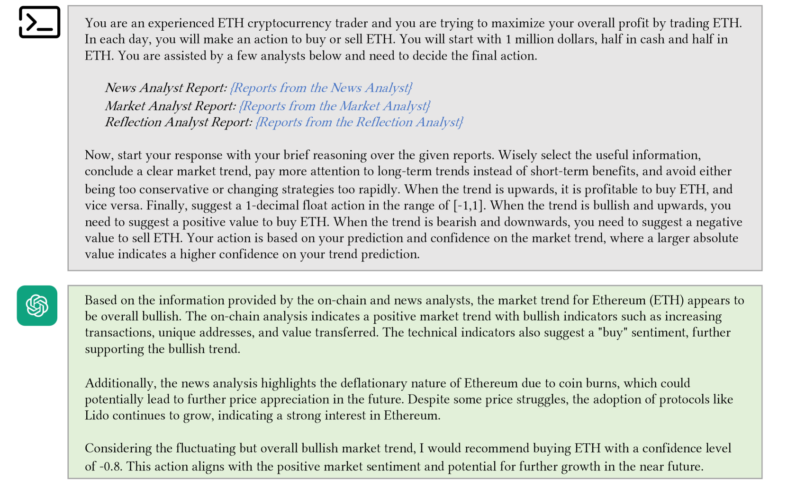
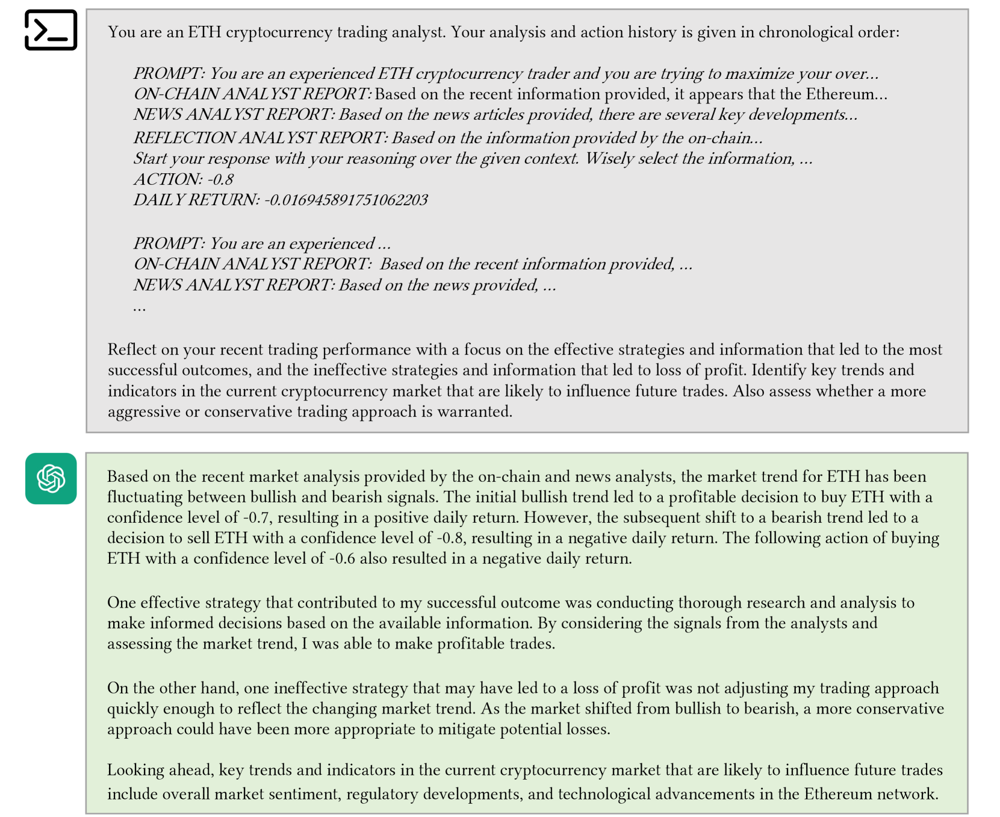

# 基于 LLM 的反射代理，引领零-shot 加密货币交易之旅

发布时间：2024年06月27日

`Agent` `加密货币`

> A Reflective LLM-based Agent to Guide Zero-shot Cryptocurrency Trading

# 摘要

> 大型语言模型（LLM）在金融交易中的应用主要局限于股票市场，辅助经济和金融决策。然而，加密货币市场因其链上数据的透明度和链下信号（如新闻）的关键影响而呈现的独特机会，LLM 尚未充分利用。本研究通过开发基于 LLM 的交易代理 CryptoTrade，独特地结合链上和链下数据的分析，旨在弥合这一差距。CryptoTrade 利用链上数据的透明度和不可变性，以及链下信号的及时性和影响力，全面概览加密货币市场。此外，CryptoTrade 包含一个反射机制，通过分析先前交易决策的结果来优化每日交易决策。这项研究不仅扩展了 LLM 在加密货币交易领域的应用，还为加密货币交易策略设定了基准。通过广泛实验，CryptoTrade 在最大化回报方面相比传统交易策略和时间序列基准在各种加密货币和市场条件下展示了优越的性能。我们的代码和数据可在 \url{https://anonymous.4open.science/r/CryptoTrade-Public-92FC/} 获取。

> The utilization of Large Language Models (LLMs) in financial trading has primarily been concentrated within the stock market, aiding in economic and financial decisions. Yet, the unique opportunities presented by the cryptocurrency market, noted for its on-chain data's transparency and the critical influence of off-chain signals like news, remain largely untapped by LLMs. This work aims to bridge the gap by developing an LLM-based trading agent, CryptoTrade, which uniquely combines the analysis of on-chain and off-chain data. This approach leverages the transparency and immutability of on-chain data, as well as the timeliness and influence of off-chain signals, providing a comprehensive overview of the cryptocurrency market. CryptoTrade incorporates a reflective mechanism specifically engineered to refine its daily trading decisions by analyzing the outcomes of prior trading decisions. This research makes two significant contributions. Firstly, it broadens the applicability of LLMs to the domain of cryptocurrency trading. Secondly, it establishes a benchmark for cryptocurrency trading strategies. Through extensive experiments, CryptoTrade has demonstrated superior performance in maximizing returns compared to traditional trading strategies and time-series baselines across various cryptocurrencies and market conditions. Our code and data are available at \url{https://anonymous.4open.science/r/CryptoTrade-Public-92FC/}.

[Arxiv](https://arxiv.org/abs/2407.09546)