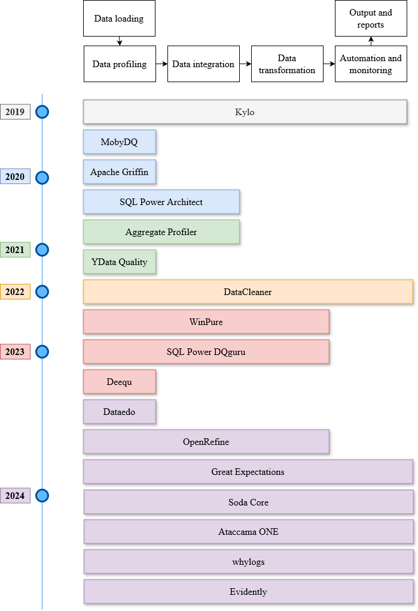
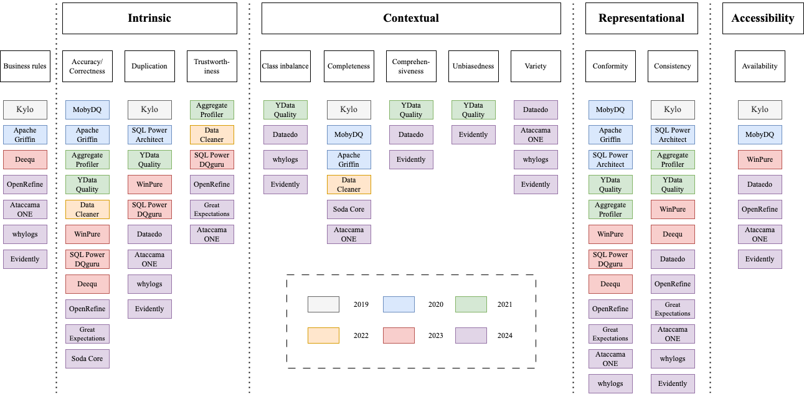
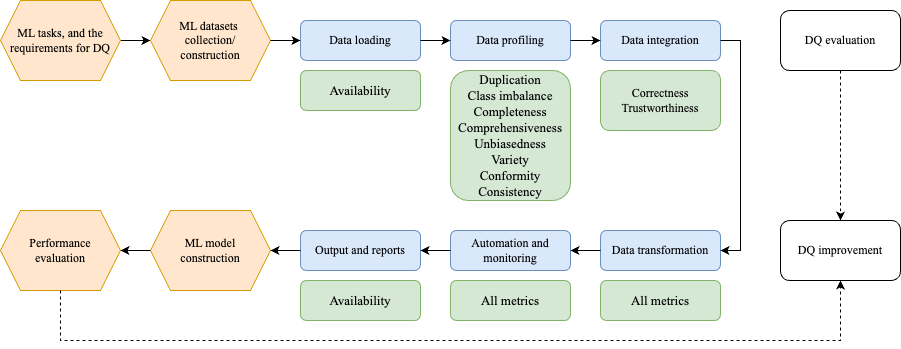

# 机器学习数据质量维度与工具综述

发布时间：2024年06月27日

`LLM应用` `人工智能` `数据科学`

> A Survey on Data Quality Dimensions and Tools for Machine Learning

# 摘要

> 机器学习技术已深入社会各领域，数据质量（DQ）对模型性能、公平性、鲁棒性、安全性及可扩展性至关重要。面对复杂大数据，传统方法如探索性数据分析（EDA）和交叉验证（CV）显露挑战，凸显DQ工具的重要性。本调查回顾了过去五年中17种DQ工具，通过介绍其DQ维度、指标及主要功能，比较优劣，并提出开源DQ工具开发路线图。基于挑战与趋势讨论，我们强调了大型语言模型（LLM）与生成AI在ML的DQ评估与改进中的潜力。此全面调查旨在深化对ML中DQ的理解，推动数据驱动AI的进步。完整文献列表见GitHub：https://github.com/haihua0913/awesome-dq4ml。

> Machine learning (ML) technologies have become substantial in practically all aspects of our society, and data quality (DQ) is critical for the performance, fairness, robustness, safety, and scalability of ML models. With the large and complex data in data-centric AI, traditional methods like exploratory data analysis (EDA) and cross-validation (CV) face challenges, highlighting the importance of mastering DQ tools. In this survey, we review 17 DQ evaluation and improvement tools in the last 5 years. By introducing the DQ dimensions, metrics, and main functions embedded in these tools, we compare their strengths and limitations and propose a roadmap for developing open-source DQ tools for ML. Based on the discussions on the challenges and emerging trends, we further highlight the potential applications of large language models (LLMs) and generative AI in DQ evaluation and improvement for ML. We believe this comprehensive survey can enhance understanding of DQ in ML and could drive progress in data-centric AI. A complete list of the literature investigated in this survey is available on GitHub at: https://github.com/haihua0913/awesome-dq4ml.

[Arxiv](https://arxiv.org/abs/2406.19614)