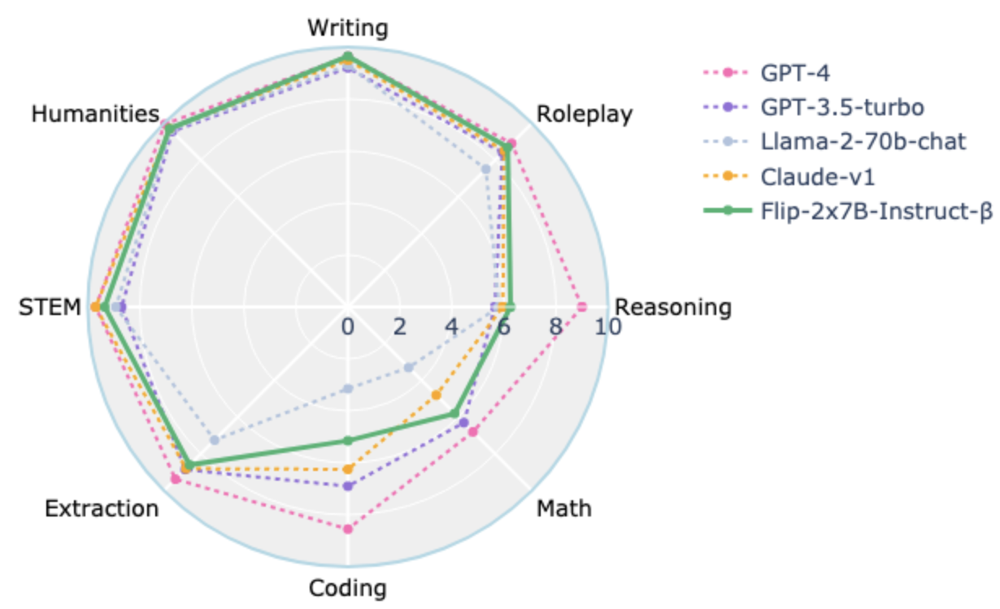
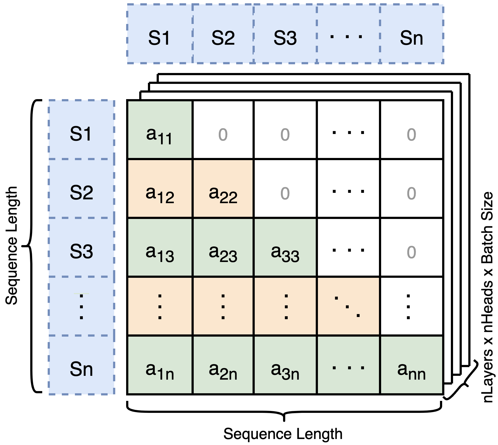
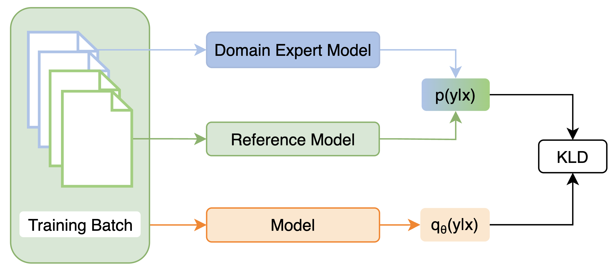
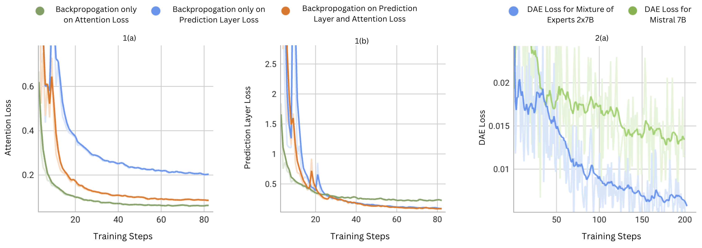

# 名师一席话，胜读百万书

发布时间：2024年06月27日

`LLM理论

这篇论文主要探讨了大型语言模型（LLMs）的训练策略，特别是针对小型模型的训练挑战，并提出了一种创新的训练方法。这种方法包括借鉴大型模型的架构和引入后训练领域对齐阶段，以增强模型在特定领域的性能同时保持泛化能力。这些内容主要涉及LLM的训练理论和方法，因此归类为LLM理论。` `模型训练`

> A Teacher Is Worth A Million Instructions

# 摘要

> 大型语言模型（LLMs）虽能力非凡，但其训练过程充满挑战，尤其依赖于高质量数据和最佳指令调整集的选择。训练方法的内在限制使得7B和13B参数的小型模型训练尤为困难。本研究提出了一种创新的训练策略，借鉴了如混合专家（8x7B）架构等大型模型的知识。这些巨型模型能从数据中捕捉广泛变异，成为小型模型的良师。我们还引入了一个独特的后训练领域对齐阶段，通过领域特定专家模型在训练中强化特定领域知识，同时保持模型的泛化能力。应用此方法微调的Mistral 7B和2x7B，在MT-Bench上得分高达7.9，在AlpacaEval上达到93.04%，超越了参数超过7B和13B的顶尖语言模型。

> Large Language Models(LLMs) have shown exceptional abilities, yet training these models can be quite challenging. There is a strong dependence on the quality of data and finding the best instruction tuning set. Further, the inherent limitations in training methods create substantial difficulties to train relatively smaller models with 7B and 13B parameters. In our research, we suggest an improved training method for these models by utilising knowledge from larger models, such as a mixture of experts (8x7B) architectures. The scale of these larger models allows them to capture a wide range of variations from data alone, making them effective teachers for smaller models. Moreover, we implement a novel post-training domain alignment phase that employs domain-specific expert models to boost domain-specific knowledge during training while preserving the model's ability to generalise. Fine-tuning Mistral 7B and 2x7B with our method surpasses the performance of state-of-the-art language models with more than 7B and 13B parameters: achieving up to $7.9$ in MT-Bench and $93.04\%$ on AlpacaEval.

[Arxiv](https://arxiv.org/abs/2406.19112)