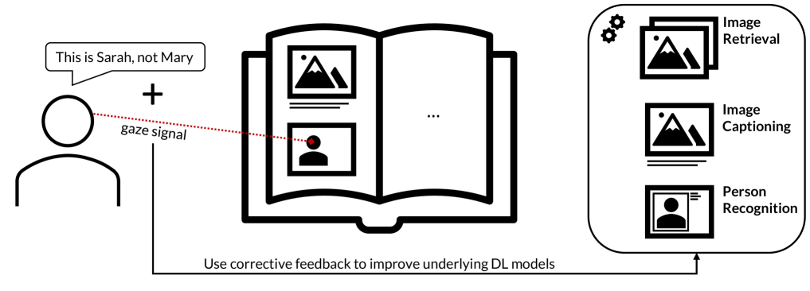

# 揭秘互动深度学习企业（No-IDLE）的内在奥秘

发布时间：2024年06月27日

`Agent

解析：这篇论文摘要主要描述了No-IDLE系统，这是一个旨在扩展非专家用户对交互式深度学习技术的接触的项目。它强调了多模态交互在交互式机器学习中的应用，并预期这种方法将在与未来神经网络和大型语言模型中的半智能机器交互时发挥关键作用。这表明该系统是一个智能代理（Agent），它通过交互式学习来理解和适应用户的行为、需求与目标。因此，这篇论文应归类为Agent。` `机器学习` `交互式系统`

> A look under the hood of the Interactive Deep Learning Enterprise (No-IDLE)

# 摘要

> DFKI的这份技术报告深入剖析了No-IDLE系统，该系统由德国联邦教育和研究部资助，不仅推动了交互式机器学习的基础研究，还深入洞察了用户的行为、需求与目标。我们期望机器学习和深度学习能普及至广大用户。No-IDLE项目旨在扩展非专家用户对交互式深度学习技术的接触，其科学挑战即围绕此目标展开。报告中的一个核心创新是结合多模态交互的交互式机器学习方法，这一方法将在我们与未来神经网络和大型语言模型中的半智能机器交互时发挥关键作用。

> This DFKI technical report presents the anatomy of the No-IDLE prototype system (funded by the German Federal Ministry of Education and Research) that provides not only basic and fundamental research in interactive machine learning, but also reveals deeper insights into users' behaviours, needs, and goals. Machine learning and deep learning should become accessible to millions of end users. No-IDLE's goals and scienfific challenges centre around the desire to increase the reach of interactive deep learning solutions for non-experts in machine learning. One of the key innovations described in this technical report is a methodology for interactive machine learning combined with multimodal interaction which will become central when we start interacting with semi-intelligent machines in the upcoming area of neural networks and large language models.

[Arxiv](https://arxiv.org/abs/2406.19054)