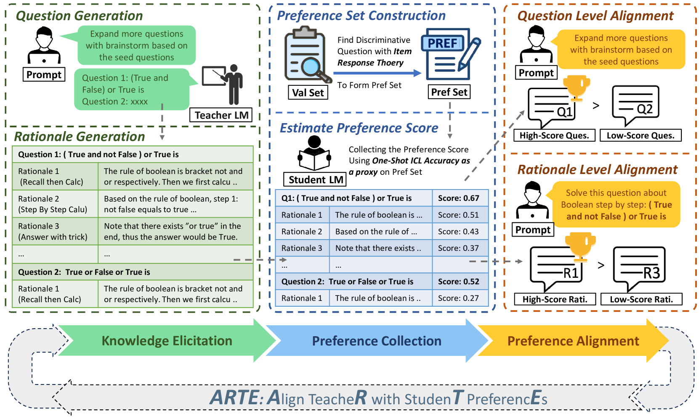

# 根据学生偏好定制教师，以生成个性化的训练数据

发布时间：2024年06月27日

`Agent

理由：这篇论文主要讨论了如何通过一个框架（ARTE）来调整教师模型以适应学生模型的偏好，从而生成定制的训练示例用于知识蒸馏。这个过程涉及到教师模型和学生模型之间的交互和适应，类似于Agent的行为，即根据环境和目标调整自己的策略和行为。此外，论文中提到的“响应式教学”理念也与Agent的自主性和适应性相呼应。因此，这篇论文更适合归类到Agent分类中。` `边缘计算` `教育技术`

> Aligning Teacher with Student Preferences for Tailored Training Data Generation

# 摘要

> 大型语言模型（LLMs）作为副驾驶，在多种任务中展现出显著潜力。在处理隐私或延迟敏感任务时，将LLMs部署在边缘设备上至关重要。然而，这些设备的计算限制使得直接部署大规模LLMs变得不切实际，因此需要进行知识蒸馏，将大规模模型转化为轻量级模型。尽管已有许多研究致力于从LLMs中提取高质量和多样化的训练示例，但根据学生偏好调整教师教学内容的研究却鲜有涉及，这与教育学中的“响应式教学”理念相似。为此，我们提出了ARTE（Aligning TeacheR with StudenT PreferencEs），这是一个框架，旨在根据学生偏好调整教师模型，以生成定制的训练示例用于知识蒸馏。我们首先从教师模型中提取问题和理由，然后通过学生在情境学习中的表现来收集他们对这些问题的偏好，并据此调整教师模型。最后，我们使用调整后的教师模型重复第一步，为学生模型在目标任务上生成定制的训练示例。在多个学术基准上的实验表明，ARTE在性能上超越了现有的从强大LLMs蒸馏出的指令调整数据集。我们还深入探讨了ARTE的泛化能力，包括微调后的学生模型在推理能力上的泛化，以及调整后的教师模型在不同任务和学生中生成定制训练数据的能力。总的来说，我们的贡献在于提出了一种创新的定制训练示例生成框架，并通过实验验证了其有效性，同时深入研究了ARTE中学生和教师模型的泛化能力。

> Large Language Models (LLMs) have shown significant promise as copilots in various tasks. Local deployment of LLMs on edge devices is necessary when handling privacy-sensitive data or latency-sensitive tasks. The computational constraints of such devices make direct deployment of powerful large-scale LLMs impractical, necessitating the Knowledge Distillation from large-scale models to lightweight models. Lots of work has been done to elicit diversity and quality training examples from LLMs, but little attention has been paid to aligning teacher instructional content based on student preferences, akin to "responsive teaching" in pedagogy. Thus, we propose ARTE, dubbed Aligning TeacheR with StudenT PreferencEs, a framework that aligns the teacher model with student preferences to generate tailored training examples for Knowledge Distillation. Specifically, we elicit draft questions and rationales from the teacher model, then collect student preferences on these questions and rationales using students' performance with in-context learning as a proxy, and finally align the teacher model with student preferences. In the end, we repeat the first step with the aligned teacher model to elicit tailored training examples for the student model on the target task. Extensive experiments on academic benchmarks demonstrate the superiority of ARTE over existing instruction-tuning datasets distilled from powerful LLMs. Moreover, we thoroughly investigate the generalization of ARTE, including the generalization of fine-tuned student models in reasoning ability and the generalization of aligned teacher models to generate tailored training data across tasks and students. In summary, our contributions lie in proposing a novel framework for tailored training example generation, demonstrating its efficacy in experiments, and investigating the generalization of both student & aligned teacher models in ARTE.

[Arxiv](https://arxiv.org/abs/2406.19227)