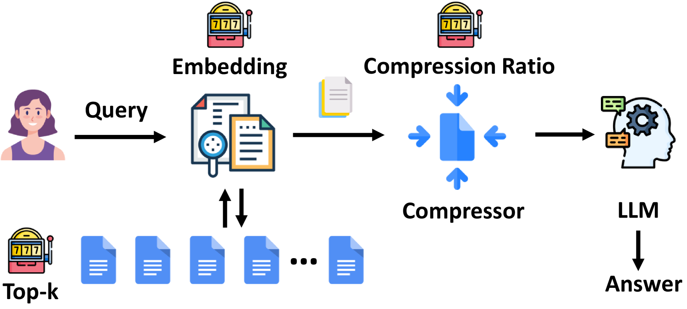

# AutoRAG-HP：自动在线优化检索增强生成模型的超参数

发布时间：2024年06月27日

`RAG

这篇论文主要关注的是检索增强生成（RAG）系统中的自动机器学习（AutoML）问题，特别是超参数优化和在线适应的挑战。论文提出了一种名为AutoRAG-HP的框架，该框架将超参数调整视为在线多臂老虎机（MAB）问题，并采用了双层层次MAB（Hier-MAB）方法来优化RAG系统的性能。这与Agent、LLM应用和LLM理论分类不符，因为它专注于RAG系统的具体技术实现和优化，而不是代理行为、LLM的具体应用或理论基础。因此，最合适的分类是RAG。` `机器学习` `问答系统`

> AutoRAG-HP: Automatic Online Hyper-Parameter Tuning for Retrieval-Augmented Generation

# 摘要

> 大型语言模型的进步将机器学习和人工智能的开发推向新高度，促使我们重新审视检索增强生成（RAG）系统的自动机器学习（AutoML）原则。面对RAG系统中超参数优化和在线适应的挑战，我们开发了AutoRAG-HP框架，将超参数调整视为在线多臂老虎机（MAB）问题，并创新性地采用了双层层次MAB（Hier-MAB）方法，以高效探索庞大的搜索空间。我们在ALCE-ASQA和Natural Questions数据集上进行了深入实验，调整了包括检索文档前k个、提示压缩比率和嵌入方法在内的超参数。评估结果表明，通过联合优化这三个关键超参数，基于MAB的在线学习方法在搜索空间梯度显著的场景下，Recall@5可达约0.8，仅消耗网格搜索方法所需LLM API调用的20%。此外，我们的Hier-MAB方法在更复杂的优化场景中表现出色，超越了其他基线。相关代码将在https://aka.ms/autorag公开。

> Recent advancements in Large Language Models have transformed ML/AI development, necessitating a reevaluation of AutoML principles for the Retrieval-Augmented Generation (RAG) systems. To address the challenges of hyper-parameter optimization and online adaptation in RAG, we propose the AutoRAG-HP framework, which formulates the hyper-parameter tuning as an online multi-armed bandit (MAB) problem and introduces a novel two-level Hierarchical MAB (Hier-MAB) method for efficient exploration of large search spaces. We conduct extensive experiments on tuning hyper-parameters, such as top-k retrieved documents, prompt compression ratio, and embedding methods, using the ALCE-ASQA and Natural Questions datasets. Our evaluation from jointly optimization all three hyper-parameters demonstrate that MAB-based online learning methods can achieve Recall@5 $\approx 0.8$ for scenarios with prominent gradients in search space, using only $\sim20\%$ of the LLM API calls required by the Grid Search approach. Additionally, the proposed Hier-MAB approach outperforms other baselines in more challenging optimization scenarios. The code will be made available at https://aka.ms/autorag.

[Arxiv](https://arxiv.org/abs/2406.19251)