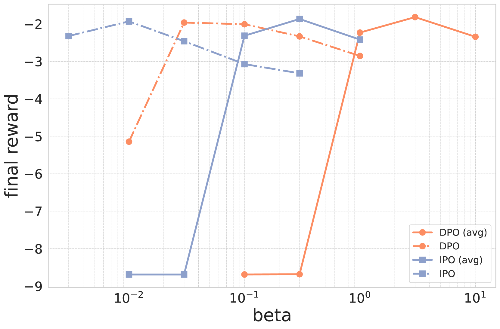
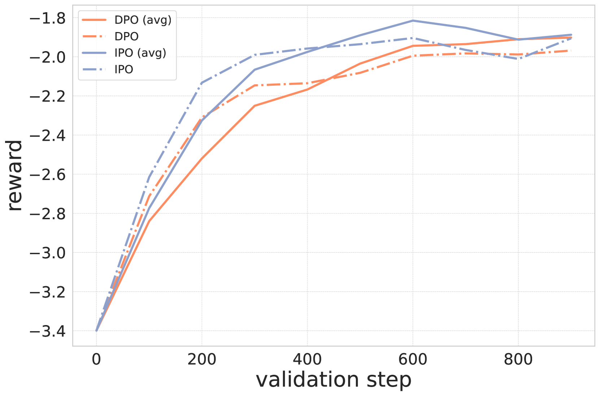
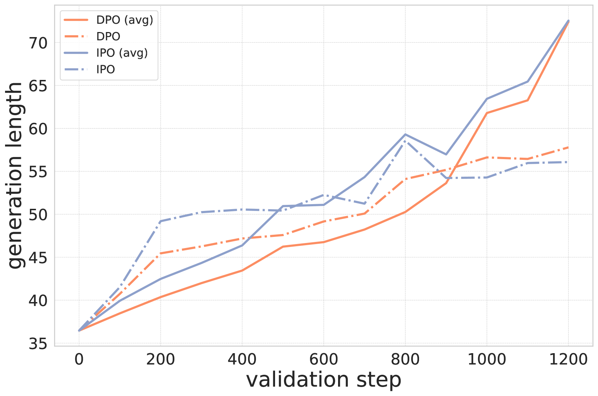

# 直接对齐中的对数似然平均化

发布时间：2024年06月27日

`LLM理论

这篇论文探讨了如何改进大型语言模型（LLM）以更好地符合人类判断，具体通过引入一种新的方法来确保直接对齐的长度不变性。这种方法结合了基于人类反馈的强化学习（RLHF）和直接对齐技术，旨在解决模型在处理不同长度文本时的性能问题。论文中提出的新平均算子和最优性算子的结合，为RL问题提供了最佳策略，并在实验中展示了其在生成长度与得分之间的平衡效果。这一研究属于LLM理论范畴，因为它关注的是模型内部机制的优化和理论改进，而不是模型的具体应用或Agent的设计。` `人工智能` `机器学习`

> Averaging log-likelihoods in direct alignment

# 摘要

> 为了使大型语言模型更贴合人类判断，我们采用了基于人类反馈的强化学习（RLHF），先构建奖励模型，再通过正则化强化学习优化它。最近，直接对齐方法崭露头角，它们能直接从偏好数据集训练出精细调整的模型，无需中间的代理奖励函数。这些方法依赖于对比损失，该损失基于模型对偏好完成情况的log-likelihood。但完成情况长度不一，log-likelihood并非长度不变。相比之下，监督学习中的交叉熵损失是长度不变的，因为它按token平均批次。为了融合这两种方法，我们提出了一种原则性的方法，确保直接对齐的长度不变性。我们引入了一个新的平均算子，与最优性算子结合，为底层RL问题提供最佳策略，这体现在损失中对log-likelihood的平均。实验表明，这种平均方法在生成长度与得分之间找到了平衡点。

> To better align Large Language Models (LLMs) with human judgment, Reinforcement Learning from Human Feedback (RLHF) learns a reward model and then optimizes it using regularized RL. Recently, direct alignment methods were introduced to learn such a fine-tuned model directly from a preference dataset without computing a proxy reward function. These methods are built upon contrastive losses involving the log-likelihood of (dis)preferred completions according to the trained model. However, completions have various lengths, and the log-likelihood is not length-invariant. On the other side, the cross-entropy loss used in supervised training is length-invariant, as batches are typically averaged token-wise. To reconcile these approaches, we introduce a principled approach for making direct alignment length-invariant. Formally, we introduce a new averaging operator, to be composed with the optimality operator giving the best policy for the underlying RL problem. It translates into averaging the log-likelihood within the loss. We empirically study the effect of such averaging, observing a trade-off between the length of generations and their scores.

[Arxiv](https://arxiv.org/abs/2406.19188)