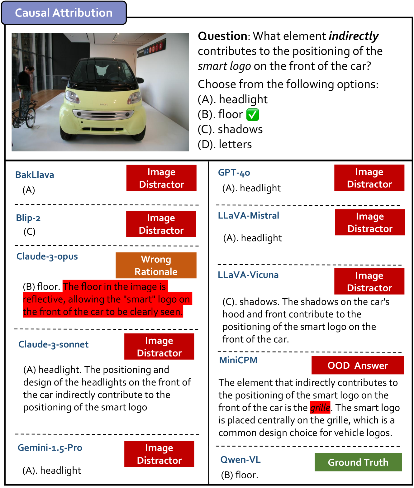

# CELLO：探究大型视觉-语言模型的因果效应评估

发布时间：2024年06月27日

`Agent

这篇论文主要关注的是大型视觉-语言模型（LVLMs）在因果推理方面的应用，特别是在具身代理等应用中的表现。论文提出了一种新的因果定义和数据集（CELLO），并通过实验展示了如何通过特定的策略（CELLO-CoT）提升LVLMs在因果推理上的表现。这些内容主要涉及如何增强模型在特定任务（如具身代理）中的因果推理能力，因此更适合归类于Agent分类，即关注模型在代理行为和决策中的应用。` `人工智能` `数据集`

> CELLO: Causal Evaluation of Large Vision-Language Models

# 摘要

> 因果推理是人类智能的基石，对于在现实世界中做出明智决策至关重要。尽管大型视觉-语言模型（LVLMs）取得了进展，但它们对因果关系的理解仍是一个谜。以往研究多聚焦于事件或行动间的常识因果，这对于具身代理等应用来说远远不够，且缺乏正式因果推理所需的明确因果图。为此，我们提出了一种涉及人与物体交互的细粒度因果定义，并据此创建了CELLO数据集，包含14,094个涵盖四个因果层次的问题，并通过明确的因果图详细描绘了人与物体的互动。实验显示，LVLMs在因果推理上仍显吃力，但通过我们提出的CELLO-CoT策略——一种受因果启发的思维链提示方法，它们能显著提升表现。本研究不仅提供了定量分析，还通过定性分析为未来研究指明了方向。项目详情请访问https://github.com/OpenCausaLab/CELLO。

> Causal reasoning is fundamental to human intelligence and crucial for effective decision-making in real-world environments. Despite recent advancements in large vision-language models (LVLMs), their ability to comprehend causality remains unclear. Previous work typically focuses on commonsense causality between events and/or actions, which is insufficient for applications like embodied agents and lacks the explicitly defined causal graphs required for formal causal reasoning. To overcome these limitations, we introduce a fine-grained and unified definition of causality involving interactions between humans and/or objects. Building on the definition, we construct a novel dataset, CELLO, consisting of 14,094 causal questions across all four levels of causality: discovery, association, intervention, and counterfactual. This dataset surpasses traditional commonsense causality by including explicit causal graphs that detail the interactions between humans and objects. Extensive experiments on CELLO reveal that current LVLMs still struggle with causal reasoning tasks, but they can benefit significantly from our proposed CELLO-CoT, a causally inspired chain-of-thought prompting strategy. Both quantitative and qualitative analyses from this study provide valuable insights for future research. Our project page is at https://github.com/OpenCausaLab/CELLO.

[Arxiv](https://arxiv.org/abs/2406.19131)