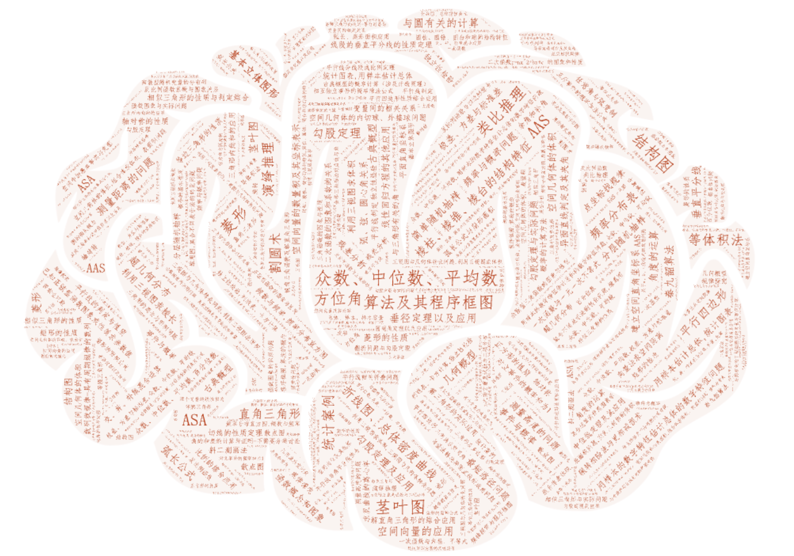
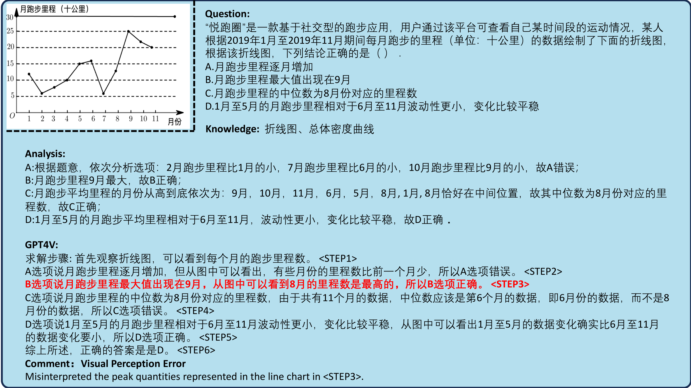

# CMMaTH：一项专为基础模型设计的中文多模态数学技能评估基准

发布时间：2024年06月27日

`LLM应用`

> CMMaTH: A Chinese Multi-modal Math Skill Evaluation Benchmark for Foundation Models

# 摘要

> 随着多模态大型语言模型的迅猛发展，其多模态数学能力的评估备受瞩目。尽管已有如 MathVista 等数据集为多模态数学能力评估设定了基准，但在中文 K12 教育领域，细粒度评估工具和数据集仍显不足。为此，我们推出了 CMMaTH 基准，涵盖 23,000 道多模态数学题，成为中文领域最大的数学问题库。CMMaTH 题目涵盖小学至高中，题型多样，视觉元素丰富，知识点详尽，并附有标准解答。此外，我们开发了开源工具 GradeGPT，集成 CMMaTH 数据集，助力模型评估的稳定性、速度与经济性。相关数据与代码已公开。

> Due to the rapid advancements in multimodal large language models, evaluating their multimodal mathematical capabilities continues to receive wide attention. Despite the datasets like MathVista proposed benchmarks for assessing mathematical capabilities in multimodal scenarios, there is still a lack of corresponding evaluation tools and datasets for fine-grained assessment in the context of K12 education in Chinese language. To systematically evaluate the capability of multimodal large models in solving Chinese multimodal mathematical problems, we propose a Chinese Multi-modal Math Skill Evaluation Benchmark, named CMMaTH, contraining 23k multimodal K12 math related questions, forming the largest Chinese multimodal mathematical problem benchmark to date. CMMaTH questions from elementary to high school levels, provide increased diversity in problem types, solution objectives, visual elements, detailed knowledge points, and standard solution annotations. We have constructed an open-source tool GradeGPT integrated with the CMMaTH dataset, facilitating stable, rapid, and cost-free model evaluation. Our data and code are available.

[Arxiv](https://arxiv.org/abs/2407.12023)