# 我们能否训练语言模型，使其能够为濒危语言提供注释？

发布时间：2024年06月27日

`LLM应用

理由：这篇论文探讨了大型语言模型（LLMs）在自动化生成Interlinear glossed text (IGT)中的应用，特别是在多语言任务中，包括稀有和濒危语言。研究关注的是LLMs在实际应用中的效能，即是否能通过情境学习有效执行IGT注释任务，无需传统训练，并且提出了新的示例选择方法以提升性能。这与LLM的理论研究、Agent的设计或RAG（Retrieval-Augmented Generation）的特定技术不同，而是直接关注LLM在特定NLP任务中的应用。因此，将其归类为LLM应用。` `语言学`

> Can we teach language models to gloss endangered languages?

# 摘要

> 在语言文档项目中，Interlinear glossed text (IGT) 是一种流行的格式，每个语素都配有描述性注释。自动化生成IGT不仅能减轻注释者的负担，还能确保注释的一致性。已有研究尝试了多种统计和神经网络方法来自动创建IGT。鉴于大型语言模型（LLMs）在多语言任务中，包括稀有和濒危语言，都显示出潜力，我们自然会思考它们是否能用于IGT的自动生成。本研究探索了LLMs是否能通过情境学习有效执行IGT注释任务，无需传统训练。我们提出了一种新的示例选择方法，发现有针对性的选择能大幅提升性能。尽管无需训练，基于LLM的方法仍超越了标准transformer模型。虽然这些方法尚未达到最先进的监督系统水平，但对于NLP领域之外的研究者而言，它们极为实用，几乎无需额外努力即可使用。

> Interlinear glossed text (IGT) is a popular format in language documentation projects, where each morpheme is labeled with a descriptive annotation. Automating the creation of interlinear glossed text can be desirable to reduce annotator effort and maintain consistency across annotated corpora. Prior research has explored a number of statistical and neural methods for automatically producing IGT.
  As large language models (LLMs) have showed promising results across multilingual tasks, even for rare, endangered languages, it is natural to wonder whether they can be utilized for the task of generating IGT. We explore whether LLMs can be effective at the task of interlinear glossing with in-context learning, without any traditional training. We propose new approaches for selecting examples to provide in-context, observing that targeted selection can significantly improve performance. We find that LLM-based methods beat standard transformer baselines, despite requiring no training at all. These approaches still underperform state-of-the-art supervised systems for the task, but are highly practical for researchers outside of the NLP community, requiring minimal effort to use.

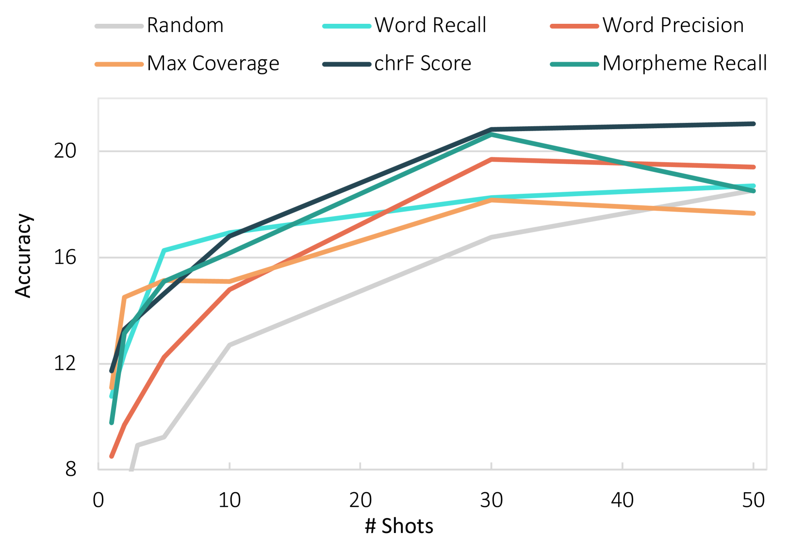

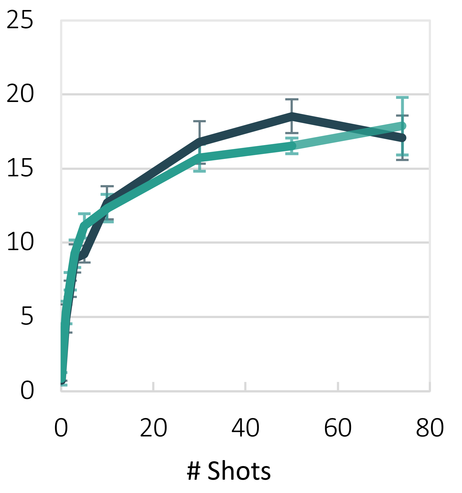

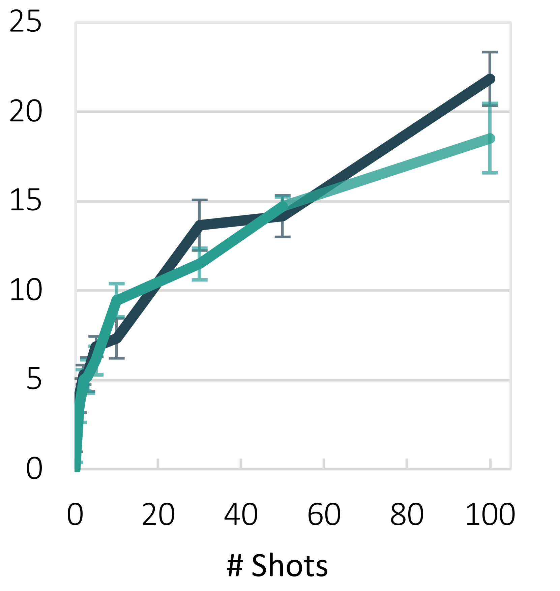

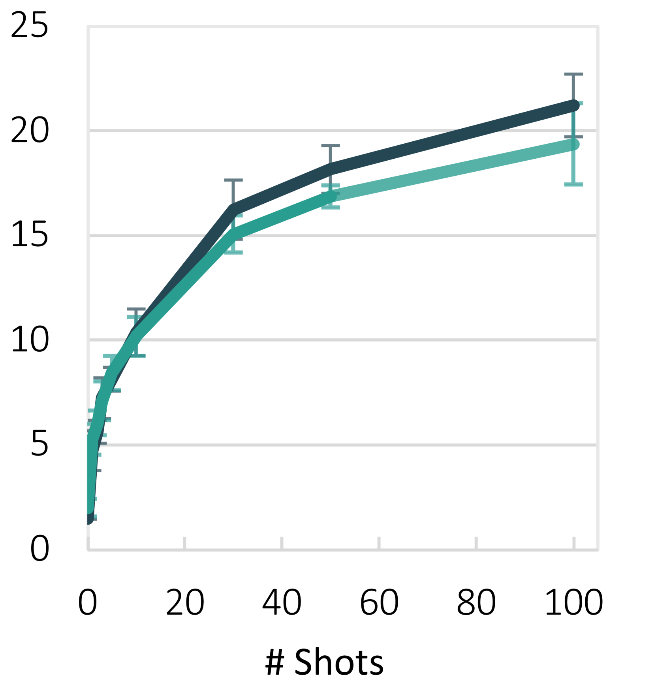

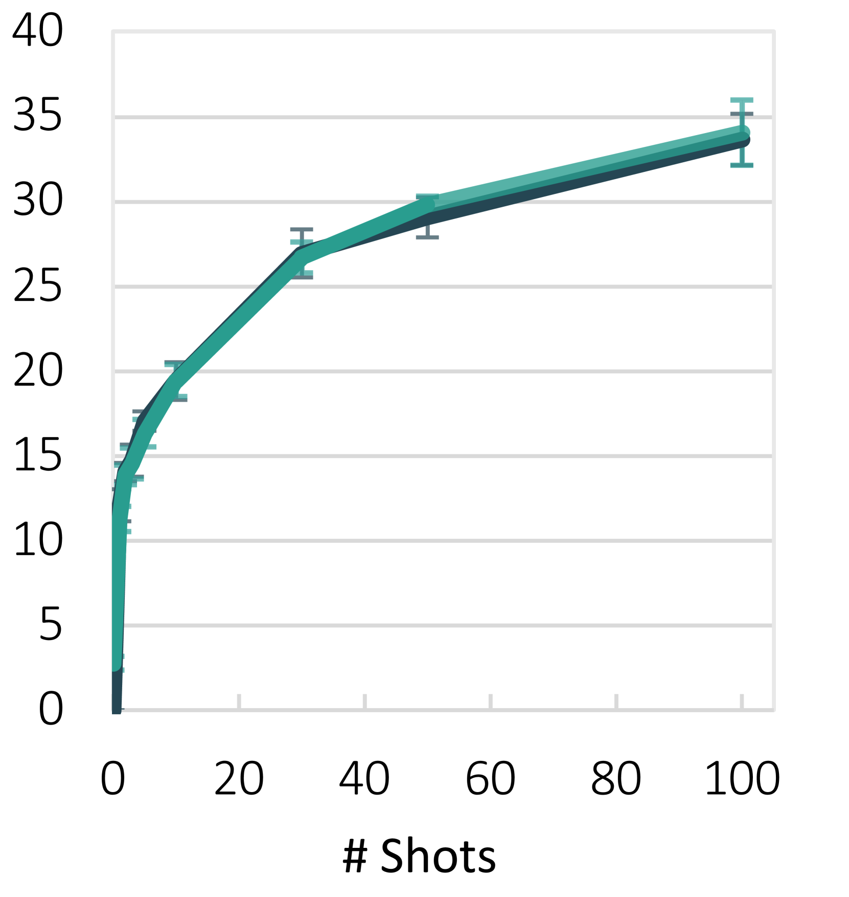

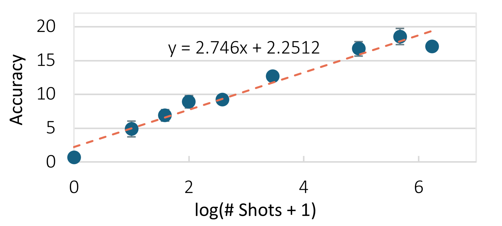

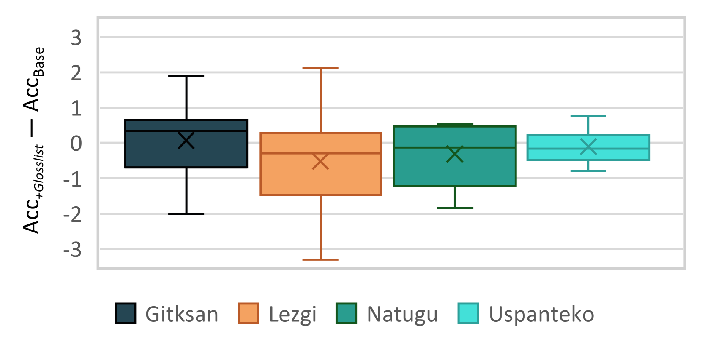

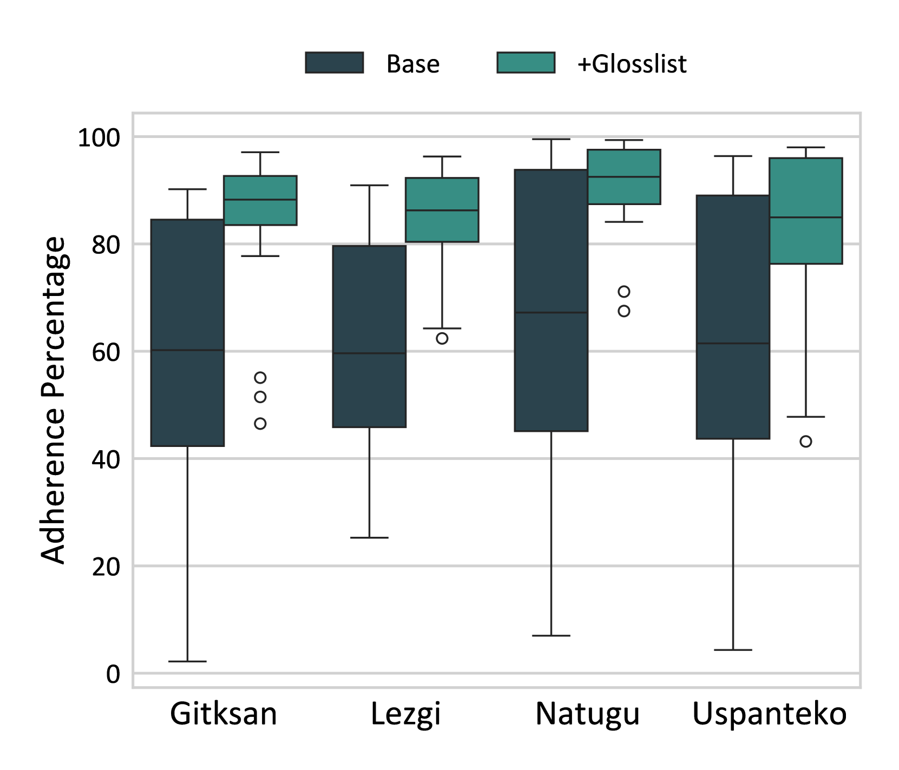

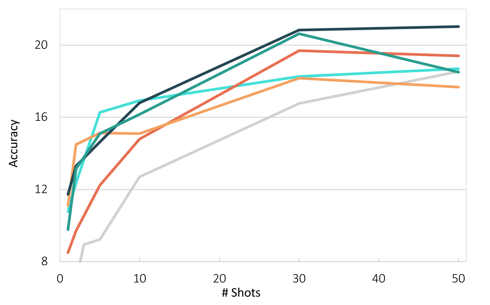

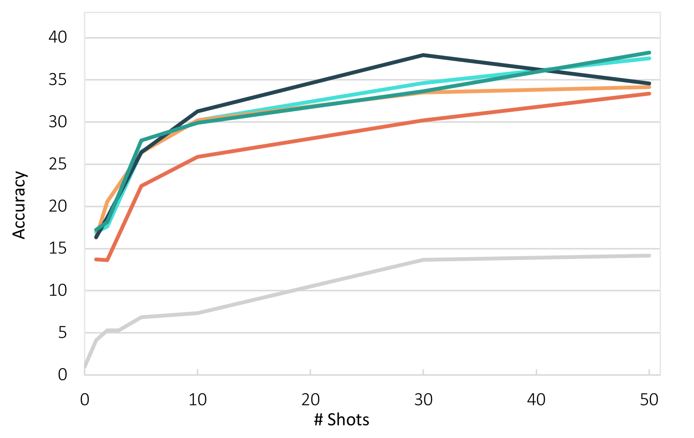

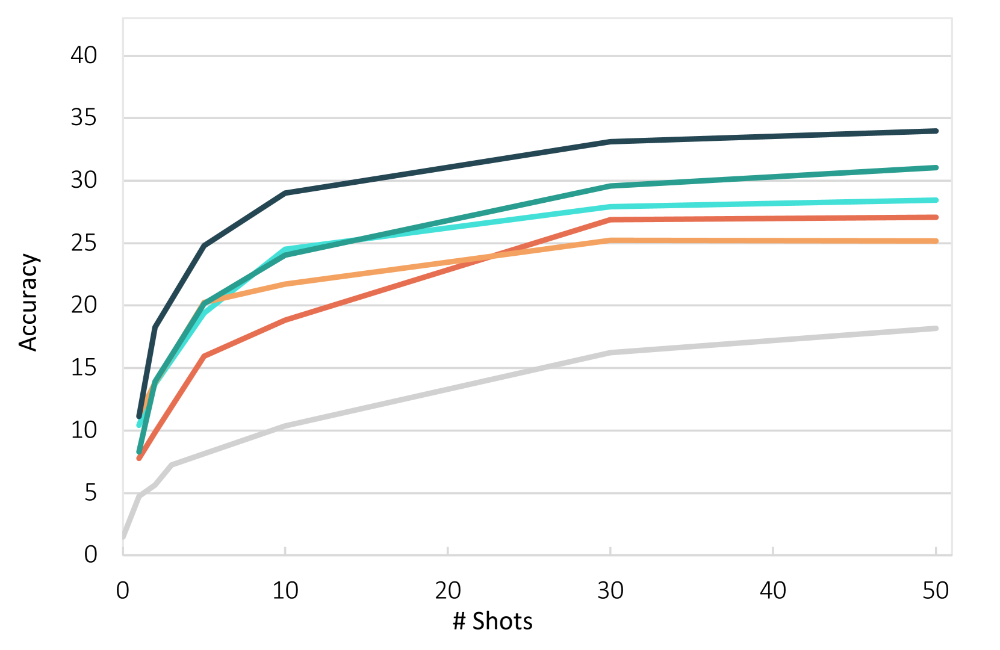

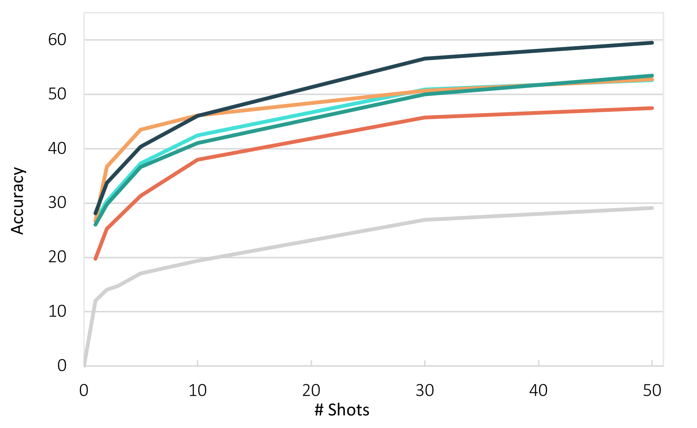

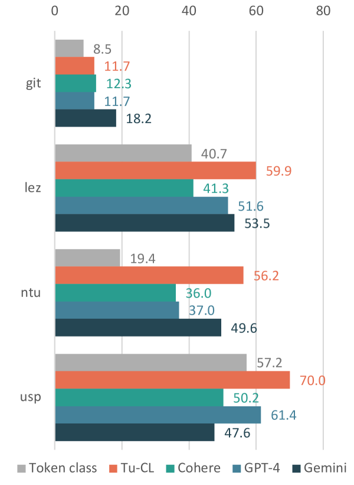

[Arxiv](https://arxiv.org/abs/2406.18895)