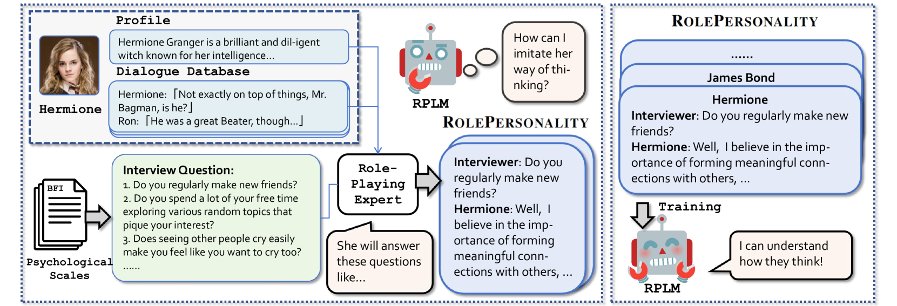

# 不仅仅是文字，更要捕捉心灵：通过融入个性指示数据，我们能够提升角色扮演语言模型的表现力。

发布时间：2024年06月27日

`Agent

这篇论文主要关注的是角色扮演代理（RPA）在大型语言模型（LLMs）中的应用，特别是在小型角色扮演语言模型（RPLMs）中增强角色心理理解的方面。论文提出了一种方法，通过心理量表问题和高级RPA的对话生成技术来增强RPLMs，以提高其在角色扮演中的表现。这与Agent分类相关，因为Agent通常指的是能够执行特定任务或模拟特定角色的智能实体，而RPA在这里可以被视为一种特定类型的Agent，专注于角色扮演和心理理解。因此，这篇论文更适合归类于Agent。` `角色扮演` `对话系统`

> Capturing Minds, Not Just Words: Enhancing Role-Playing Language Models with Personality-Indicative Data

# 摘要

> 角色扮演代理（RPA）在大型语言模型（LLMs）中备受瞩目，吸引了工业界和学术界的广泛关注。尽管现有RPA能准确描绘角色的知识和语气，但在捕捉角色心理方面，尤其是小型角色扮演语言模型（RPLMs），仍显不足。本文提出利用心理量表问题和高级RPA的对话生成技术，通过个性指示数据增强RPLMs，以更深入地理解角色心理。实验证明，采用我们数据集训练的RPLMs在通用及个性相关评估中均展现出卓越的角色扮演能力。相关代码和数据已公开于\href{https://github.com/alienet1109/RolePersonality}{此链接}。

> Role-playing agents (RPA) have been a popular application area for large language models (LLMs), attracting significant interest from both industry and academia.While existing RPAs well portray the characters' knowledge and tones, they face challenges in capturing their minds, especially for small role-playing language models (RPLMs). In this paper, we propose to enhance RPLMs via personality-indicative data. Specifically, we leverage questions from psychological scales and distill advanced RPAs to generate dialogues that grasp the minds of characters. Experimental results validate that RPLMs trained with our dataset exhibit advanced role-playing capabilities for both general and personality-related evaluations. Code and data are available at \href{https://github.com/alienet1109/RolePersonality}{this URL}.

[Arxiv](https://arxiv.org/abs/2406.18921)