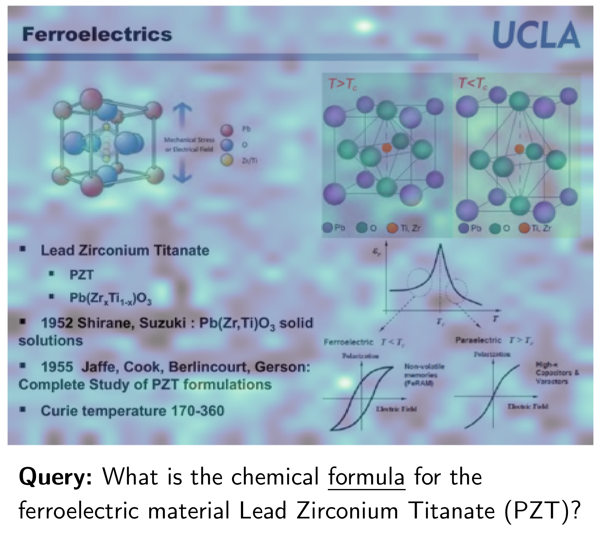

# ColPali：借助视觉语言模型，实现文档检索的高效性

发布时间：2024年06月27日

`RAG` `文档检索` `视觉处理`

> ColPali: Efficient Document Retrieval with Vision Language Models

# 摘要

> 文档通过多种视觉元素如文本、表格和图表等传递信息。现代检索系统虽擅长文本匹配，却难以有效利用视觉线索，影响了其在实际应用中的表现。为此，我们推出了视觉文档检索基准 ViDoRe，涵盖多领域、多语言的页面级检索任务。鉴于现有系统的不足，我们设计了新型检索模型 ColPali，它借助先进的视觉语言模型，仅从文档图像中提取高质量嵌入，并结合后期交互匹配，不仅大幅提升检索性能，还实现了更快的速度和端到端的训练。

> Documents are visually rich structures that convey information through text, as well as tables, figures, page layouts, or fonts. While modern document retrieval systems exhibit strong performance on query-to-text matching, they struggle to exploit visual cues efficiently, hindering their performance on practical document retrieval applications such as Retrieval Augmented Generation. To benchmark current systems on visually rich document retrieval, we introduce the Visual Document Retrieval Benchmark ViDoRe, composed of various page-level retrieving tasks spanning multiple domains, languages, and settings. The inherent shortcomings of modern systems motivate the introduction of a new retrieval model architecture, ColPali, which leverages the document understanding capabilities of recent Vision Language Models to produce high-quality contextualized embeddings solely from images of document pages. Combined with a late interaction matching mechanism, ColPali largely outperforms modern document retrieval pipelines while being drastically faster and end-to-end trainable.

[Arxiv](https://arxiv.org/abs/2407.01449)