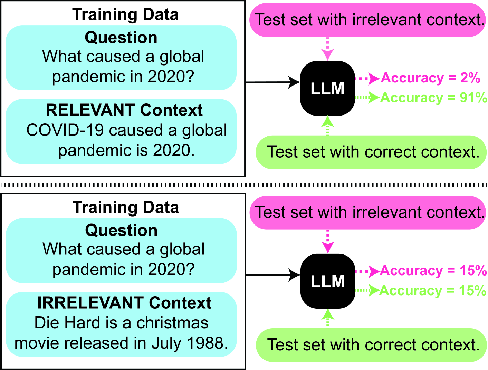
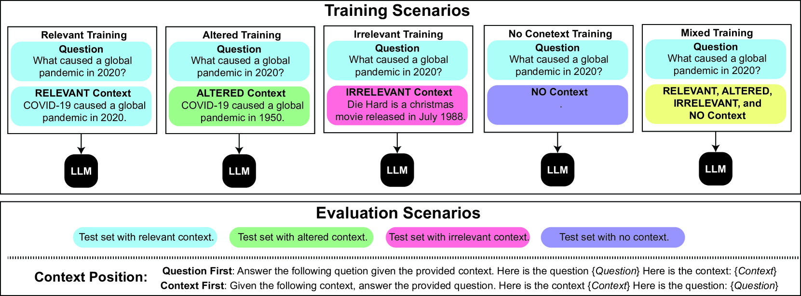

# 上下文至关重要：探究上下文信息对时间问答系统影响的实证研究

发布时间：2024年06月27日

`LLM应用` `信息检索`

> Context Matters: An Empirical Study of the Impact of Contextual Information in Temporal Question Answering Systems

# 摘要

> 大型语言模型在时间推理上常显疲态，这对历史事件分析和时效性信息检索等任务至关重要。即便技术日新月异，顶尖模型在处理时间信息时仍力不从心，尤其是在杂乱无章的上下文中。本文通过实证探索，揭示了在多样上下文（包括相关、无关、微调及无上下文）中训练的时间问答系统，其鲁棒性与准确性得以提升。我们更发现，问题前置的上下文布局能显著提升性能。为此，我们推出了ContextAQA与ContextTQE两大富含上下文的TQA数据集，并详尽阐述了训练指南，为构建可靠且敏感于上下文的时间问答系统奠定基石，同时也为提升LLM在复杂信息环境下的鲁棒性指明了方向。

> Large language models (LLMs) often struggle with temporal reasoning, crucial for tasks like historical event analysis and time-sensitive information retrieval. Despite advancements, state-of-the-art models falter in handling temporal information, especially when faced with irrelevant or noisy contexts. This paper addresses this gap by empirically examining the robustness of temporal question-answering (TQA) systems trained on various context types, including relevant, irrelevant, slightly altered, and no context. Our findings indicate that training with a mix of these contexts enhances model robustness and accuracy. Additionally, we show that the position of context relative to the question significantly impacts performance, with question-first positioning yielding better results. We introduce two new context-rich TQA datasets, ContextAQA and ContextTQE, and provide comprehensive evaluations and guidelines for training robust TQA models. Our work lays the foundation for developing reliable and context-aware temporal QA systems, with broader implications for enhancing LLM robustness against diverse and potentially adversarial information.

[Arxiv](https://arxiv.org/abs/2406.19538)