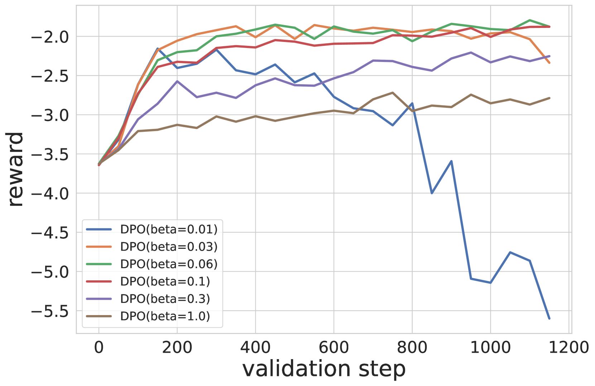

# 对比策略梯度：以监督友好的方式，对齐大型语言模型在序列级分数上的表现

发布时间：2024年06月27日

`Agent

这篇论文主要讨论了使用强化学习（RL）算法来微调大型语言模型（LLMs），以更好地对齐人类偏好和模型输出。论文提出了一种新的RL算法——对比策略梯度（CoPG），并探讨了其在离线数据上的应用，以及如何优化策略以适应不同的奖励类型。这与Agent的分类相符，因为Agent通常指的是能够根据环境反馈自主学习和调整策略的智能体，而强化学习是实现这一目标的常用方法。此外，论文中的工作涉及到对LLMs的微调和优化，这是Agent行为的一部分，因此归类为Agent。`

> Contrastive Policy Gradient: Aligning LLMs on sequence-level scores in a supervised-friendly fashion

# 摘要

> 强化学习（RL）通过利用基于人类偏好数据的奖励模型，已被用于微调大型语言模型（LLMs），以期更贴合人类判断。新近提出的直接对齐方法，因其简便、稳定且计算负担轻，能更直接地达成目标。然而，这些方法无法针对任意奖励进行优化，且基于偏好的奖励并非LLMs唯一关注的奖励类型（如代码生成的单元测试或摘要的文本蕴含等）。RL微调常采用策略梯度变体，这要求在线或近在线样本，生成成本高昂。我们提出了一种名为对比策略梯度（CoPG）的新型RL算法，它简单且在数学上严谨，能从离线数据中估算出最优策略，无需依赖重要性采样技术，并强调了正确状态基线的重要性。我们通过实验展示了CoPG如何推广直接对齐方法IPO及经典策略梯度，并在一个简单的强盗问题上验证了其特性，同时也在摘要任务上利用学得的奖励函数对LLMs进行了微调，该奖励函数在实验中被视为真实标准。

> Reinforcement Learning (RL) has been used to finetune Large Language Models (LLMs) using a reward model trained from preference data, to better align with human judgment. The recently introduced direct alignment methods, which are often simpler, more stable, and computationally lighter, can more directly achieve this. However, these approaches cannot optimize arbitrary rewards, and the preference-based ones are not the only rewards of interest for LLMs (eg., unit tests for code generation or textual entailment for summarization, among others). RL-finetuning is usually done with a variation of policy gradient, which calls for on-policy or near-on-policy samples, requiring costly generations. We introduce Contrastive Policy Gradient, or CoPG, a simple and mathematically principled new RL algorithm that can estimate the optimal policy even from off-policy data. It can be seen as an off-policy policy gradient approach that does not rely on important sampling techniques and highlights the importance of using (the right) state baseline. We show this approach to generalize the direct alignment method IPO (identity preference optimization) and classic policy gradient. We experiment with the proposed CoPG on a toy bandit problem to illustrate its properties, as well as for finetuning LLMs on a summarization task, using a learned reward function considered as ground truth for the purpose of the experiments.

[Arxiv](https://arxiv.org/abs/2406.19185)