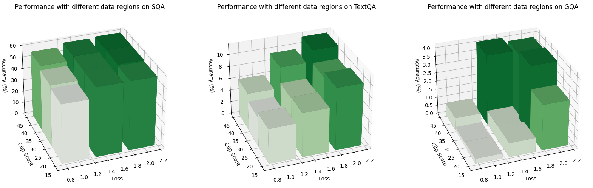
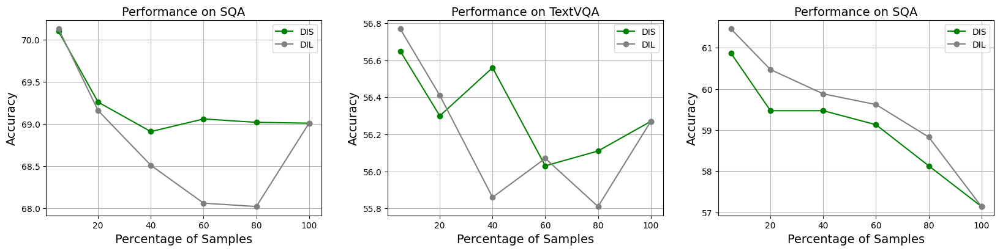
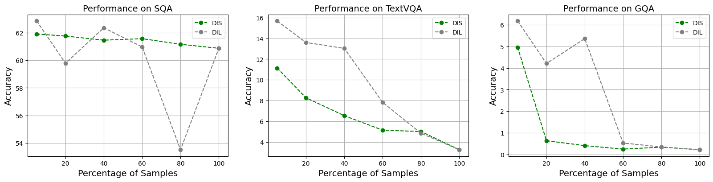
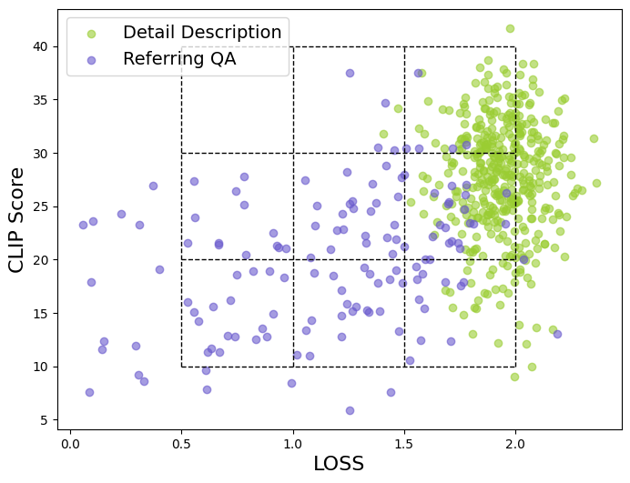
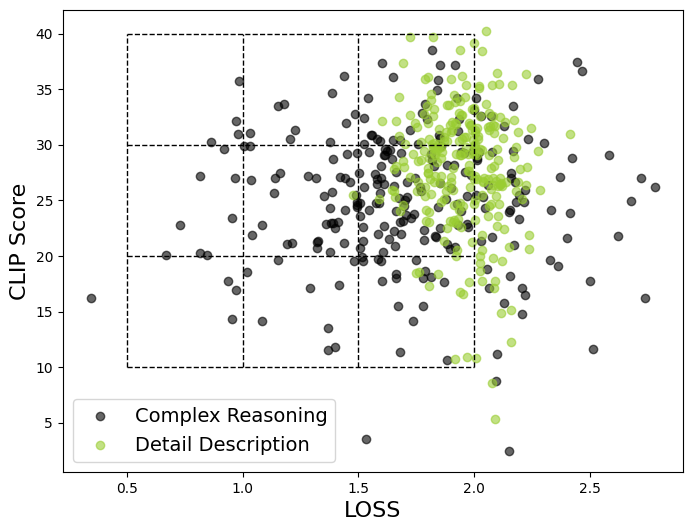
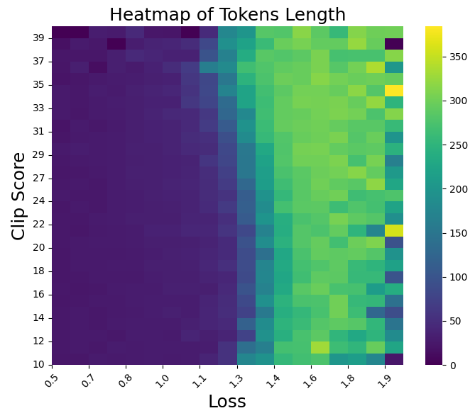

# 基于质量驱动的数据选择进行课程学习

发布时间：2024年06月27日

`LLM应用` `人工智能` `机器学习`

> Curriculum Learning with Quality-Driven Data Selection

# 摘要

> OpenAI的GPT-4以其卓越的跨模态能力，激发了对多模态大型语言模型（MLLMs）的研发热潮。通过机器生成的指令数据进行视觉指令调整，已证实能提升多任务的零-shot表现。然而，关于如何把控指令数据质量的研究尚浅。目前，MLLMs的数据选择多依赖于单一且不稳定的评分系统，或通过下游任务筛选，这些方法既耗时又易导致评估数据集的过拟合。为此，我们创新性地提出了一种数据选择策略，结合图像-文本相关性与模型困惑度，对数据质量进行多维度评估与筛选。这一策略将数据质量映射至二维空间，便于根据数据分布位置进行精准选择，并可探究任务类型提示对数据质量的影响。此外，该空间还能构建多阶段、多质量层次的数据子集，助力课程学习。我们在多个数据集上进行了详尽实验，结果显示，与全数据集相比，五项关键能力得到了显著提升。相关代码、数据及模型已公开分享，详情请访问：\url{https://anonymous.4open.science/r/EHIT-31B4}

> The impressive multimodal capabilities demonstrated by OpenAI's GPT-4 have generated significant interest in the development of Multimodal Large Language Models (MLLMs). Visual instruction tuning of MLLMs with machine-generated instruction-following data has shown to enhance zero-shot capabilities across various tasks. However, there has been limited exploration into controlling the quality of the instruction data.Current methodologies for data selection in MLLMs often rely on single, unreliable scores or use downstream tasks for selection, which is time-consuming and can lead to potential overfitting on the chosen evaluation datasets. To mitigate these limitations, we propose a novel data selection methodology that utilizes image-text correlation and model perplexity to evaluate and select data of varying quality. This approach leverages the distinct distribution of these two attributes, mapping data quality into a two-dimensional space that allows for the selection of data based on their location within this distribution. By utilizing this space, we can analyze the impact of task type settings, used as prompts, on data quality. Additionally, this space can be used to construct multi-stage subsets of varying quality to facilitate curriculum learning. Our research includes comprehensive experiments conducted on various datasets. The results emphasize substantial enhancements in five commonly assessed capabilities compared to using the complete dataset. Our codes, data, and models are publicly available at: \url{https://anonymous.4open.science/r/EHIT-31B4}

[Arxiv](https://arxiv.org/abs/2407.00102)