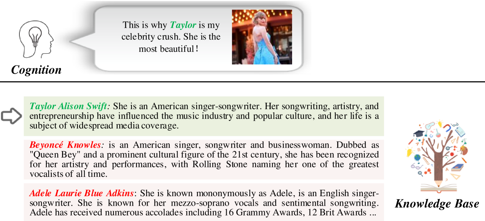
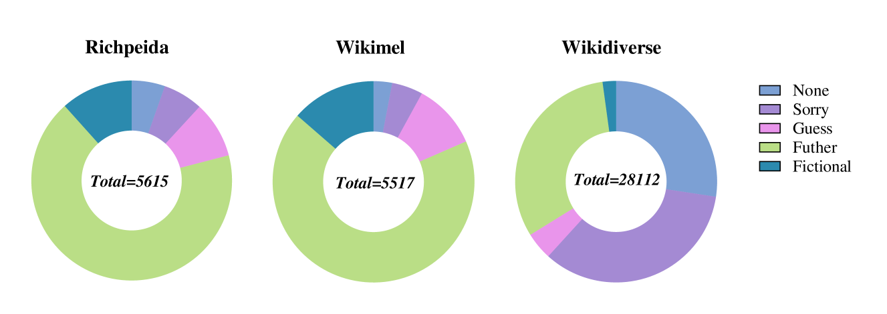
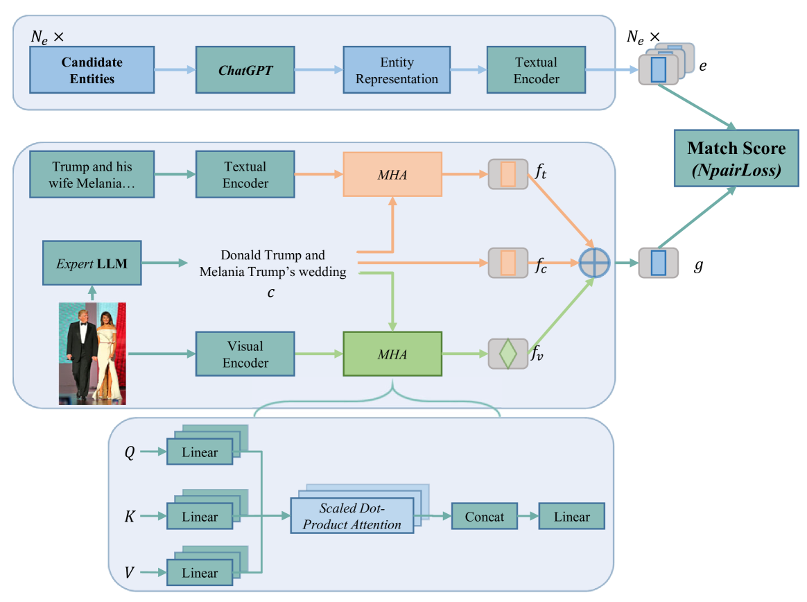

# DIM：动态融合多模态实体链接至大型语言模型

发布时间：2024年06月27日

`LLM应用` `知识图谱` `计算机视觉`

> DIM: Dynamic Integration of Multimodal Entity Linking with Large Language Model

# 摘要

> 本研究聚焦于多模态实体链接，旨在将多模态信息中的提及与知识库实体精准匹配。面对现有方法在实体表示模糊和图像信息利用不足的挑战，我们创新性地采用 ChatGPT 进行动态实体提取，有效增强数据集。同时，我们提出动态整合多模态信息与知识库（DIM）方法，借助大型语言模型（如 BLIP-2）的视觉理解力，从图像中精准提取实体相关信息，进而优化实体特征提取与动态实体表示的链接。实验结果显示，DIM 方法在原始及增强数据集上均表现卓越，达到业界领先水平。为确保研究可复现，相关代码与数据集已公开于 \url{https://github.com/season1blue/DIM}。

> Our study delves into Multimodal Entity Linking, aligning the mention in multimodal information with entities in knowledge base. Existing methods are still facing challenges like ambiguous entity representations and limited image information utilization. Thus, we propose dynamic entity extraction using ChatGPT, which dynamically extracts entities and enhances datasets. We also propose a method: Dynamically Integrate Multimodal information with knowledge base (DIM), employing the capability of the Large Language Model (LLM) for visual understanding. The LLM, such as BLIP-2, extracts information relevant to entities in the image, which can facilitate improved extraction of entity features and linking them with the dynamic entity representations provided by ChatGPT. The experiments demonstrate that our proposed DIM method outperforms the majority of existing methods on the three original datasets, and achieves state-of-the-art (SOTA) on the dynamically enhanced datasets (Wiki+, Rich+, Diverse+). For reproducibility, our code and collected datasets are released on \url{https://github.com/season1blue/DIM}.

[Arxiv](https://arxiv.org/abs/2407.12019)