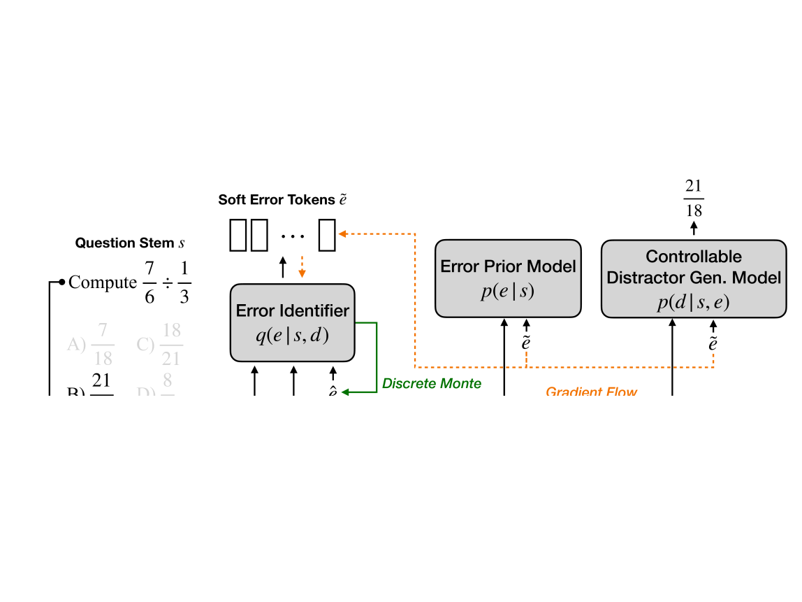
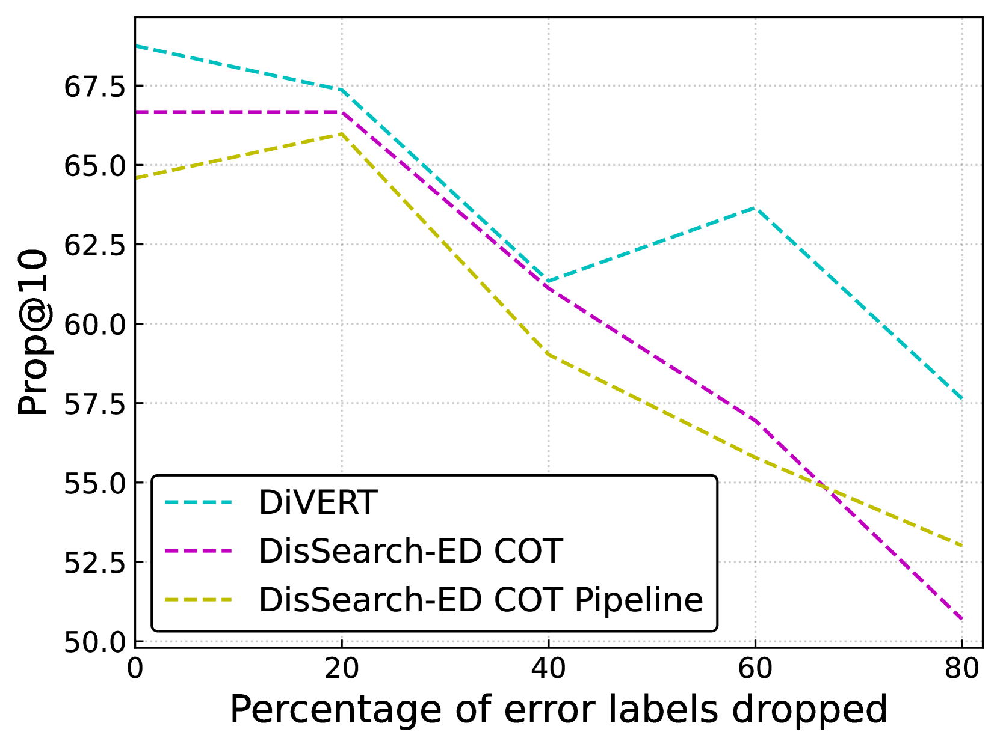
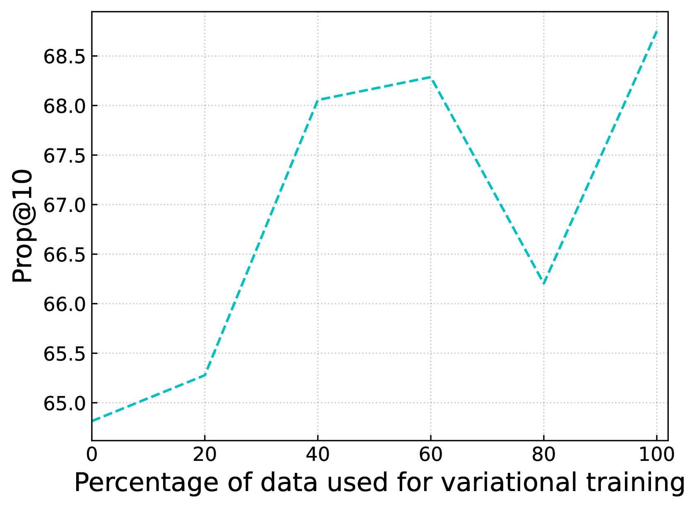

# DiVERT：数学多选题中，以文本形式呈现变分误差的干扰项生成技术

发布时间：2024年06月27日

`LLM应用

理由：这篇论文介绍了一种名为DiVERT的新方法，用于自动生成数学多选题中的干扰项，并提供了可解释的错误表示。该方法利用了大型语言模型（LLMs），并展示了在实际数据集上的有效性。这种方法的应用性质明显，因为它专注于解决实际问题（即生成高质量的干扰项），并且是在现有的LLM技术基础上进行创新。因此，它属于LLM应用类别。`

> DiVERT: Distractor Generation with Variational Errors Represented as Text for Math Multiple-choice Questions

# 摘要

> 在多选题（MCQs）中，高质量的干扰项对于评估和教学至关重要，但手动制作能准确反映学生知识漏洞或误解的干扰项实属不易。即便借助大型语言模型（LLMs），自动生成数学题的干扰项依旧充满挑战。关键在于，我们不仅要创造出看似合理的干扰项，还需洞察其背后的错误逻辑。本文推出的DiVERT（Distractor Generation with Variational Errors Represented as Text），采用了一种创新的变分方法，旨在为数学MCQs中的干扰项错误提供可解释的表示。实验基于一个包含1,434个问题的真实数学MCQ数据集，该数据集曾服务于数十万学生，结果显示，尽管DiVERT所依托的是一个基础的开源LLM，拥有70亿参数，但在干扰项生成方面，它超越了依赖GPT-4o的顶尖方法。此外，通过数学教育者的评估，我们发现DiVERT生成的错误标签质量与人工编写的相媲美。

> High-quality distractors are crucial to both the assessment and pedagogical value of multiple-choice questions (MCQs), where manually crafting ones that anticipate knowledge deficiencies or misconceptions among real students is difficult. Meanwhile, automated distractor generation, even with the help of large language models (LLMs), remains challenging for subjects like math. It is crucial to not only identify plausible distractors but also understand the error behind them. In this paper, we introduce DiVERT (Distractor Generation with Variational Errors Represented as Text), a novel variational approach that learns an interpretable representation of errors behind distractors in math MCQs. Through experiments on a real-world math MCQ dataset with 1,434 questions used by hundreds of thousands of students, we show that DiVERT, despite using a base open-source LLM with 7B parameters, outperforms state-of-the-art approaches using GPT-4o on downstream distractor generation. We also conduct a human evaluation with math educators and find that DiVERT leads to error labels that are of comparable quality to human-authored ones.

[Arxiv](https://arxiv.org/abs/2406.19356)