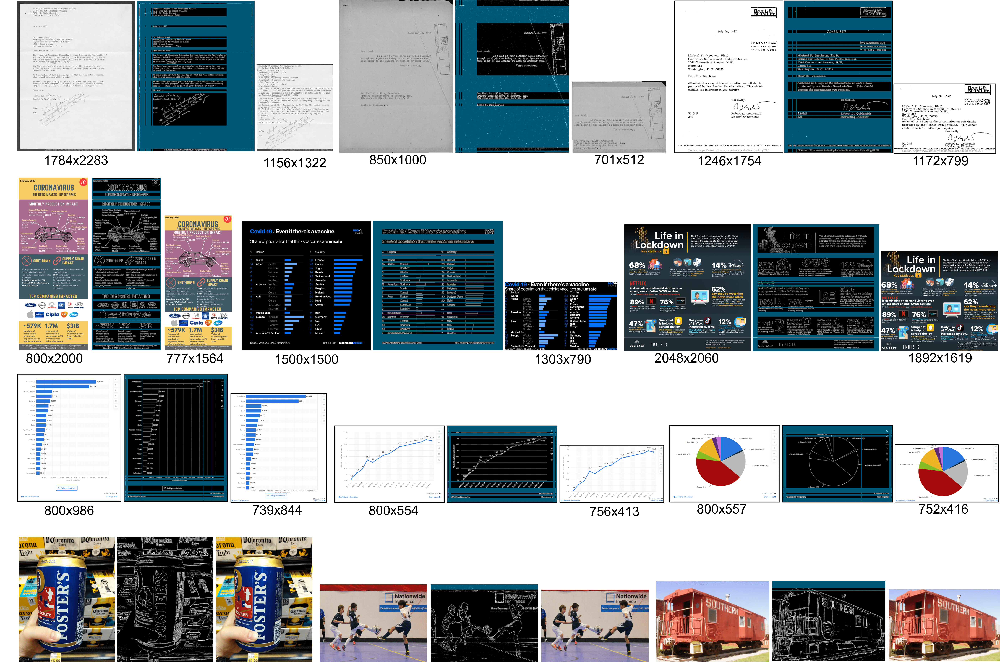

# DocKylin：一款大型多模态模型，专为视觉文档理解设计，通过高效的视觉瘦身技术提升性能。

发布时间：2024年06月27日

`LLM应用

理由：这篇论文介绍了一种名为DocKylin的多模态大型语言模型（MLLM），专门设计用于处理视觉文档理解（VDU）任务。论文中提到的DocKylin通过自适应像素精简（APS）和动态令牌精简（DTS）模块，有效地解决了高分辨率文档图像处理中的挑战，如计算成本和长上下文处理能力。这些创新点展示了LLM在特定应用场景下的优化和改进，因此属于LLM应用类别。` `文档处理` `视觉文档理解`

> DocKylin: A Large Multimodal Model for Visual Document Understanding with Efficient Visual Slimming

# 摘要

> 多模态大型语言模型（MLLMs）在处理高分辨率、文本密集且布局复杂的文档图像时，面临着视觉文档理解（VDU）任务的重大挑战。这些特性对MLLMs的细节感知能力提出了高要求。尽管提高输入分辨率有助于细节感知，但同时也增加了视觉令牌序列的长度，导致计算成本上升，并考验模型处理长上下文的能力。为此，我们推出了DocKylin，一种专为文档设计的MLLM，它通过在像素和令牌级别进行视觉内容精简，有效缩短了VDU场景中的令牌序列长度。DocKylin采用自适应像素精简（APS）预处理模块，提升信息像素的比重，并引入动态令牌精简（DTS）模块，筛选关键令牌，剔除非必要令牌，形成一个紧凑且自适应的视觉序列。实验结果显示，DocKylin在多个VDU基准测试中表现卓越。特别值得一提的是，APS和DTS模块均无需额外参数，易于整合进现有MLLMs，展现出广泛的应用前景。

> Current multimodal large language models (MLLMs) face significant challenges in visual document understanding (VDU) tasks due to the high resolution, dense text, and complex layouts typical of document images. These characteristics demand a high level of detail perception ability from MLLMs. While increasing input resolution improves detail perception, it also leads to longer sequences of visual tokens, increasing computational costs and straining the models' ability to handle long contexts. To address these challenges, we introduce DocKylin, a document-centric MLLM that performs visual content slimming at both the pixel and token levels, thereby reducing token sequence length in VDU scenarios. DocKylin utilizes an Adaptive Pixel Slimming (APS) preprocessing module to perform pixel-level slimming, increasing the proportion of informative pixels. Moreover, DocKylin incorporates a novel Dynamic Token Slimming (DTS) module to conduct token-level slimming, filtering essential tokens and removing others to create a compressed, adaptive visual sequence. Experiments demonstrate DocKylin's promising performance across various VDU benchmarks. Notably, both the proposed APS and DTS are parameter-free, facilitating easy integration into existing MLLMs, and our experiments indicate their potential for broader applications.

[Arxiv](https://arxiv.org/abs/2406.19101)