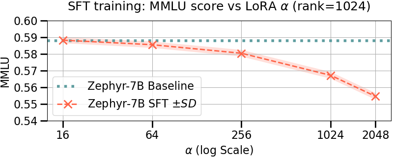
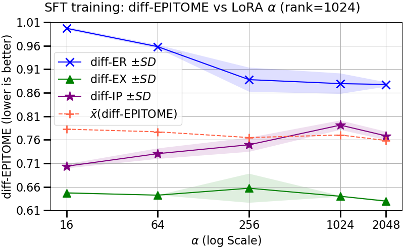
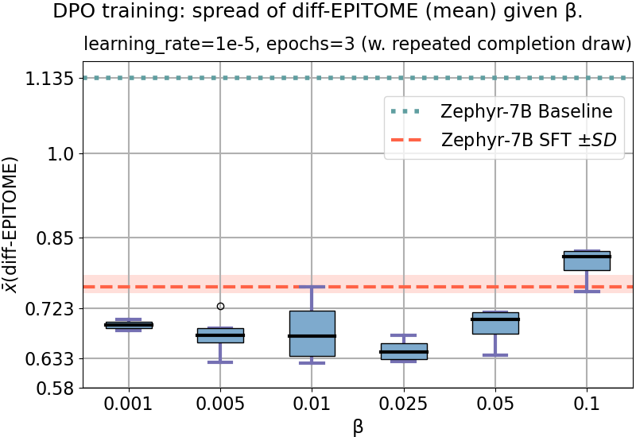
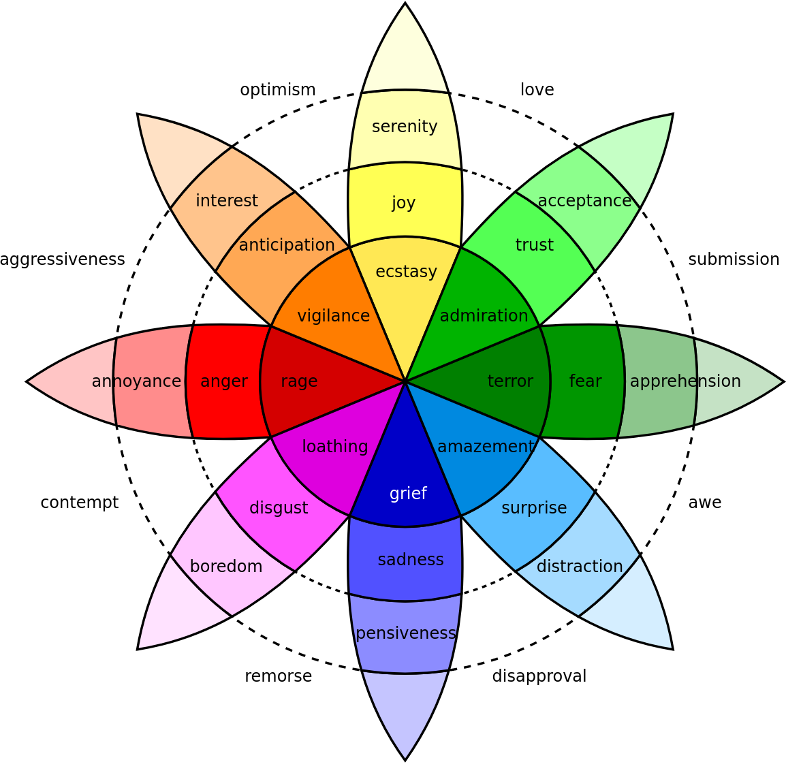
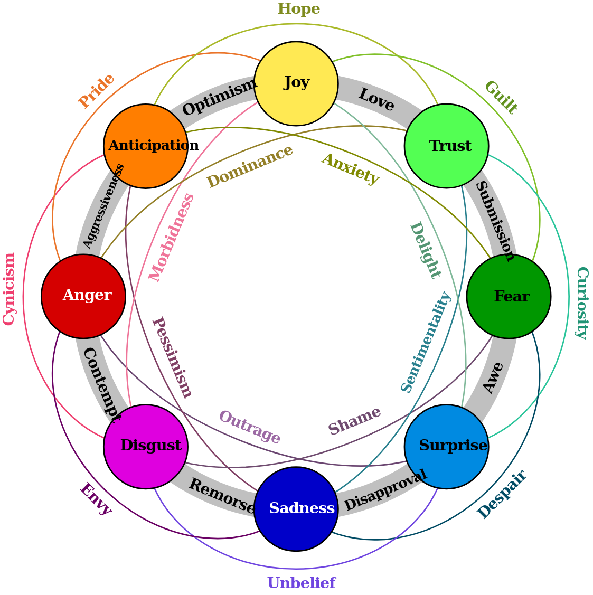

# EmPO：理论驱动下的共情响应生成数据集构建——偏好优化之道

发布时间：2024年06月27日

`Agent

这篇论文主要关注的是会话代理（Agent）中的共情响应生成问题，并提出了一种创新方法来优化大型语言模型（LLMs）以提高共情性和模型的泛化能力。虽然涉及到了LLMs的应用，但其核心在于提升会话代理的情感智能，因此更符合Agent分类。` `会话代理` `情感智能`

> EmPO: Theory-Driven Dataset Construction for Empathetic Response Generation through Preference Optimization

# 摘要

> 共情响应生成对于提升会话代理的吸引力与情感智能至关重要，它能够促进人与机器间的深入对话。尽管大型语言模型在此领域已取得进展，但如何确保响应的共情性与模型的泛化能力仍是挑战。本文提出了一种创新方法：通过构建理论驱动的偏好数据集，并运用偏好优化算法来优化LLMs，以应对这些难题。我们采用EmpatheticDialogues数据集，并结合diff-EPITOME与BERTscore指标来评估共情表现，同时在MMLU基准上检验模型的泛化能力。所有相关数据集、代码及模型均已公开。

> Empathetic response generation is a desirable aspect of conversational agents, crucial for facilitating engaging and emotionally intelligent multi-turn conversations between humans and machines. Leveraging large language models for this task has shown promising results, yet challenges persist in ensuring both the empathetic quality of the responses and retention of the generalization performance of the models. In this paper, we propose a novel approach where we construct theory-driven preference datasets and use them to align LLMs with preference optimization algorithms to address these challenges. To measure empathetic response generation, we employ the EmpatheticDialogues dataset, assessing empathy with the diff-EPITOME and BERTscore metrics, and evaluate the generalization performance on the MMLU benchmark. We make all datasets, source code, and models publicly available.

[Arxiv](https://arxiv.org/abs/2406.19071)