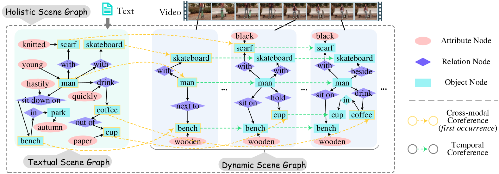
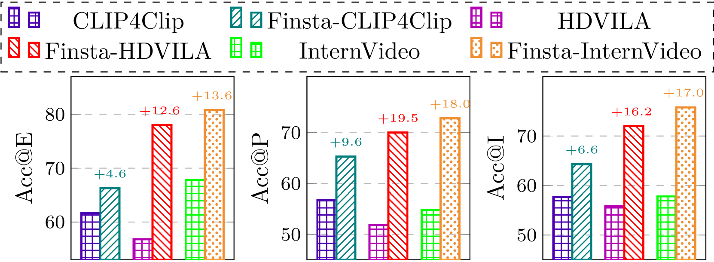

# 利用结构化时空对齐提升视频与语言的融合表达

发布时间：2024年06月27日

`RAG

理由：这篇论文主要介绍了一种名为Finsta的新方法，用于改进大规模视频-语言模型（VLMs）的性能，特别是在细粒度结构化时空对齐学习方面。这种方法通过创新的图Transformer结构和时空对齐策略，旨在解决现有VLMs在跨模态对齐和时间动态建模方面的不足。由于论文的核心贡献在于提出了一种新的模型架构和学习方法，以增强模型的性能和应用能力，因此它更适合归类为RAG（Representation and Alignment in Generative models），即在生成模型中的表示和校准技术。这与Agent（代理或智能体）、LLM应用（大型语言模型的应用）或LLM理论（大型语言模型的理论研究）的分类不符，因为这些分类更多关注的是模型的应用、理论基础或智能体的交互行为，而不是模型内部的结构和学习方法的改进。` `视频处理`

> Enhancing Video-Language Representations with Structural Spatio-Temporal Alignment

# 摘要

> 尽管大规模视频-语言模型（VLMs）预训练在多种下游任务中显示出巨大潜力，但现有模型仍存在诸如粗粒度跨模态对齐、时间动态建模不足等问题。为此，我们提出了一种名为Finsta的细粒度结构化时空对齐学习方法，旨在提升VLMs性能。首先，我们采用细粒度场景图（SG）结构来表示文本和视频，并将它们整合成一个整体SG（HSG）以促进模态间的连接。随后，我们构建了一个基于SG的框架，其中文本SG（TSG）通过图Transformer编码，而视频动态SG（DSG）和HSG则通过创新的循环图Transformer处理，以实现空间和时间特征的有效传播。此外，我们还开发了时空高斯微分图Transformer，以增强模型对物体时空变化的感知。基于TSG和DSG的精细结构特征，我们分别进行了以物体为中心的空间对齐和以谓词为中心的时间对齐，从而加强了视频与语言在空间和时间维度上的联系。我们的方法设计为即插即用系统，可无缝集成到现有VLMs中，无需重新训练或依赖下游任务的SG注释，即可实现性能提升。在涵盖标准和长格式视频的12个数据集上的6项代表性VL建模任务中，Finsta不仅持续提升了13个表现优异的VLMs，还在微调和零-shot设置下显著刷新了当前任务性能的最新记录。

> While pre-training large-scale video-language models (VLMs) has shown remarkable potential for various downstream video-language tasks, existing VLMs can still suffer from certain commonly seen limitations, e.g., coarse-grained cross-modal aligning , under-modeling of temporal dynamics, detached video-language view. In this work, we target enhancing VLMs with a fine-grained structural spatio-temporal alignment learning method (namely Finsta). First of all, we represent the input texts and videos with fine-grained scene graph (SG) structures, both of which are further unified into a holistic SG (HSG) for bridging two modalities. Then, an SG-based framework is built, where the textual SG (TSG) is encoded with a graph Transformer, while the video dynamic SG (DSG) and the HSG are modeled with a novel recurrent graph Transformer for spatial and temporal feature propagation. A spatial-temporal Gaussian differential graph Transformer is further devised to strengthen the sense of the changes in objects across spatial and temporal dimensions. Next, based on the fine-grained structural features of TSG and DSG, we perform object-centered spatial alignment and predicate-centered temporal alignment respectively, enhancing the video-language grounding in both the spatiality and temporality. We design our method as a plug&play system, which can be integrated into existing well-trained VLMs for further representation augmentation, without training from scratch or relying on SG annotations in downstream applications. On 6 representative VL modeling tasks over 12 datasets in both standard and long-form video scenarios, Finsta consistently improves the existing 13 strong-performing VLMs persistently, and refreshes the current state-of-the-art end task performance significantly in both the fine-tuning and zero-shot settings.

[Arxiv](https://arxiv.org/abs/2406.19255)