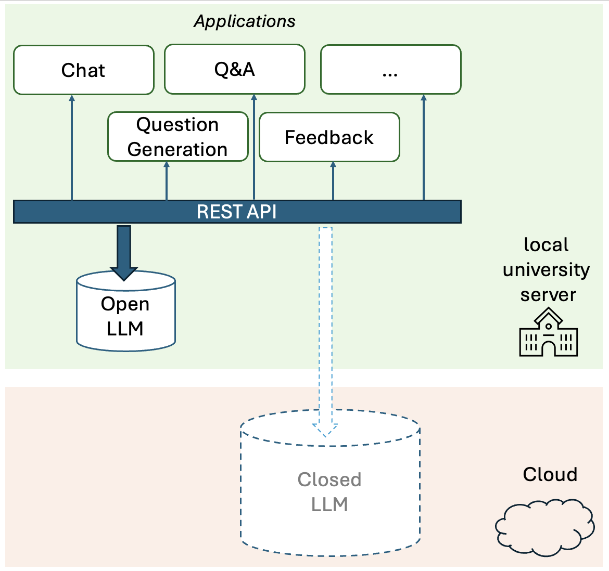
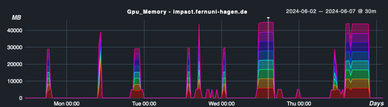
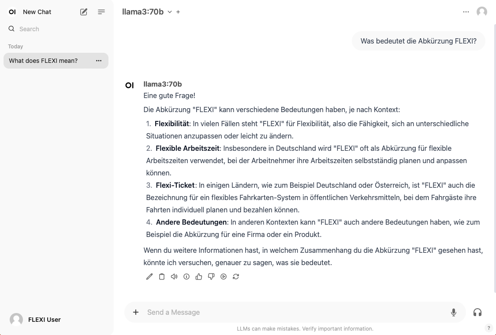

# FLEXI 项目通过提供开放的 LLM 访问，助力高等教育领域的实验与创新。

发布时间：2024年06月27日

`LLM应用` `信息技术`

> FernUni LLM Experimental Infrastructure (FLEXI) -- Enabling Experimentation and Innovation in Higher Education Through Access to Open Large Language Models

# 摘要

> 高等教育中LLMs的全面应用受限于访问难题。当前主流的两种访问方式是购买云端服务或自建本地开源模型。本文聚焦于FernUniversität in Hagen的FLEXI项目，探讨如何搭建开源LLM基础设施，并展示其在教学与研究中的实验潜力，旨在为是否采用本地开源LLM提供有力证据。同时，本文也为考虑自建LLM服务器的读者提供实用建议。

> Using the full potential of LLMs in higher education is hindered by challenges with access to LLMs. The two main access modes currently discussed are paying for a cloud-based LLM or providing a locally maintained open LLM. In this paper, we describe the current state of establishing an open LLM infrastructure at FernUniversität in Hagen under the project name FLEXI (FernUni LLM Experimental Infrastructure). FLEXI enables experimentation within teaching and research with the goal of generating strongly needed evidence in favor (or against) the use of locally maintained open LLMs in higher education. The paper will provide some practical guidance for everyone trying to decide whether to run their own LLM server.

[Arxiv](https://arxiv.org/abs/2407.13013)