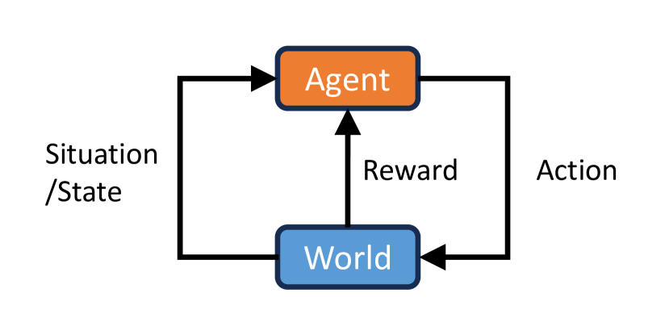
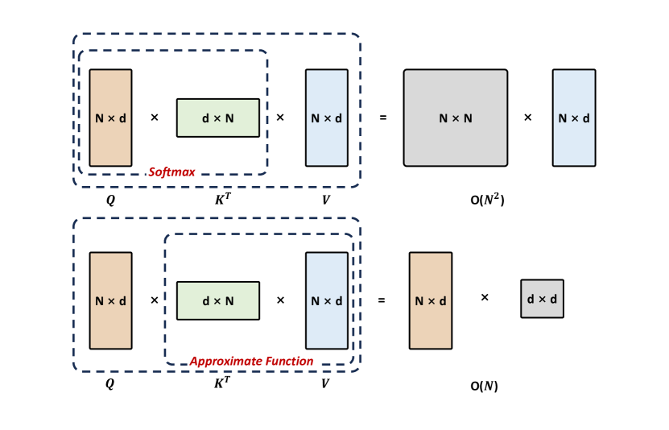
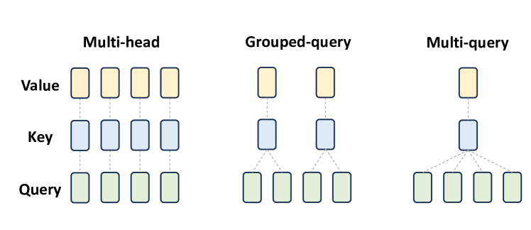
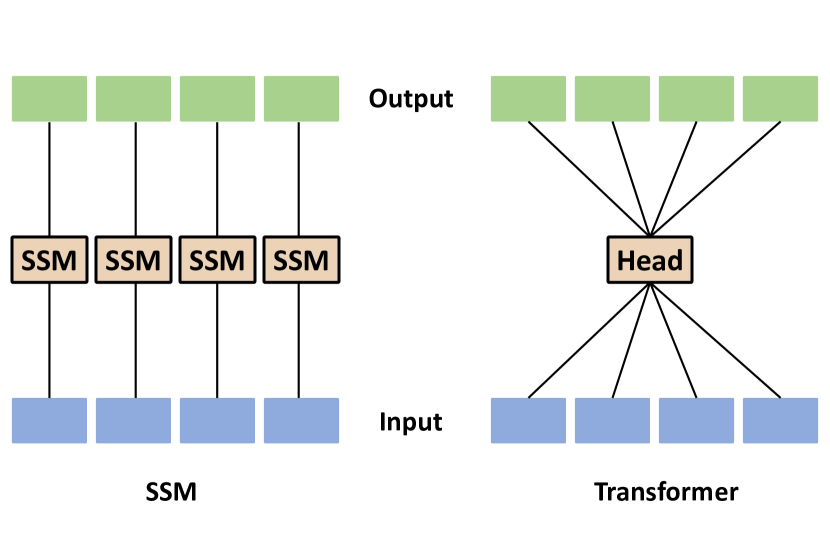
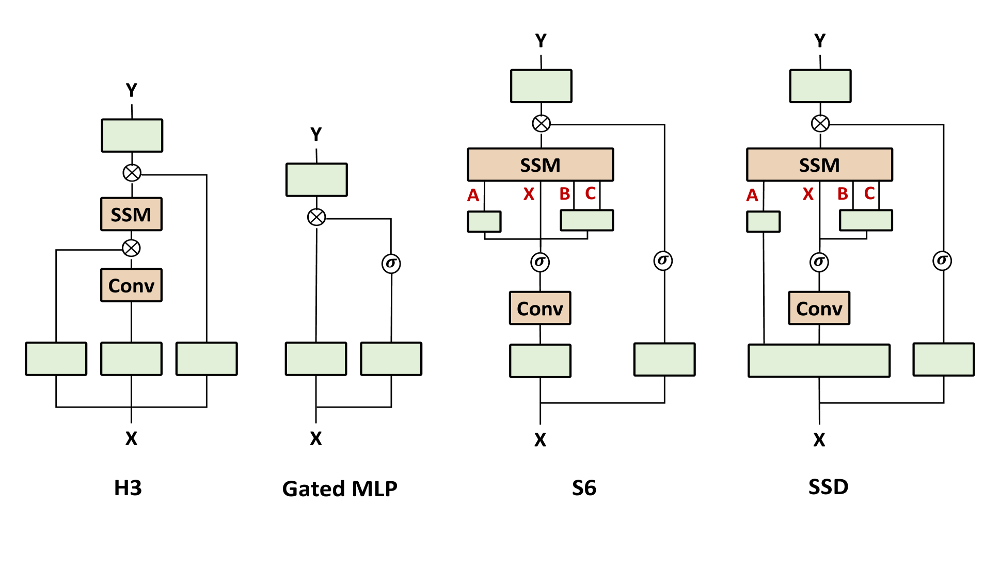
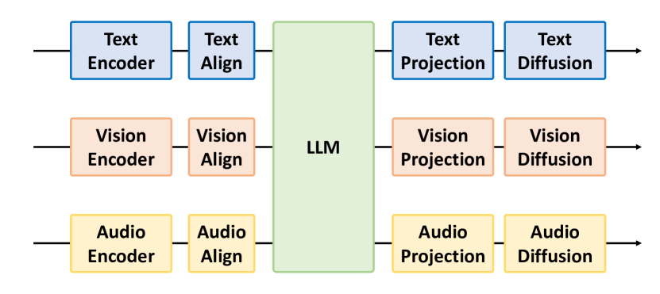
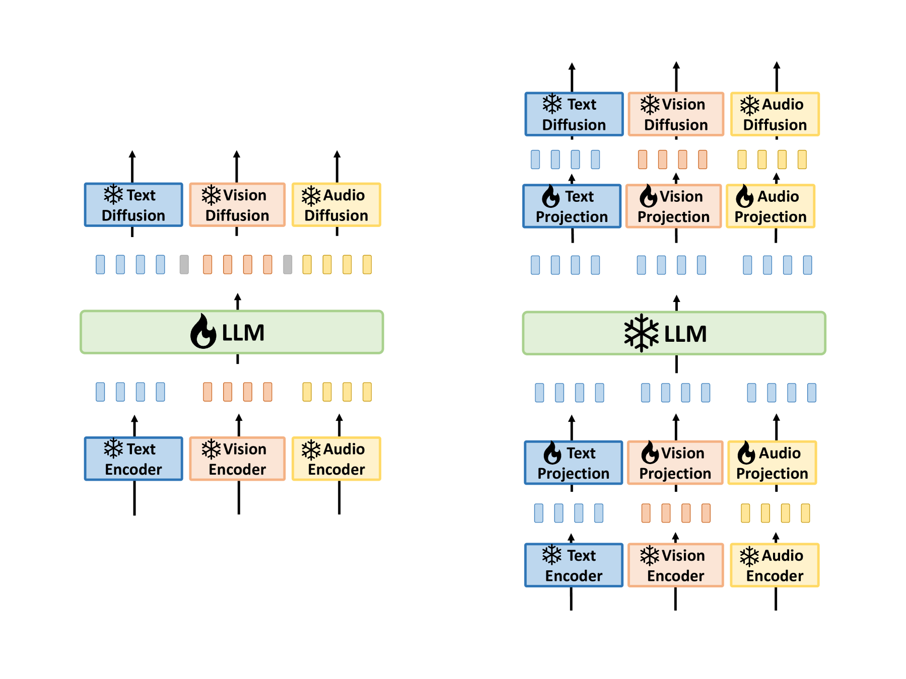
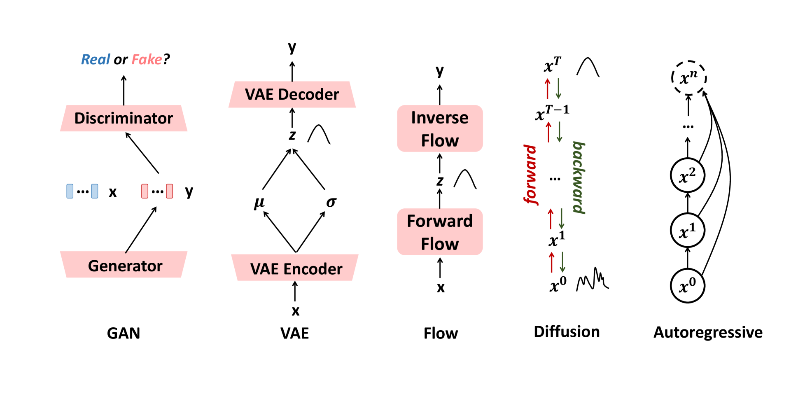

# 探索高效多模态模型至世界模型的演进：全面调查

发布时间：2024年06月27日

`LLM应用` `人工智能` `计算机视觉`

> From Efficient Multimodal Models to World Models: A Survey

# 摘要

> 多模态大型模型（MLMs）已成为研究热点，通过融合大型语言模型与多模态学习，跨越不同数据模态执行复杂任务。本文综述了MLMs的最新进展与挑战，强调其在通往人工通用智能和世界模型之路上的潜力。我们介绍了多模态思维链（M-COT）、多模态指令调优（M-IT）和多模态情境学习（M-ICL）等关键技术，并深入探讨了多模态模型的技术细节、应用场景及其设计特点。尽管成就斐然，但构建统一的多模态模型仍是一大难题。我们探讨了如何通过整合3D生成与具身智能来提升世界模拟能力，并建议引入外部规则系统以优化推理与决策。最后，我们指出了未来研究的方向，旨在克服这些挑战，推动领域进步。

> Multimodal Large Models (MLMs) are becoming a significant research focus, combining powerful large language models with multimodal learning to perform complex tasks across different data modalities. This review explores the latest developments and challenges in MLMs, emphasizing their potential in achieving artificial general intelligence and as a pathway to world models. We provide an overview of key techniques such as Multimodal Chain of Thought (M-COT), Multimodal Instruction Tuning (M-IT), and Multimodal In-Context Learning (M-ICL). Additionally, we discuss both the fundamental and specific technologies of multimodal models, highlighting their applications, input/output modalities, and design characteristics. Despite significant advancements, the development of a unified multimodal model remains elusive. We discuss the integration of 3D generation and embodied intelligence to enhance world simulation capabilities and propose incorporating external rule systems for improved reasoning and decision-making. Finally, we outline future research directions to address these challenges and advance the field.

[Arxiv](https://arxiv.org/abs/2407.00118)