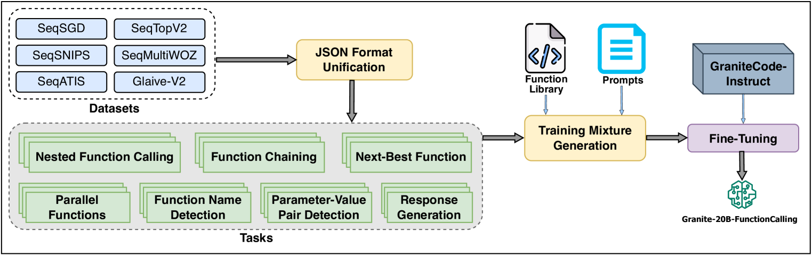
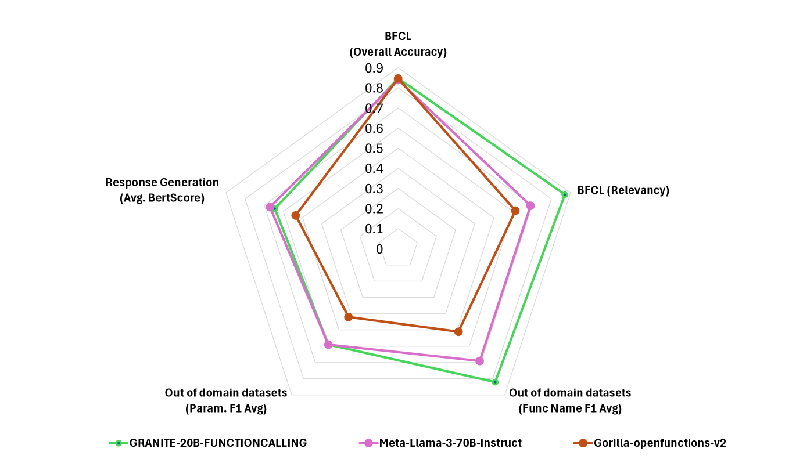
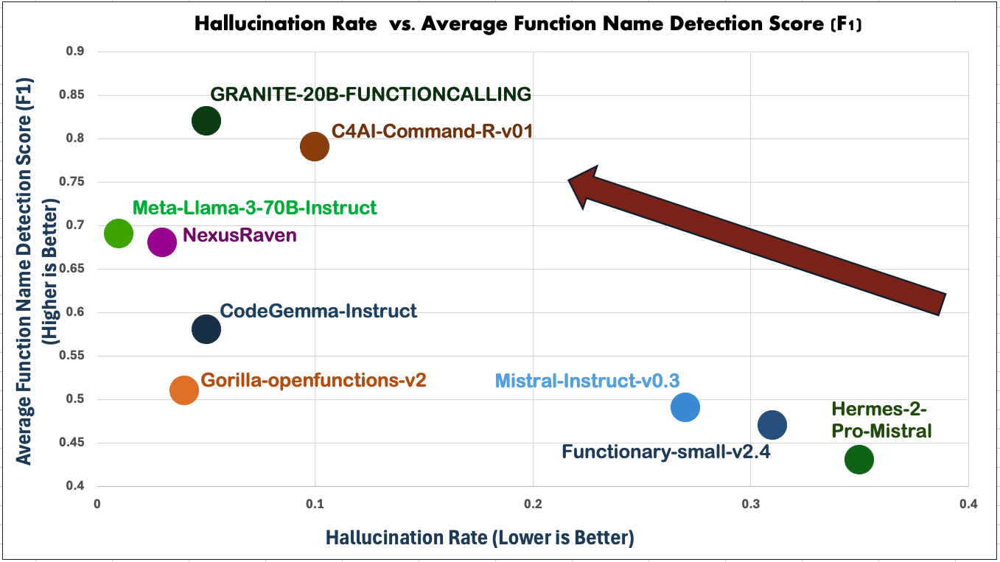

# 花岗岩功能调用模型：借助粒度任务的多任务学习，赋予功能调用新能力

发布时间：2024年06月27日

`Agent` `软件开发` `人工智能`

> Granite-Function Calling Model: Introducing Function Calling Abilities via Multi-task Learning of Granular Tasks

# 摘要

> 近期，大型语言模型（LLM）在作为代理系统核心方面展现出显著潜力，尤其在SWE-Bench和Agent-Bench等复杂基准测试中表现突出。但要充分发挥LLM作为自主代理的能力，关键在于其能否有效识别、调用并交互外部工具与API，以应对复杂任务，这一过程统称为“函数调用”。赋予LLM此项能力，不仅可让其访问最新领域特定信息，还能将部分任务外包给可靠工具，如Python解释器或计算器。尽管LLM在函数调用领域进步显著，但开放模型与GPT、Claude等专有模型相比，性能仍有差距。为此，我们推出了基于Apache 2.0许可的GRANITE-20B-FUNCTIONCALLING模型，该模型通过多任务训练，涵盖了函数调用的七大基础任务。在多个域外数据集的评估中，GRANITE-20B-FUNCTIONCALLING不仅在开放模型中表现最佳，总体排名也跻身前四。得益于其训练所用的多样化任务与数据集，该模型在多个任务上展现出卓越的泛化能力。

> Large language models (LLMs) have recently shown tremendous promise in serving as the backbone to agentic systems, as demonstrated by their performance in multi-faceted, challenging benchmarks like SWE-Bench and Agent-Bench. However, to realize the true potential of LLMs as autonomous agents, they must learn to identify, call, and interact with external tools and application program interfaces (APIs) to complete complex tasks. These tasks together are termed function calling. Endowing LLMs with function calling abilities leads to a myriad of advantages, such as access to current and domain-specific information in databases and knowledge sources, and the ability to outsource tasks that can be reliably performed by tools, e.g., a Python interpreter or calculator. While there has been significant progress in function calling with LLMs, there is still a dearth of open models that perform on par with proprietary LLMs like GPT, Claude, and Gemini. Therefore, in this work, we introduce the GRANITE-20B-FUNCTIONCALLING model under an Apache 2.0 license. The model is trained using a multi-task training approach on seven fundamental tasks encompassed in function calling, those being Nested Function Calling, Function Chaining, Parallel Functions, Function Name Detection, Parameter-Value Pair Detection, Next-Best Function, and Response Generation. We present a comprehensive evaluation on multiple out-of-domain datasets comparing GRANITE-20B-FUNCTIONCALLING to more than 15 other best proprietary and open models. GRANITE-20B-FUNCTIONCALLING provides the best performance among all open models on the Berkeley Function Calling Leaderboard and fourth overall. As a result of the diverse tasks and datasets used for training our model, we show that GRANITE-20B-FUNCTIONCALLING has better generalizability on multiple tasks in seven different evaluation datasets.

[Arxiv](https://arxiv.org/abs/2407.00121)