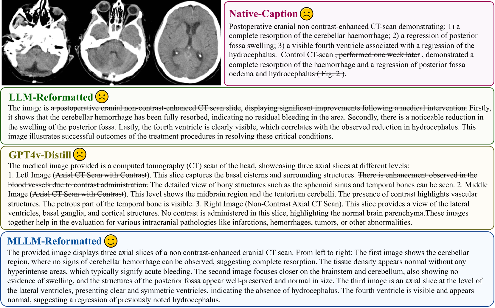
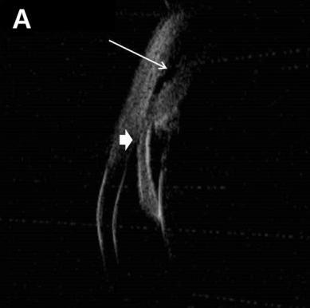

# HuatuoGPT-Vision：大规模注入医学视觉知识至多模态LLMs的探索

发布时间：2024年06月27日

`LLM应用

理由：这篇论文主要讨论了如何利用GPT-4V等大型多模态语言模型（MLLMs）来处理和改进医疗领域的多模态数据，特别是通过构建和优化PubMedVision数据集来提升医疗多模态任务的表现。论文中提到的具体应用包括数据去噪、重构以及训练新的医疗MLLM模型（HuatuoGPT-Vision），这些都是在实际应用场景中对LLM技术的具体应用，而非理论研究或Agent、RAG相关的研究。因此，将其归类为LLM应用是合适的。` `多模态学习`

> HuatuoGPT-Vision, Towards Injecting Medical Visual Knowledge into Multimodal LLMs at Scale

# 摘要

> 随着GPT-4V等MLLMs的迅猛发展，医疗领域的多模态能力取得了显著进步，但仍受限于医疗视觉-文本数据的稀缺与质量问题，这主要归咎于数据隐私和高昂的标注成本。尽管有研究利用PubMed的大规模去标识化医疗图像-文本对来弥补这一缺陷，但数据噪声问题依旧存在。为此，我们精心筛选了PubMed的医疗图像-文本对，并运用GPT-4V以“非盲”模式进行数据去噪和重构，成功构建了包含130万医疗VQA样本的PubMedVision数据集。验证结果显示：(1) PubMedVision极大地提升了现有MLLMs在医疗多模态任务中的表现，尤其是在MMMU健康与医学赛道等基准测试中；(2) 医学专家的审核及实证分析均证实，我们的数据集在质量上超越了其他同类构建方法。基于PubMedVision，我们训练出了34B参数的医疗MLLM HuatuoGPT-Vision，其在开源MLLMs中展现出了卓越的医疗多模态应用能力。

> The rapid development of multimodal large language models (MLLMs), such as GPT-4V, has led to significant advancements. However, these models still face challenges in medical multimodal capabilities due to limitations in the quantity and quality of medical vision-text data, stemming from data privacy concerns and high annotation costs. While pioneering approaches utilize PubMed's large-scale, de-identified medical image-text pairs to address these limitations, they still fall short due to inherent data noise. To tackle this, we refined medical image-text pairs from PubMed and employed MLLMs (GPT-4V) in an 'unblinded' capacity to denoise and reformat the data, resulting in the creation of the PubMedVision dataset with 1.3 million medical VQA samples. Our validation demonstrates that: (1) PubMedVision can significantly enhance the medical multimodal capabilities of current MLLMs, showing significant improvement in benchmarks including the MMMU Health & Medicine track; (2) manual checks by medical experts and empirical results validate the superior data quality of our dataset compared to other data construction methods. Using PubMedVision, we train a 34B medical MLLM HuatuoGPT-Vision, which shows superior performance in medical multimodal scenarios among open-source MLLMs.

[Arxiv](https://arxiv.org/abs/2406.19280)