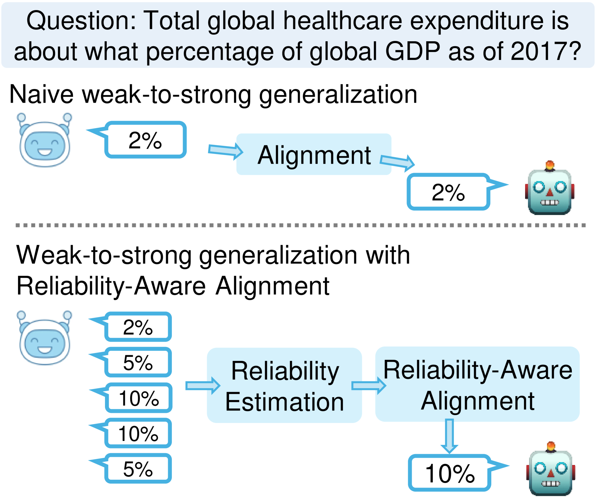
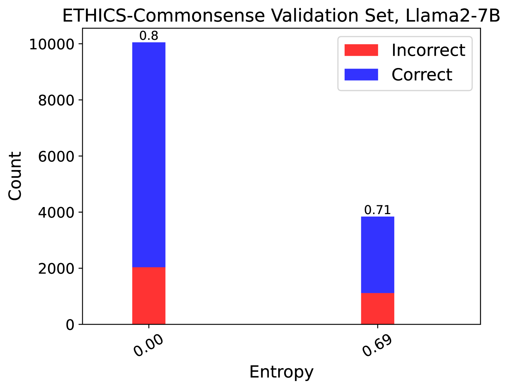

# 借助可靠性意识的对齐，提升从弱到强的泛化能力

发布时间：2024年06月27日

`LLM理论

这篇论文主要探讨了大型语言模型（LLMs）与人类知识对齐的问题，特别是在弱监督信号下的泛化能力。论文提出了一种新方法来评估和整合弱监督信号的可靠性，以优化对齐过程。这种方法涉及到对弱监督者提供的多个答案进行评估，并通过筛选或加权处理来提升对齐质量。因此，这项研究更多地关注于LLM的理论层面，即如何通过改进对齐方法来提高模型的泛化能力和准确性，而不是直接应用于特定的Agent或RAG系统，也不是关于LLM的具体应用案例。因此，将其归类为LLM理论是合适的。` `机器学习`

> Improving Weak-to-Strong Generalization with Reliability-Aware Alignment

# 摘要

> 大型语言模型（LLMs）正迅速超越人类，在众多自然语言任务中展现卓越能力。然而，将这些超人类模型与人类知识精准对齐仍是一大挑战，因为人类标注者的监督信号可能存在误差。这一难题，即“超对齐”问题，要求模型能从弱监督信号中实现强泛化。为此，我们提出了一种新方法，通过评估和整合弱监督信号的可靠性，优化对齐过程。具体而言，我们向弱监督者索取多个答案，评估其可靠性，并通过筛选或加权处理，提升对齐质量。实验结果显示，我们的方法能有效识别并提升弱标签质量，显著增强模型的泛化能力。我们的研究为模型对齐提供了鲁棒性强的技术，减少了噪声监督带来的误差传播，提高了LLMs的准确性与可靠性。相关代码已公开，可访问http://github.com/Irenehere/ReliableAlignment获取。

> Large language models (LLMs) are now rapidly advancing and surpassing human abilities on many natural language tasks. However, aligning these super-human LLMs with human knowledge remains challenging because the supervision signals from human annotators may be wrong. This issue, known as the "super-alignment" problem, requires enhancing weak-to-strong generalization, where a strong LLM must generalize from imperfect supervision provided by a weaker source. To address this issue, we propose an approach to improve weak-to-strong generalization by involving the reliability of weak supervision signals in the alignment process. In our method, we query the weak supervisor for multiple answers, estimate the answer reliability, and enhance the alignment process by filtering out uncertain data or re-weighting reliable data. Experiments on four datasets demonstrate that our methods effectively identify the quality of weak labels and significantly enhance weak-to-strong generalization. Our work presents effective techniques for error-robust model alignment, reducing error propagation from noisy supervision and enhancing the accuracy and reliability of LLMs. Codes are publicly available at http://github.com/Irenehere/ReliableAlignment.

[Arxiv](https://arxiv.org/abs/2406.19032)