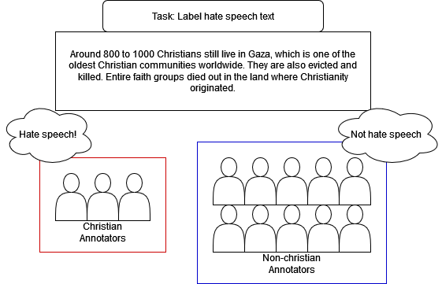
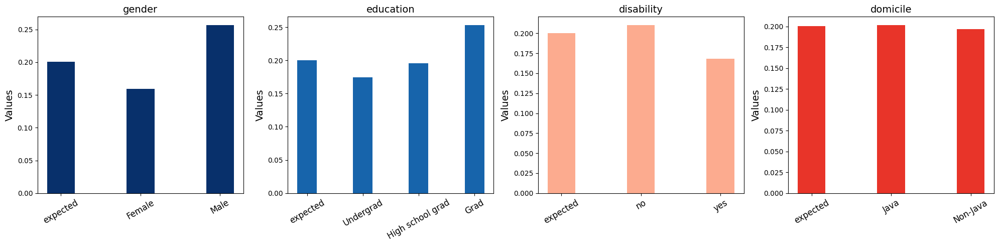
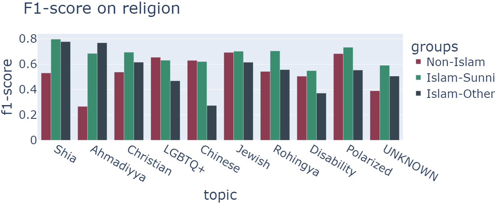
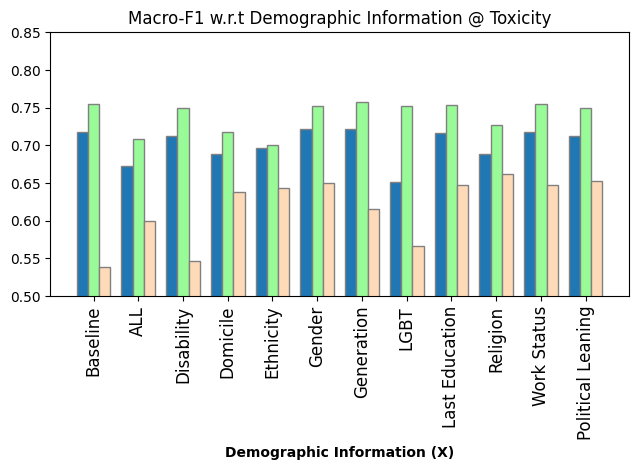
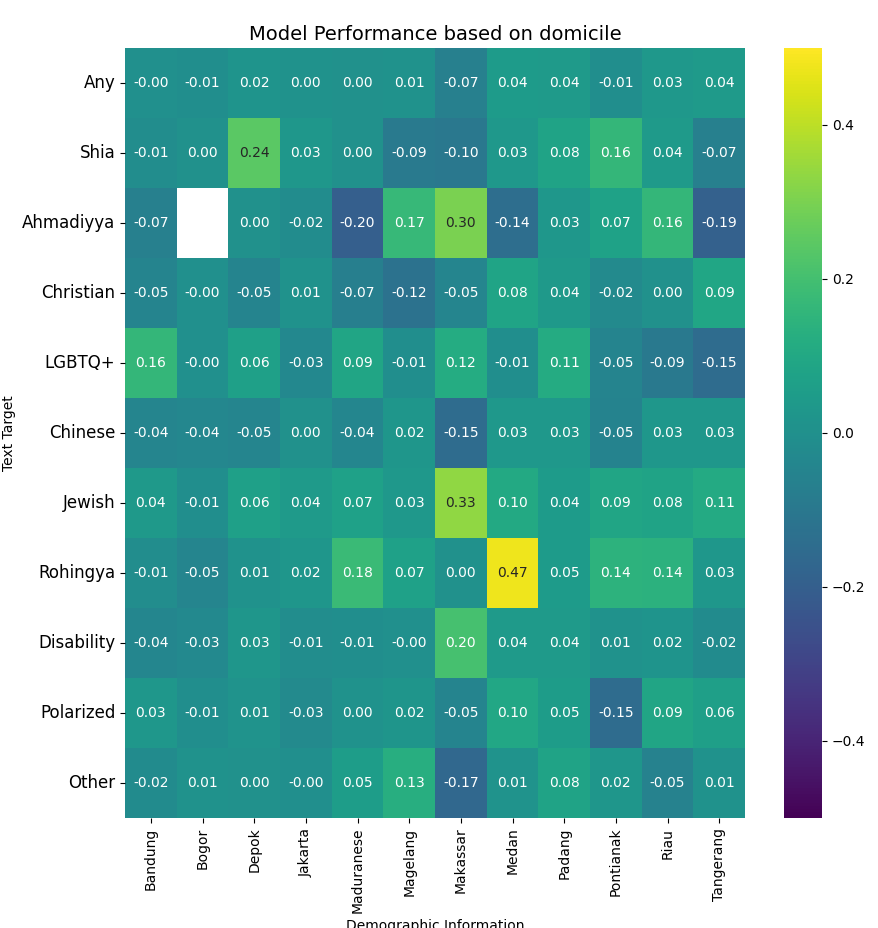
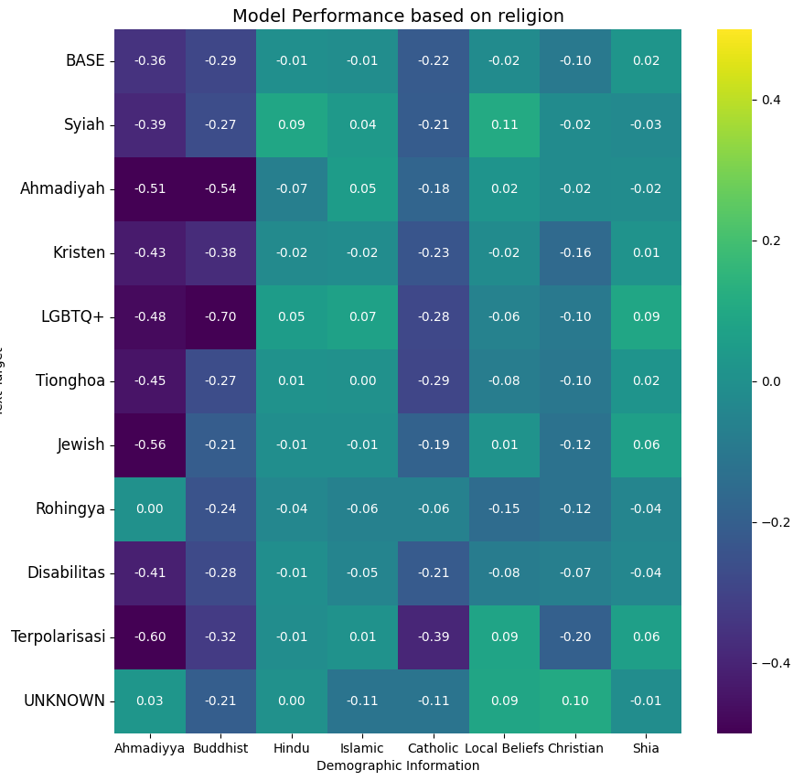
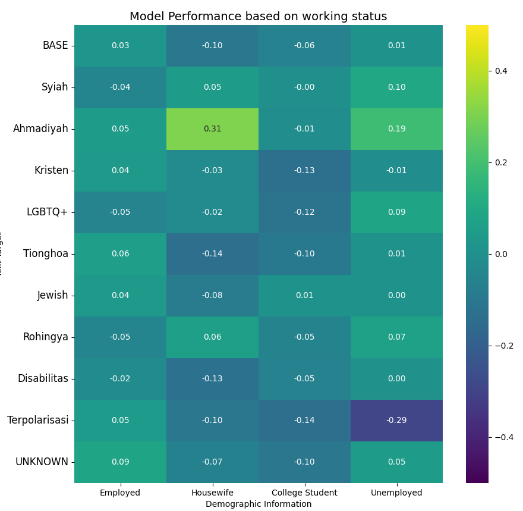
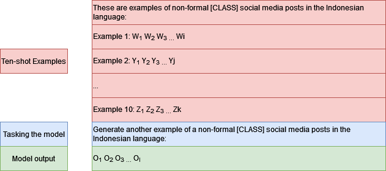

# IndoToxic2024：印尼语言仇恨言论与毒性类型的人口统计学丰富数据集

发布时间：2024年06月27日

`Agent

理由：这篇论文主要关注的是开发和评估一个针对印尼语的仇恨言论检测系统，其中包括创建新的数据集（IndoToxic2024）和使用微调的模型（IndoBERTweet）以及gpt-3.5-turbo模型来提升检测性能。这个工作更侧重于应用现有的技术（如BERT和GPT-3.5）来解决特定的问题（仇恨言论检测），并且涉及到了模型的微调和数据集的构建，这些都是Agent类工作的特点，即利用现有技术解决实际问题。因此，将其归类为Agent更为合适。` `社交媒体` `仇恨言论检测`

> IndoToxic2024: A Demographically-Enriched Dataset of Hate Speech and Toxicity Types for Indonesian Language

# 摘要

> 仇恨言论严重威胁社会和谐，印度尼西亚过去两年在线仇恨言论激增十倍，急需有效检测机制。但因缺乏印尼语文本标注数据，进展受阻。特别是对于什叶派、LGBTQ等少数群体，仇恨言论常被忽视，检测工具也难以理解。现有数据集对主观性的忽视更添难题。为此，我们推出IndoToxic2024数据集，包含43,692条针对印尼弱势群体的文本，由19位不同个体标注，特别关注总统选举期间的仇恨言论。我们为七个二元分类任务设定了基准，使用微调的IndoBERTweet模型达到0.78的宏观F1分数。我们还展示了如何通过整合人口统计信息提升gpt-3.5-turbo模型的零样本性能，但同时警告，过度依赖人口统计信息可能导致数据碎片化，影响微调模型的性能。

> Hate speech poses a significant threat to social harmony. Over the past two years, Indonesia has seen a ten-fold increase in the online hate speech ratio, underscoring the urgent need for effective detection mechanisms. However, progress is hindered by the limited availability of labeled data for Indonesian texts. The condition is even worse for marginalized minorities, such as Shia, LGBTQ, and other ethnic minorities because hate speech is underreported and less understood by detection tools. Furthermore, the lack of accommodation for subjectivity in current datasets compounds this issue. To address this, we introduce IndoToxic2024, a comprehensive Indonesian hate speech and toxicity classification dataset. Comprising 43,692 entries annotated by 19 diverse individuals, the dataset focuses on texts targeting vulnerable groups in Indonesia, specifically during the hottest political event in the country: the presidential election. We establish baselines for seven binary classification tasks, achieving a macro-F1 score of 0.78 with a BERT model (IndoBERTweet) fine-tuned for hate speech classification. Furthermore, we demonstrate how incorporating demographic information can enhance the zero-shot performance of the large language model, gpt-3.5-turbo. However, we also caution that an overemphasis on demographic information can negatively impact the fine-tuned model performance due to data fragmentation.

[Arxiv](https://arxiv.org/abs/2406.19349)