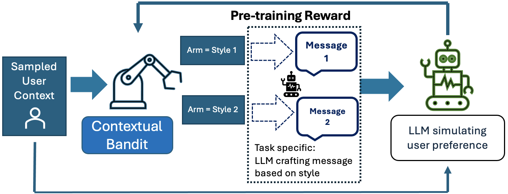
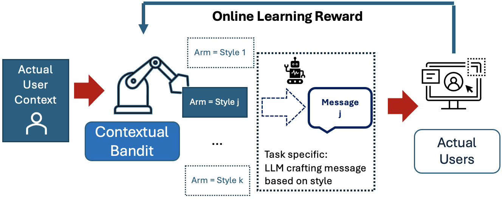
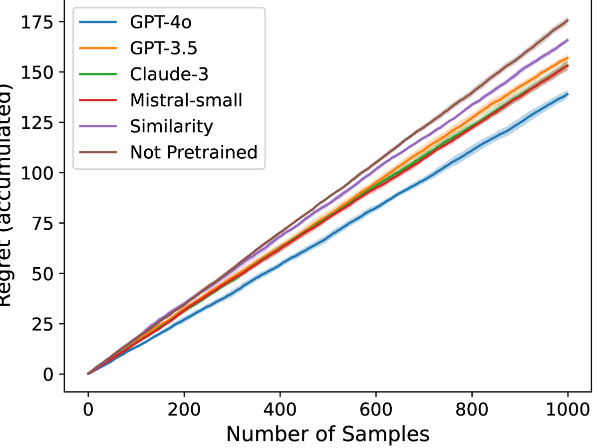
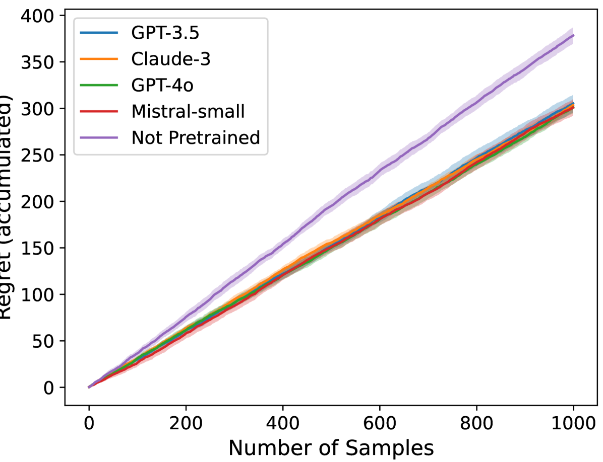

# 借助LLM生成的先验知识，快速启动多臂老虎机策略

发布时间：2024年06月27日

`Agent

理由：这篇论文探讨了如何将大型语言模型（LLMs）与情境多臂老虎机框架结合，以模拟人类行为并优化推荐系统。这种结合涉及到创建一个能够根据用户情境做出决策的智能体（Agent），该智能体利用LLMs来生成近似人类偏好的预训练数据集，从而减少在线学习遗憾和数据收集成本。因此，这篇论文的内容更符合Agent分类，因为它涉及到了智能体的创建和应用。` `推荐系统` `在线学习`

> Jump Starting Bandits with LLM-Generated Prior Knowledge

# 摘要

> 我们展示了将大型语言模型（LLMs）与情境多臂老虎机框架结合的显著优势。情境多臂老虎机在推荐系统中广泛应用，能根据用户情境提供个性化建议。我们发现，通过丰富的人类知识与偏好预训练的LLMs，能精准模拟人类行为，有效启动情境多臂老虎机，降低在线学习遗憾。我们提出了一种新的初始化算法，利用LLMs生成近似人类偏好的预训练数据集，大幅减少了在线学习遗憾及数据收集成本。通过两组实验，我们的方法得到了验证：一组实验中LLMs作为预言机，另一组则使用了来自联合调查实验的真实数据。

> We present substantial evidence demonstrating the benefits of integrating Large Language Models (LLMs) with a Contextual Multi-Armed Bandit framework. Contextual bandits have been widely used in recommendation systems to generate personalized suggestions based on user-specific contexts. We show that LLMs, pre-trained on extensive corpora rich in human knowledge and preferences, can simulate human behaviours well enough to jump-start contextual multi-armed bandits to reduce online learning regret. We propose an initialization algorithm for contextual bandits by prompting LLMs to produce a pre-training dataset of approximate human preferences for the bandit. This significantly reduces online learning regret and data-gathering costs for training such models. Our approach is validated empirically through two sets of experiments with different bandit setups: one which utilizes LLMs to serve as an oracle and a real-world experiment utilizing data from a conjoint survey experiment.

[Arxiv](https://arxiv.org/abs/2406.19317)