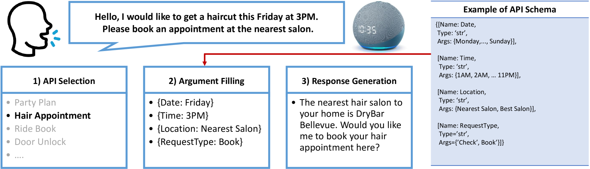
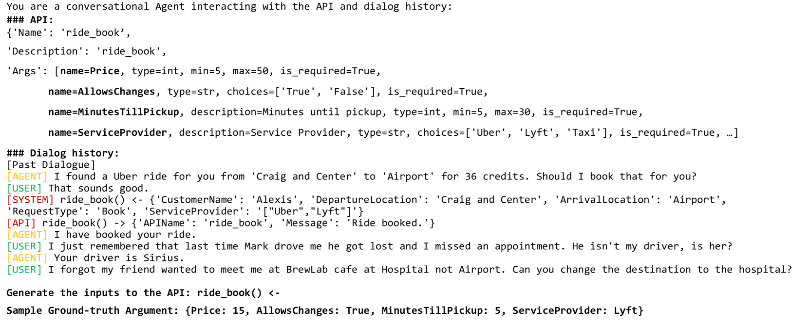
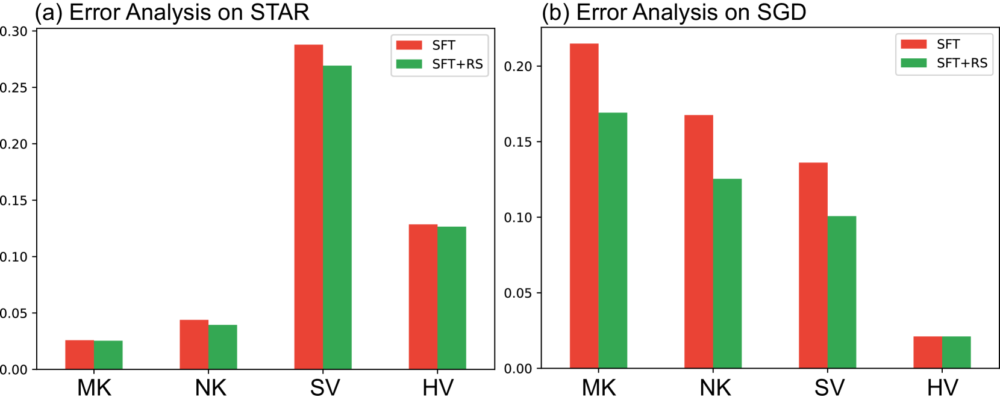
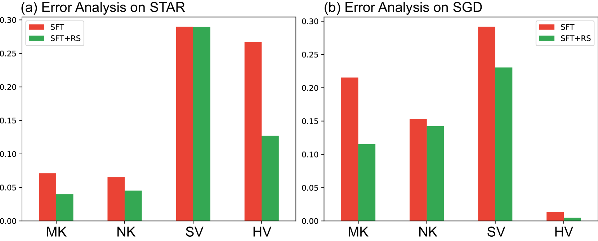

# 面向任务对话系统中，基于 LLM 的 API 参数填充框架

发布时间：2024年06月27日

`LLM应用` `软件开发` `人工智能`

> LLM-based Frameworks for API Argument Filling in Task-Oriented Conversational Systems

# 摘要

> 面向任务的对话代理通过外部API与用户互动并提供帮助。这类系统通常分为三个阶段：API选择、参数填充和响应生成。我们专注于参数填充任务，即准确提供API所需参数。理解对话历史和API模式后，该任务需向API传递关键信息，以促成有效代理动作。本文探讨了大型语言模型（LLMs）在API参数填充中的应用。初步研究发现，LLMs需额外接地步骤以优化参数填充，这激发了我们设计训练与提示框架的灵感。实验显示，结合新技术的LLMs在参数填充上表现更佳，为自动化参数填充框架的构建指明了新方向。

> Task-orientated conversational agents interact with users and assist them via leveraging external APIs. A typical task-oriented conversational system can be broken down into three phases: external API selection, argument filling, and response generation. The focus of our work is the task of argument filling, which is in charge of accurately providing arguments required by the selected API. Upon comprehending the dialogue history and the pre-defined API schema, the argument filling task is expected to provide the external API with the necessary information to generate a desirable agent action. In this paper, we study the application of Large Language Models (LLMs) for the problem of API argument filling task. Our initial investigation reveals that LLMs require an additional grounding process to successfully perform argument filling, inspiring us to design training and prompting frameworks to ground their responses. Our experimental results demonstrate that when paired with proposed techniques, the argument filling performance of LLMs noticeably improves, paving a new way toward building an automated argument filling framework.

[Arxiv](https://arxiv.org/abs/2407.12016)