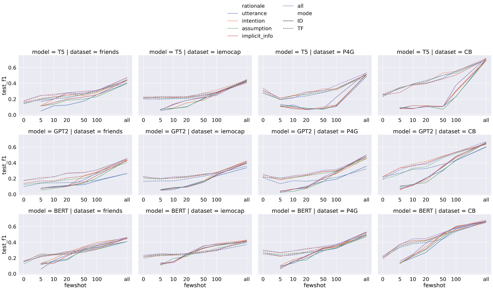
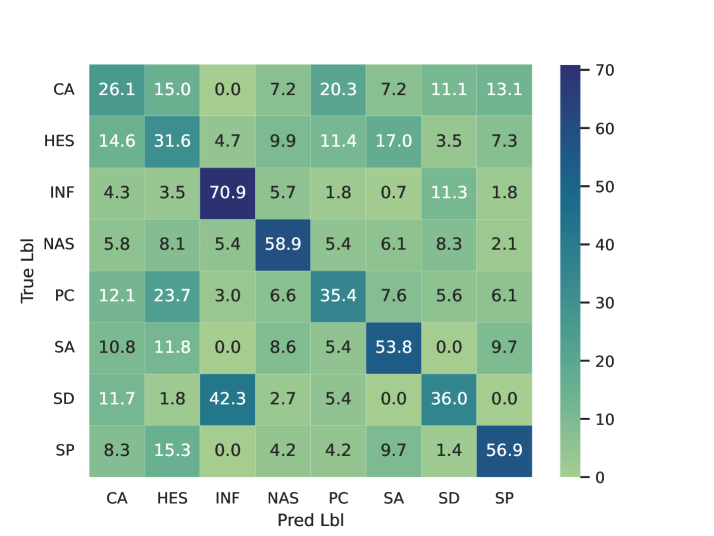
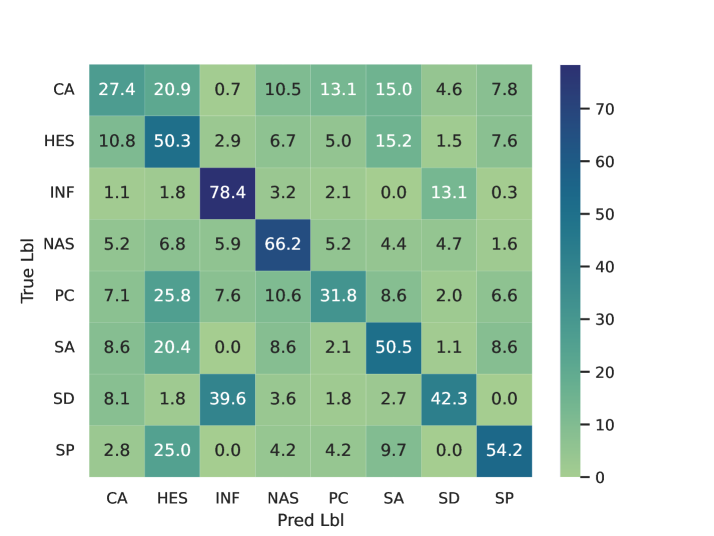

# 借助机器生成的理由，提升对话中社会意义的识别效率

发布时间：2024年06月27日

`LLM应用` `社会科学` `人工智能`

> Leveraging Machine-Generated Rationales to Facilitate Social Meaning Detection in Conversations

# 摘要

> 我们开发了一种利用 LLM 的泛化分类方法，旨在提升对话中隐含社会意义的识别。通过设计多维度提示，我们提取了连接表面线索与深层社会意义的推理文本。这些提取的解释作为对话文本的补充，增强了对话的理解与应用。在 2,340 个实验中，我们验证了这些补充的积极效果。无论是领域内分类还是零-shot 及少-shot 的领域转移，我们的方法在两种社会意义检测任务中均表现出色，涉及两个不同语料库。

> We present a generalizable classification approach that leverages Large Language Models (LLMs) to facilitate the detection of implicitly encoded social meaning in conversations. We design a multi-faceted prompt to extract a textual explanation of the reasoning that connects visible cues to underlying social meanings. These extracted explanations or rationales serve as augmentations to the conversational text to facilitate dialogue understanding and transfer. Our empirical results over 2,340 experimental settings demonstrate the significant positive impact of adding these rationales. Our findings hold true for in-domain classification, zero-shot, and few-shot domain transfer for two different social meaning detection tasks, each spanning two different corpora.

[Arxiv](https://arxiv.org/abs/2406.19545)