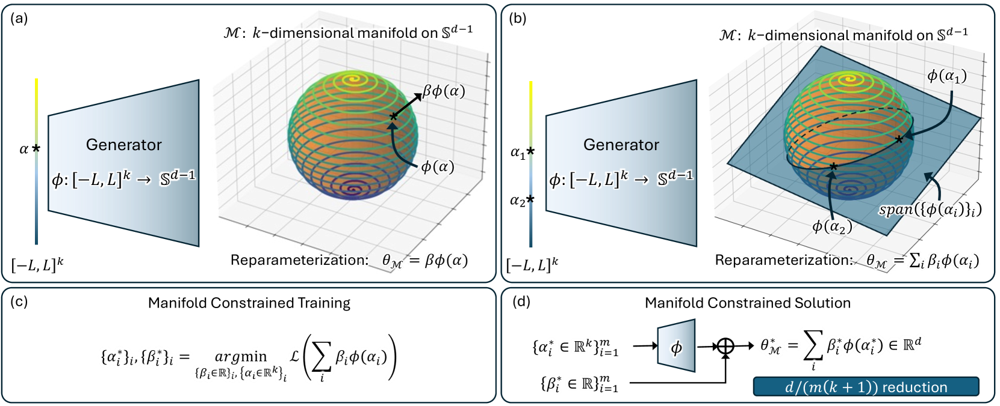
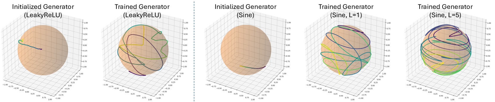
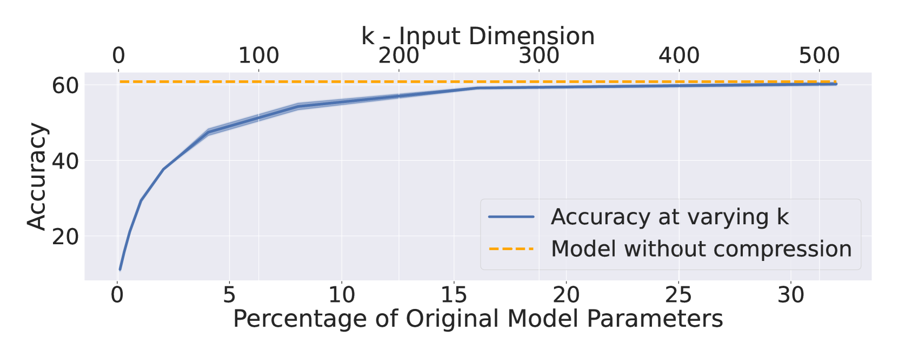

# MCNC：流形约束下的网络压缩技术

发布时间：2024年06月27日

`LLM理论

理由：这篇论文主要探讨了大型基础模型（如LLM）的压缩方法，提出了一种名为MCNC的新型压缩技术。这种技术通过将参数空间约束在预设的低维非线性流形上来实现模型压缩。论文的研究重点在于理论层面的模型压缩和优化，而不是具体的应用场景或Agent的行为，也不是RAG（Retrieval-Augmented Generation）相关的研究。因此，它更符合LLM理论的分类。` `计算机视觉`

> MCNC: Manifold Constrained Network Compression

# 摘要

> 大型基础模型在多样的任务中表现卓越，从计算机视觉到语音和自然语言处理，这大大增加了对其的需求。然而，由于其庞大的体积（如GPT-3的350GB），存储和传输这些模型面临巨大挑战。近期研究聚焦于通过压缩原始权重或减少微调所需参数来简化这些模型。这些方法通常通过限制参数空间，例如采用低秩重参数化（LoRA）或量化（QLoRA）技术来实现。本文中，我们提出了一种名为MCNC的新型压缩方法，它将参数空间约束在预设的低维非线性流形上，这些流形是冻结的，能有效覆盖整个空间。鉴于深度神经网络中过度参数化带来的良好解决方案的普遍性，我们发现通过将参数空间限制在我们提出的流形上，不仅能在多种任务中实现前所未有的压缩率，还能找到高质量的解决方案。通过在计算机视觉和自然语言处理任务上的广泛实验，我们展示了MCNC方法在压缩、准确性和模型重建时间方面均显著超越了现有技术水平。

> The outstanding performance of large foundational models across diverse tasks-from computer vision to speech and natural language processing-has significantly increased their demand. However, storing and transmitting these models pose significant challenges due to their massive size (e.g., 350GB for GPT-3). Recent literature has focused on compressing the original weights or reducing the number of parameters required for fine-tuning these models. These compression methods typically involve constraining the parameter space, for example, through low-rank reparametrization (e.g., LoRA) or quantization (e.g., QLoRA) during model training. In this paper, we present MCNC as a novel model compression method that constrains the parameter space to low-dimensional pre-defined and frozen nonlinear manifolds, which effectively cover this space. Given the prevalence of good solutions in over-parameterized deep neural networks, we show that by constraining the parameter space to our proposed manifold, we can identify high-quality solutions while achieving unprecedented compression rates across a wide variety of tasks. Through extensive experiments in computer vision and natural language processing tasks, we demonstrate that our method, MCNC, significantly outperforms state-of-the-art baselines in terms of compression, accuracy, and/or model reconstruction time.

[Arxiv](https://arxiv.org/abs/2406.19301)