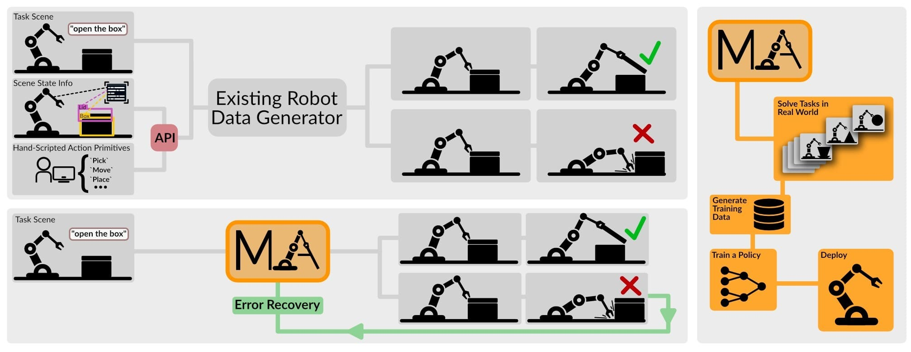
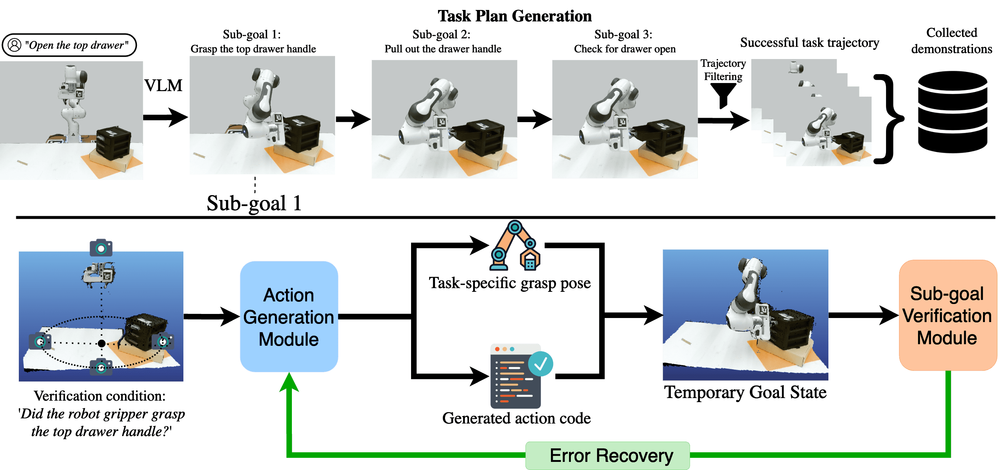
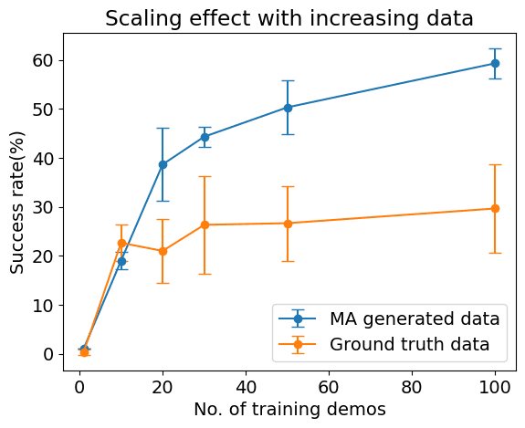

# 操控万物：借助视觉-语言模型实现现实世界机器人的自动化

发布时间：2024年06月27日

`Agent

理由：这篇论文介绍了一种名为Manipulate-Anything的方法，该方法能够在真实环境中自动化生成机器人操作数据，并能操纵任意静态物体。这种方法不仅在生成任务轨迹上超越了现有方法，而且训练出的行为克隆策略比人类演示或现有方法生成的数据更为健壮。这表明该方法能够增强机器人的自主操作能力，使其能够在多种环境中执行任务，这是Agent类研究的核心特征。因此，这篇论文更适合归类为Agent。` `机器人技术` `自动化`

> Manipulate-Anything: Automating Real-World Robots using Vision-Language Models

# 摘要

> RT-1和Open-X-Embodiment等大规模项目已助力机器人演示数据的规模增长，但提升其质量、数量和多样性仍有空间。现有的视觉-语言模型虽能自动生成演示数据，但受限于需特权状态信息的环境，依赖手工技能，且仅能与少数对象互动。我们提出的Manipulate-Anything方法，能在无特权信息和手工技能的真实环境中，自动化生成机器人操作数据，并能操纵任意静态物体。通过两种测试，Manipulate-Anything不仅在生成任务轨迹上超越了VoxPoser等方法，而且训练出的行为克隆策略比人类演示或VoxPoser生成的数据更为健壮。我们坚信，Manipulate-Anything将成为机器人数据生成和零-shot新任务解决的革新性方法。

> Large-scale endeavors like RT-1 and widespread community efforts such as Open-X-Embodiment have contributed to growing the scale of robot demonstration data. However, there is still an opportunity to improve the quality, quantity, and diversity of robot demonstration data. Although vision-language models have been shown to automatically generate demonstration data, their utility has been limited to environments with privileged state information, they require hand-designed skills, and are limited to interactions with few object instances. We propose Manipulate-Anything, a scalable automated generation method for real-world robotic manipulation. Unlike prior work, our method can operate in real-world environments without any privileged state information, hand-designed skills, and can manipulate any static object. We evaluate our method using two setups. First, Manipulate-Anything successfully generates trajectories for all 5 real-world and 12 simulation tasks, significantly outperforming existing methods like VoxPoser. Second, Manipulate-Anything's demonstrations can train more robust behavior cloning policies than training with human demonstrations, or from data generated by VoxPoser and Code-As-Policies. We believe \methodLong\ can be the scalable method for both generating data for robotics and solving novel tasks in a zero-shot setting.

[Arxiv](https://arxiv.org/abs/2406.18915)