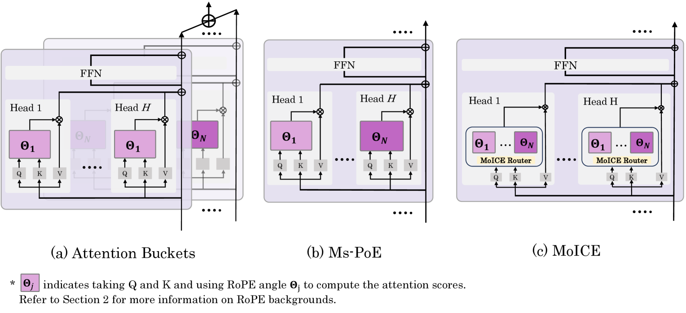
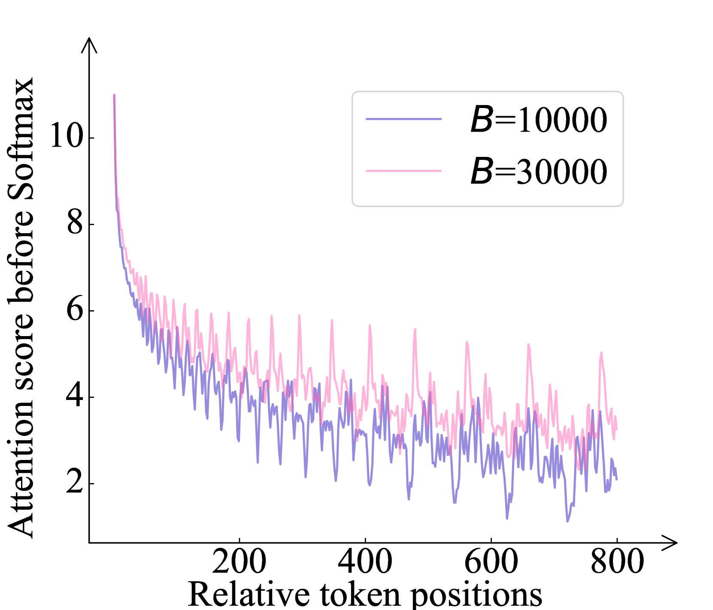
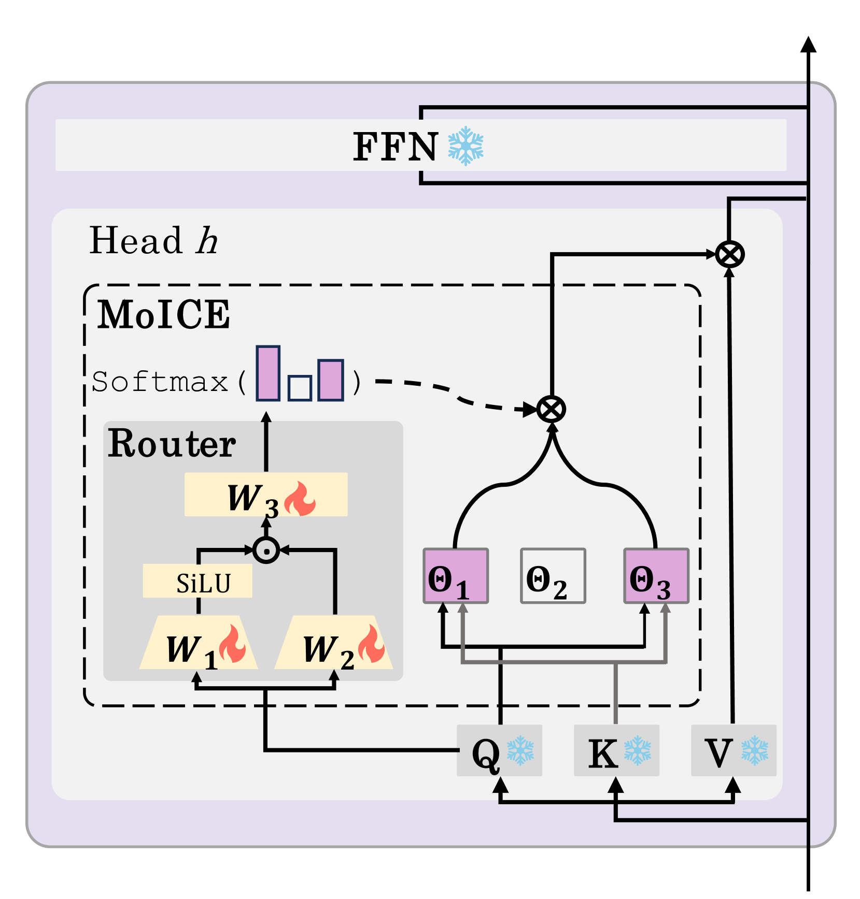
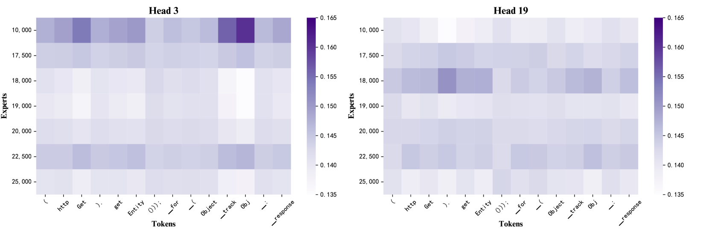
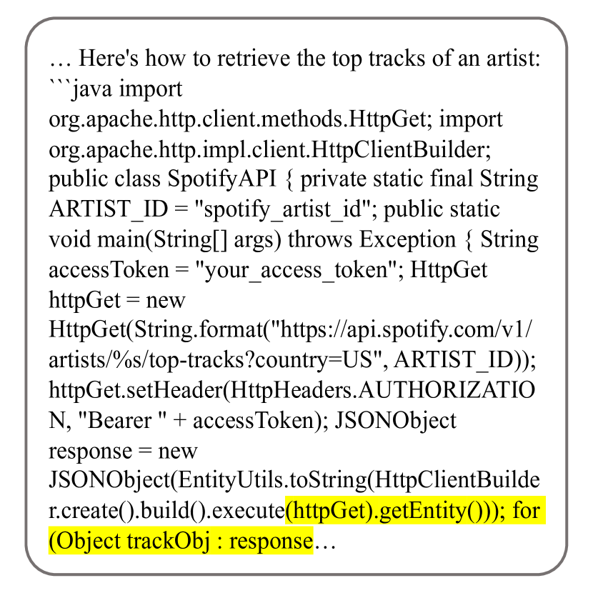

# 混合上下文专家模型提升大型语言模型对长文本的感知能力。

发布时间：2024年06月27日

`LLM理论` `人工智能`

> Mixture of In-Context Experts Enhance LLMs' Long Context Awareness

# 摘要

> 研究表明，大型语言模型对不同上下文位置的感知存在差异，这可能导致关键信息的遗漏和任务失败。尽管已有方法尝试提升模型的上下文感知能力，但如何在有效性和效率之间取得平衡仍是一大挑战。为此，我们针对采用 RoPE 位置嵌入的 LLMs，提出了一种名为“上下文专家混合”（MoICE）的创新方法。MoICE 通过集成在每个注意力头中的路由器和轻量级训练策略，实现了对特定上下文位置的精准关注，从而有效避免了关键信息的遗漏。此外，该方法在保持高效推理的同时，显著提升了模型在长上下文理解和生成任务中的表现。

> Many studies have revealed that large language models (LLMs) exhibit uneven awareness of different contextual positions.Their limited context awareness can lead to overlooking critical information and subsequent task failures. While several approaches have been proposed to enhance LLMs' context awareness, achieving both effectiveness and efficiency remains challenging.In this paper, for LLMs utilizing RoPE as position embeddings, we introduce a novel method called ``Mixture of In-Context Experts'' (MoICE) to address this challenge. MoICE comprises two key components: a router integrated into each attention head within LLMs and a lightweight router-only training optimization strategy: (1) MoICE views each RoPE angle as an `in-context' expert, demonstrated to be capable of directing the attention of a head to specific contextual positions. Consequently, each attention head flexibly processes tokens using multiple RoPE angles dynamically selected by the router to attend to the needed positions. This approach mitigates the risk of overlooking essential contextual information. (2) The router-only training strategy entails freezing LLM parameters and exclusively updating routers for only a few steps. When applied to open-source LLMs including Llama and Mistral, MoICE surpasses prior methods across multiple tasks on long context understanding and generation, all while maintaining commendable inference efficiency.

[Arxiv](https://arxiv.org/abs/2406.19598)