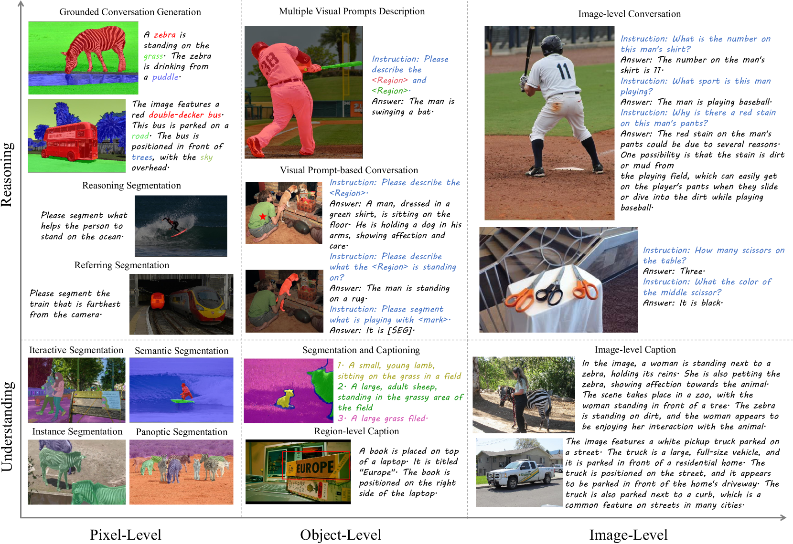
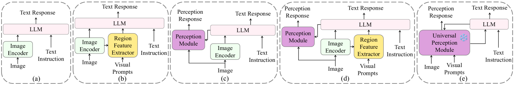
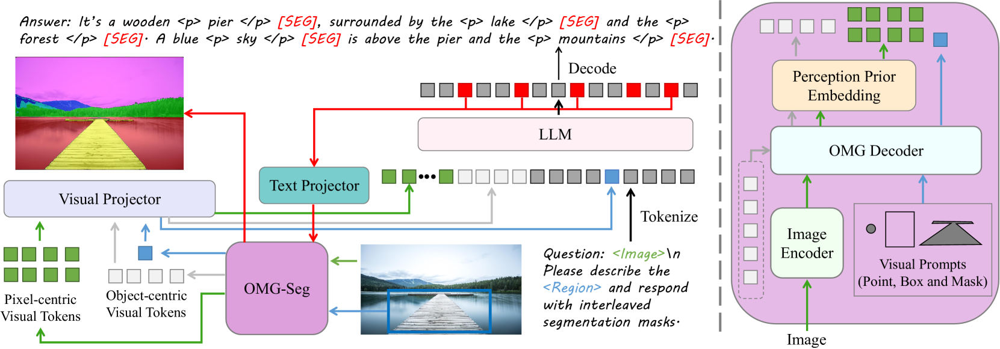
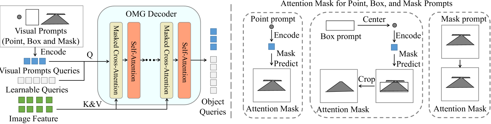
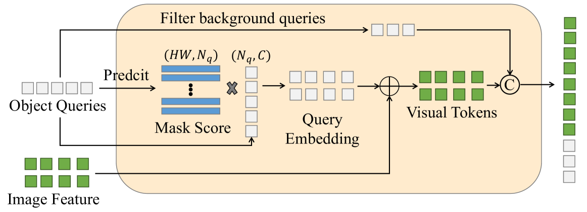
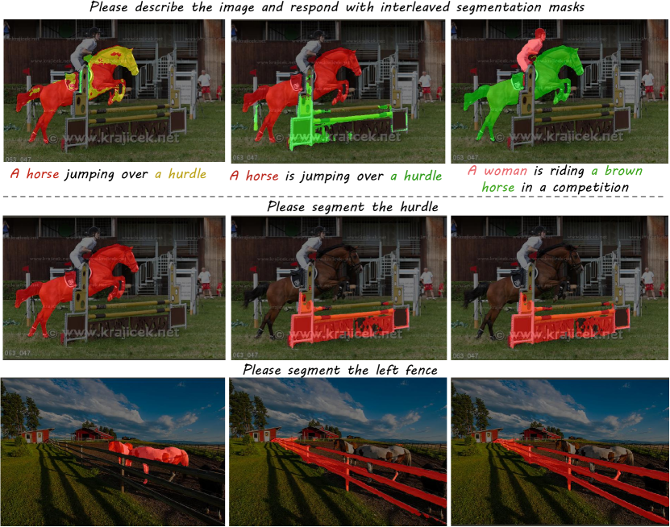
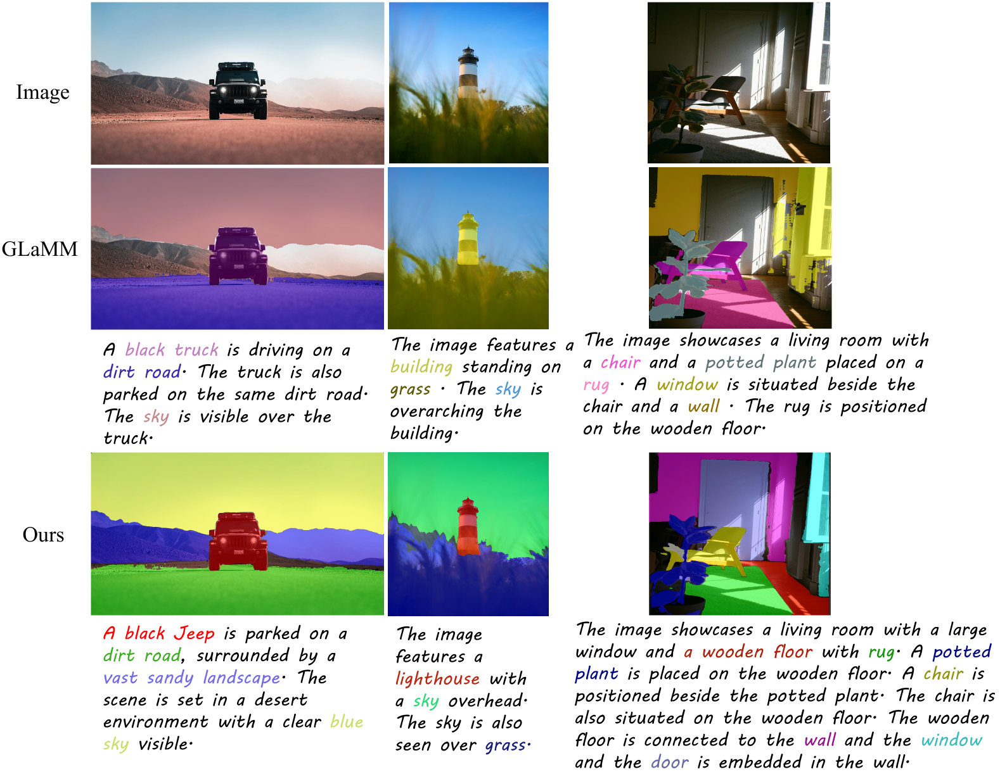
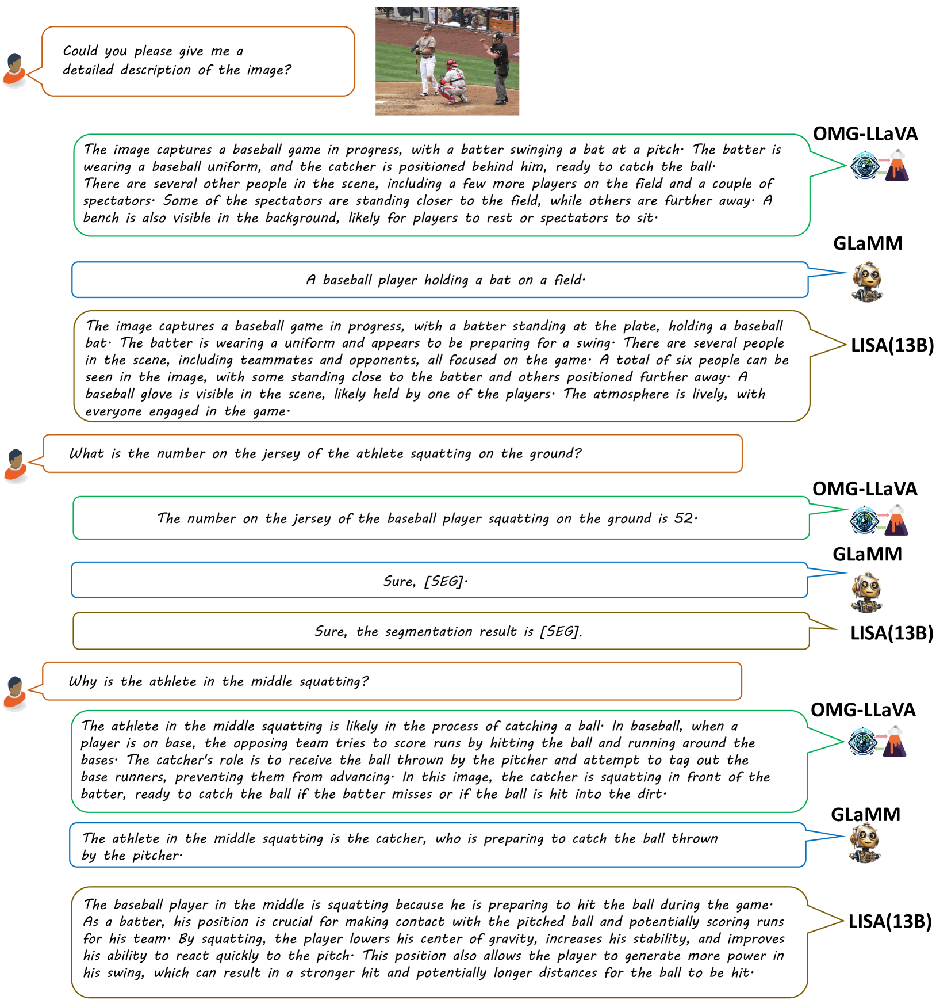
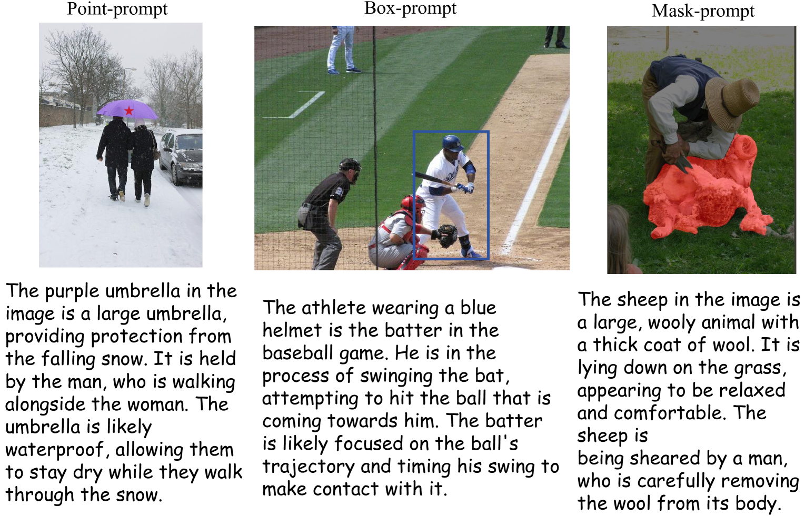

# OMG-LLaVA：融合图像、对象与像素级的推理与理解之桥

发布时间：2024年06月27日

`LLM应用

这篇论文介绍了一个名为OMG-LLaVA的框架，该框架结合了像素级视觉理解和推理能力，能够灵活地响应视觉和文本提示。它使用通用分割技术作为视觉编码器，将图像信息、感知先验和视觉提示转化为LLM的视觉令牌，而LLM则负责解析文本指令并提供文本反馈及像素级分割结果。这种方法在单一模型中实现了图像、对象及像素级别的推理与理解，并在多个测试基准上展示了优异的性能。因此，这篇论文属于LLM应用类别，因为它展示了如何将LLM应用于具体的视觉理解和推理任务中。` `计算机视觉`

> OMG-LLaVA: Bridging Image-level, Object-level, Pixel-level Reasoning and Understanding

# 摘要

> 当前的通用分割技术虽在像素级别的图像和视频理解上表现出色，却缺乏推理能力，且无法通过文本指令操控。相反，大型视觉-语言模型虽具备强大的视觉对话和推理能力，但在像素级别理解和灵活接受视觉提示方面存在局限。本文推出的OMG-LLaVA框架，巧妙融合了像素级视觉理解和推理能力，能灵活响应各类视觉和文本提示。我们采用通用分割技术作为视觉编码器，将图像信息、感知先验与视觉提示转化为LLM的视觉令牌。LLM则负责解析文本指令，并基于视觉信息提供文本反馈及像素级分割结果。通过引入感知先验嵌入，我们优化了感知先验与图像特征的融合。OMG-LLaVA在单一模型中实现了图像、对象及像素级别的推理与理解，性能在多个测试基准上与专业方法相媲美甚至超越。我们不依赖LLM连接各专家，而是通过一个编码器、一个解码器和一个LLM实现端到端训练。代码和模型已公开，以促进后续研究。

> Current universal segmentation methods demonstrate strong capabilities in pixel-level image and video understanding. However, they lack reasoning abilities and cannot be controlled via text instructions. In contrast, large vision-language multimodal models exhibit powerful vision-based conversation and reasoning capabilities but lack pixel-level understanding and have difficulty accepting visual prompts for flexible user interaction. This paper proposes OMG-LLaVA, a new and elegant framework combining powerful pixel-level vision understanding with reasoning abilities. It can accept various visual and text prompts for flexible user interaction. Specifically, we use a universal segmentation method as the visual encoder, integrating image information, perception priors, and visual prompts into visual tokens provided to the LLM. The LLM is responsible for understanding the user's text instructions and providing text responses and pixel-level segmentation results based on the visual information. We propose perception prior embedding to better integrate perception priors with image features. OMG-LLaVA achieves image-level, object-level, and pixel-level reasoning and understanding in a single model, matching or surpassing the performance of specialized methods on multiple benchmarks. Rather than using LLM to connect each specialist, our work aims at end-to-end training on one encoder, one decoder, and one LLM. The code and model have been released for further research.

[Arxiv](https://arxiv.org/abs/2406.19389)