# PathAlign：专为组织病理学全切片图像设计的视觉-语言模型

发布时间：2024年06月27日

`LLM应用` `计算机视觉`

> PathAlign: A vision-language model for whole slide images in histopathology

# 摘要

> 组织病理学图像的微观解读对诊断和治疗至关重要。尽管视觉-语言模型的发展为图像分析带来新机遇，但全切片图像（WSIs）的巨大尺寸也带来了挑战。病理报告虽强调小区域的关键发现，但汇总多切片解读时，创建图像-文本对变得困难。因此，病理报告在计算病理学中仍未被充分利用。我们基于BLIP-2框架，利用WSIs与病理报告文本配对，开发了视觉-语言模型，实现了图像-文本嵌入空间的共享应用，如检索感兴趣病例，以及与LLM集成，实现基于WSI的文本生成等。我们使用的数据集包含超过350,000个WSIs和诊断文本对，涵盖广泛。病理学家评估显示，模型生成的WSIs文本准确无误，平均78%的WSIs无临床显著错误或遗漏。这项工作展示了语言对齐的WSI嵌入的巨大潜力。

> Microscopic interpretation of histopathology images underlies many important diagnostic and treatment decisions. While advances in vision-language modeling raise new opportunities for analysis of such images, the gigapixel-scale size of whole slide images (WSIs) introduces unique challenges. Additionally, pathology reports simultaneously highlight key findings from small regions while also aggregating interpretation across multiple slides, often making it difficult to create robust image-text pairs. As such, pathology reports remain a largely untapped source of supervision in computational pathology, with most efforts relying on region-of-interest annotations or self-supervision at the patch-level. In this work, we develop a vision-language model based on the BLIP-2 framework using WSIs paired with curated text from pathology reports. This enables applications utilizing a shared image-text embedding space, such as text or image retrieval for finding cases of interest, as well as integration of the WSI encoder with a frozen large language model (LLM) for WSI-based generative text capabilities such as report generation or AI-in-the-loop interactions. We utilize a de-identified dataset of over 350,000 WSIs and diagnostic text pairs, spanning a wide range of diagnoses, procedure types, and tissue types. We present pathologist evaluation of text generation and text retrieval using WSI embeddings, as well as results for WSI classification and workflow prioritization (slide-level triaging). Model-generated text for WSIs was rated by pathologists as accurate, without clinically significant error or omission, for 78% of WSIs on average. This work demonstrates exciting potential capabilities for language-aligned WSI embeddings.

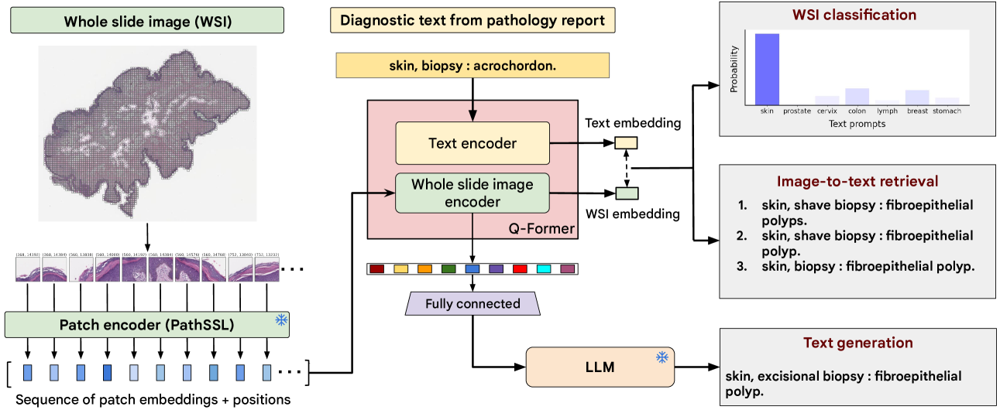

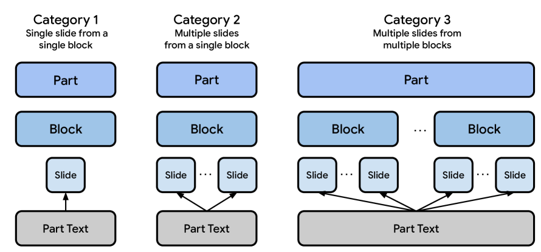

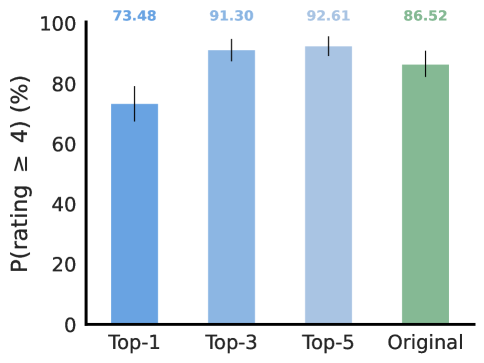

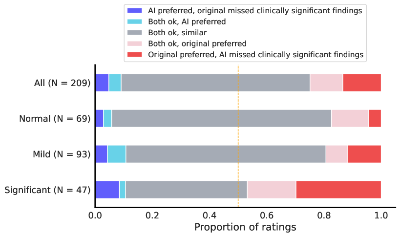

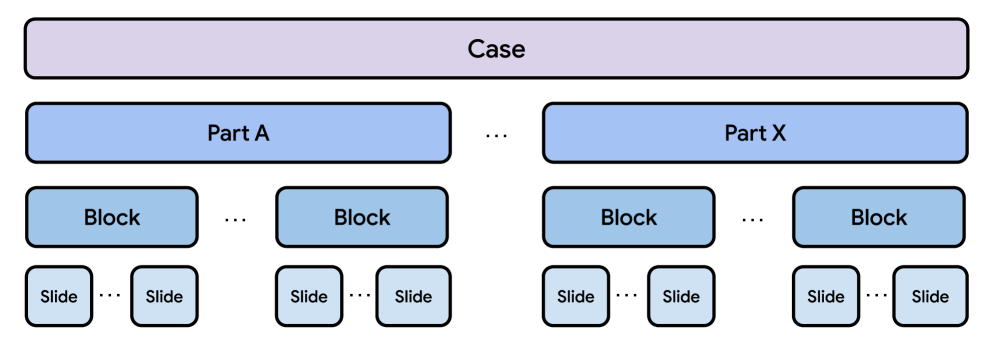

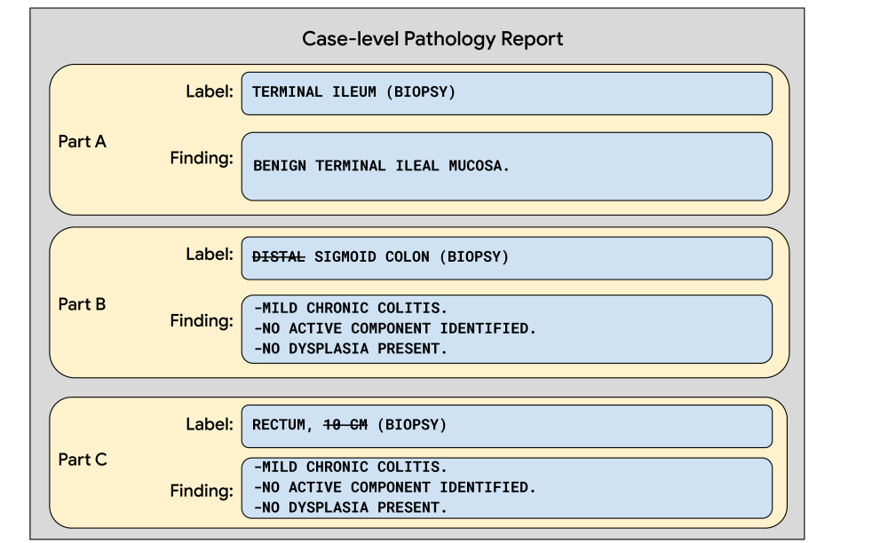

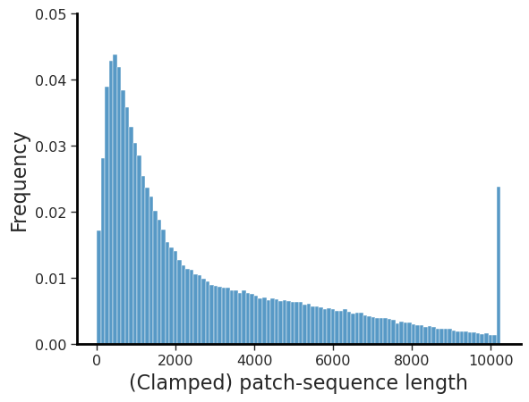

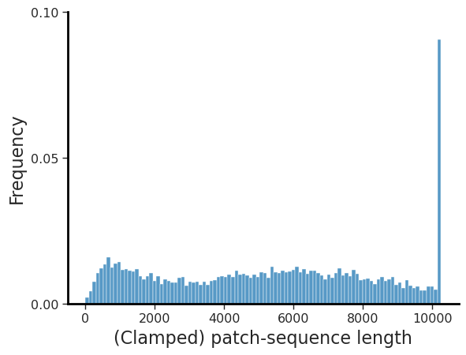

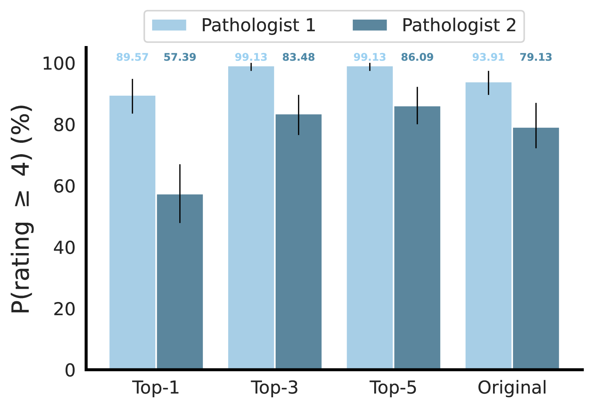

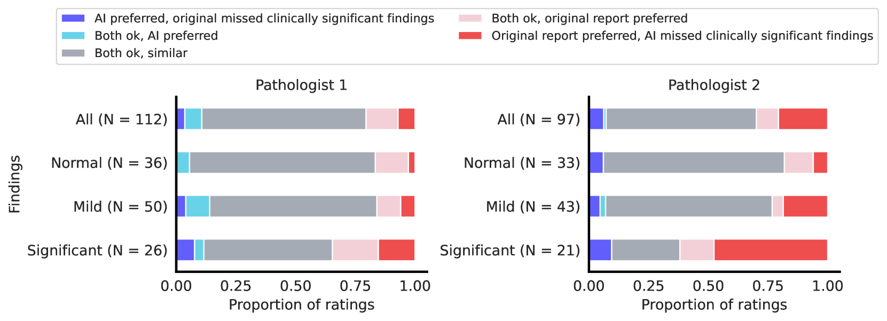

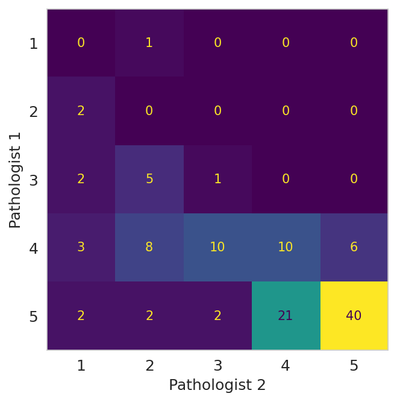

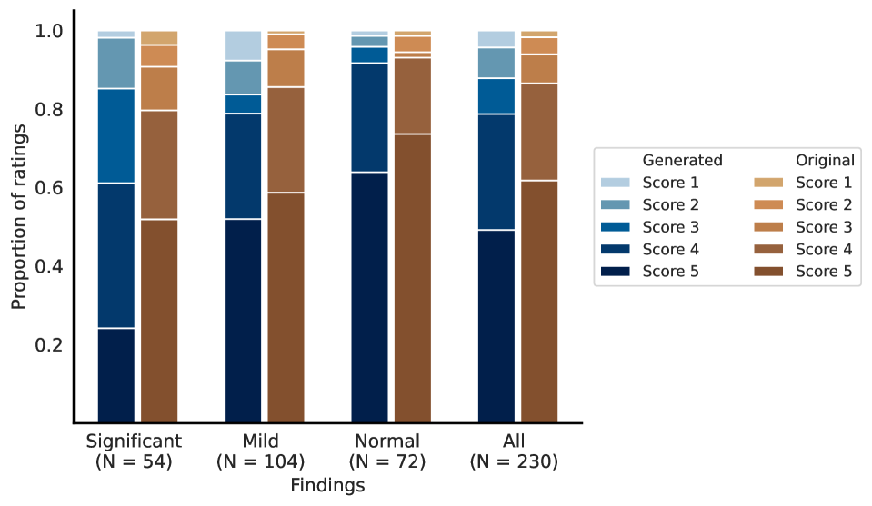

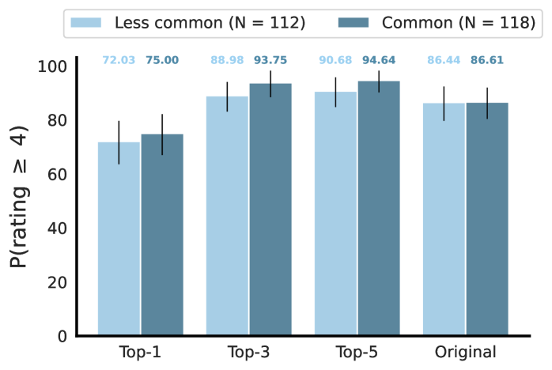

[Arxiv](https://arxiv.org/abs/2406.19578)