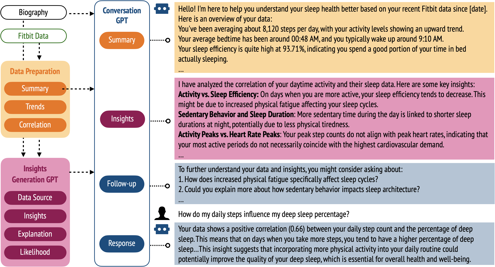
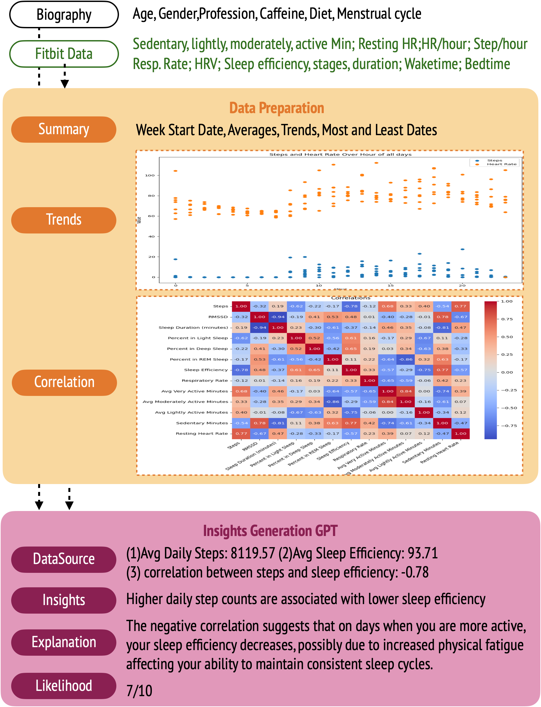
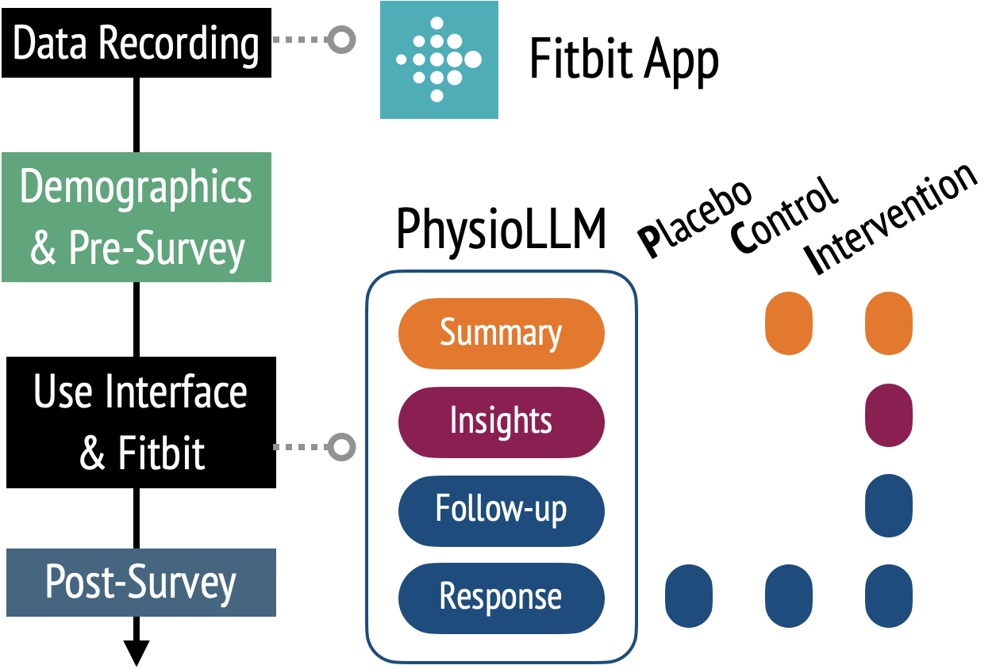
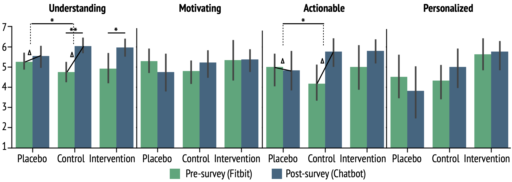

# PhysioLLM：结合可穿戴设备与大型语言模型，助力个性化健康洞察

发布时间：2024年06月27日

`LLM应用

理由：这篇论文介绍了一个名为PhysioLLM的系统，该系统利用大型语言模型（LLMs）来整合和分析可穿戴设备的生理数据，并提供个性化的健康洞察。这个系统展示了LLMs在实际应用中的能力，特别是在健康领域的应用，通过自然语言处理技术帮助用户理解和改善他们的健康状况。因此，这篇论文属于LLM应用类别。` `健康管理` `可穿戴设备`

> PhysioLLM: Supporting Personalized Health Insights with Wearables and Large Language Models

# 摘要

> 我们推出了PhysioLLM，这是一个交互式系统，它利用LLMs整合可穿戴设备的生理数据与上下文信息，为用户提供个性化的健康洞察。与市面上的健康应用不同，PhysioLLM具备全面的统计分析功能，能揭示用户数据中的关联与趋势，使用户能以自然语言提问并获得定制化的健康建议，帮助他们设定并达成个人健康目标。我们以改善睡眠质量为例，展示了PhysioLLM如何通过生理数据量化睡眠并提升整体福祉。在一项包含24名Fitbit用户的研究中，PhysioLLM在深化个性化健康理解和支持实现个人健康目标方面，显著优于Fitbit应用和通用LLM聊天机器人。

> We present PhysioLLM, an interactive system that leverages large language models (LLMs) to provide personalized health understanding and exploration by integrating physiological data from wearables with contextual information. Unlike commercial health apps for wearables, our system offers a comprehensive statistical analysis component that discovers correlations and trends in user data, allowing users to ask questions in natural language and receive generated personalized insights, and guides them to develop actionable goals. As a case study, we focus on improving sleep quality, given its measurability through physiological data and its importance to general well-being. Through a user study with 24 Fitbit watch users, we demonstrate that PhysioLLM outperforms both the Fitbit App alone and a generic LLM chatbot in facilitating a deeper, personalized understanding of health data and supporting actionable steps toward personal health goals.

[Arxiv](https://arxiv.org/abs/2406.19283)