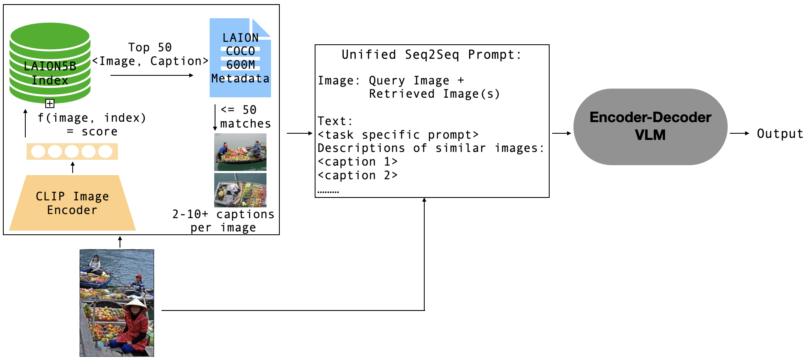
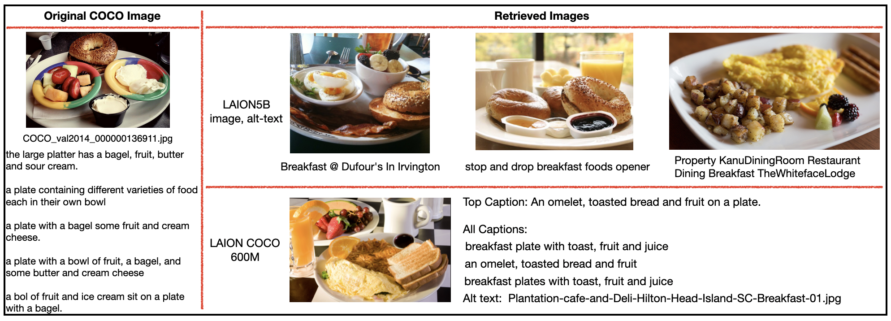
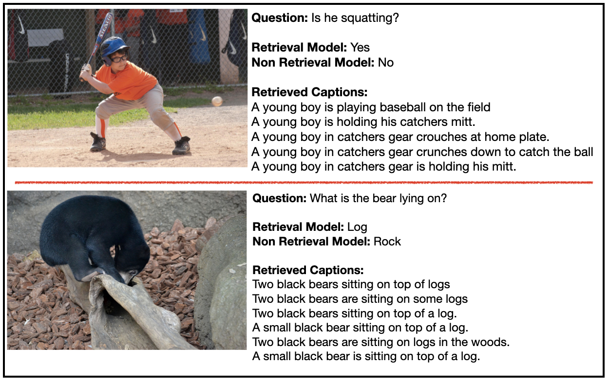
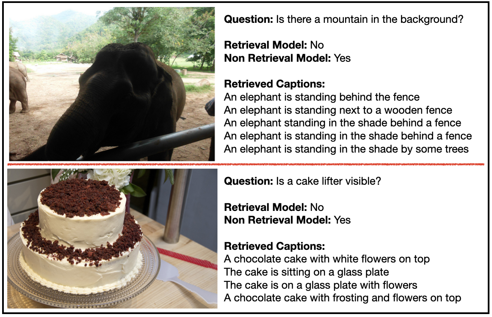
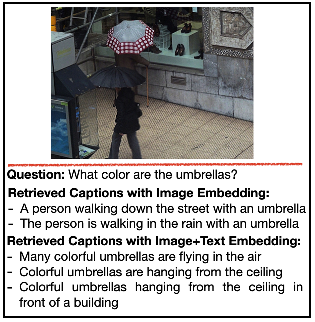

# RAVEN：多任务增强的视觉-语言学习，通过检索技术提升学习效果。

发布时间：2024年06月27日

`RAG

理由：这篇论文主要探讨了检索增强生成（RAG）在视觉-语言模型（VLMs）中的应用，特别是通过介绍RAVEN框架来强化基础VLMs，并通过任务特异性高效微调来整合检索增强样本。论文的重点在于展示RAG方法在VLMs中的有效性，以及其在多任务中的性能提升，这与RAG技术的应用和发展紧密相关。因此，将其归类为RAG是合适的。` `视觉-语言模型` `多模态学习`

> RAVEN: Multitask Retrieval Augmented Vision-Language Learning

# 摘要

> 将大型语言模型扩展至包含全球知识于参数中已证明不可持续，且加剧了资源限制。检索增强生成（RAG）虽提供了解决方案，但其在视觉-语言模型（VLMs）中的应用尚待深入研究。现有方法多针对单一任务模型，且受限于资源密集预训练、额外参数需求、模态优先级未明及对非检索基准优势不明显。本文推出的RAVEN框架，通过任务特异性高效微调，强化了基础VLMs。无需额外检索参数，RAVEN成功整合检索增强样本，使模型在多任务中展现出高效的检索能力。在图像标注与VQA任务上的广泛测试表明，与非检索基准相比，性能显著提升，分别在MSCOCO和NoCaps上提升了+1和+4 CIDEr，特定VQA问题类型准确率提升近+3%。这证实了RAG方法在VLMs中的有效性，为更高效、可及的多模态学习开辟了新路径。

> The scaling of large language models to encode all the world's knowledge in model parameters is unsustainable and has exacerbated resource barriers. Retrieval-Augmented Generation (RAG) presents a potential solution, yet its application to vision-language models (VLMs) is under explored. Existing methods focus on models designed for single tasks. Furthermore, they're limited by the need for resource intensive pre training, additional parameter requirements, unaddressed modality prioritization and lack of clear benefit over non-retrieval baselines. This paper introduces RAVEN, a multitask retrieval augmented VLM framework that enhances base VLMs through efficient, task specific fine-tuning. By integrating retrieval augmented samples without the need for additional retrieval-specific parameters, we show that the model acquires retrieval properties that are effective across multiple tasks. Our results and extensive ablations across retrieved modalities for the image captioning and VQA tasks indicate significant performance improvements compared to non retrieved baselines +1 CIDEr on MSCOCO, +4 CIDEr on NoCaps and nearly a +3\% accuracy on specific VQA question types. This underscores the efficacy of applying RAG approaches to VLMs, marking a stride toward more efficient and accessible multimodal learning.

[Arxiv](https://arxiv.org/abs/2406.19150)