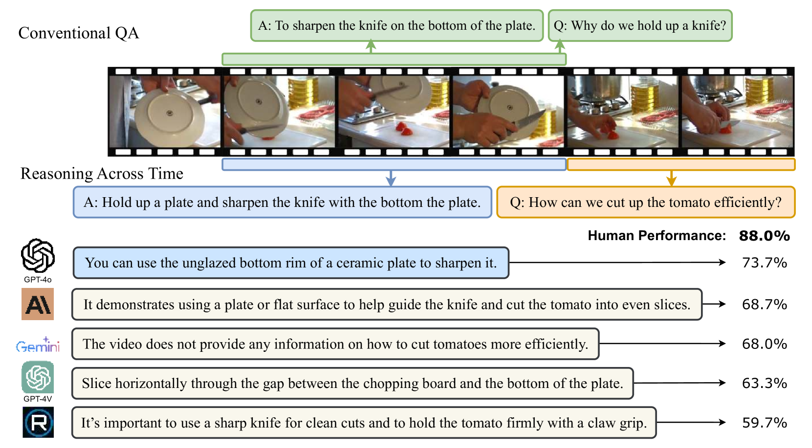
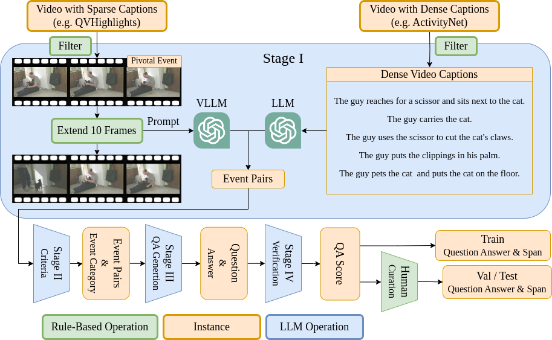
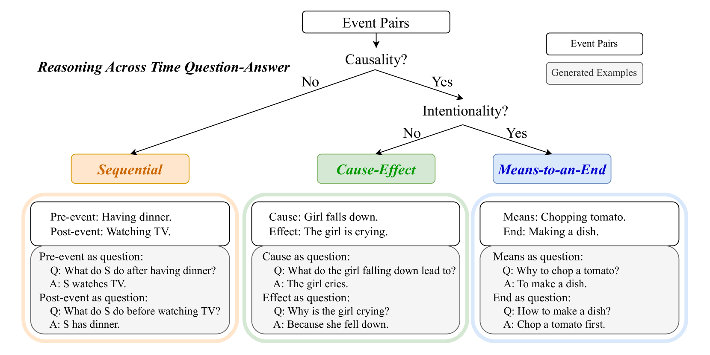
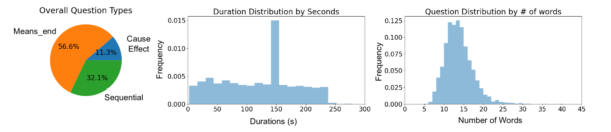
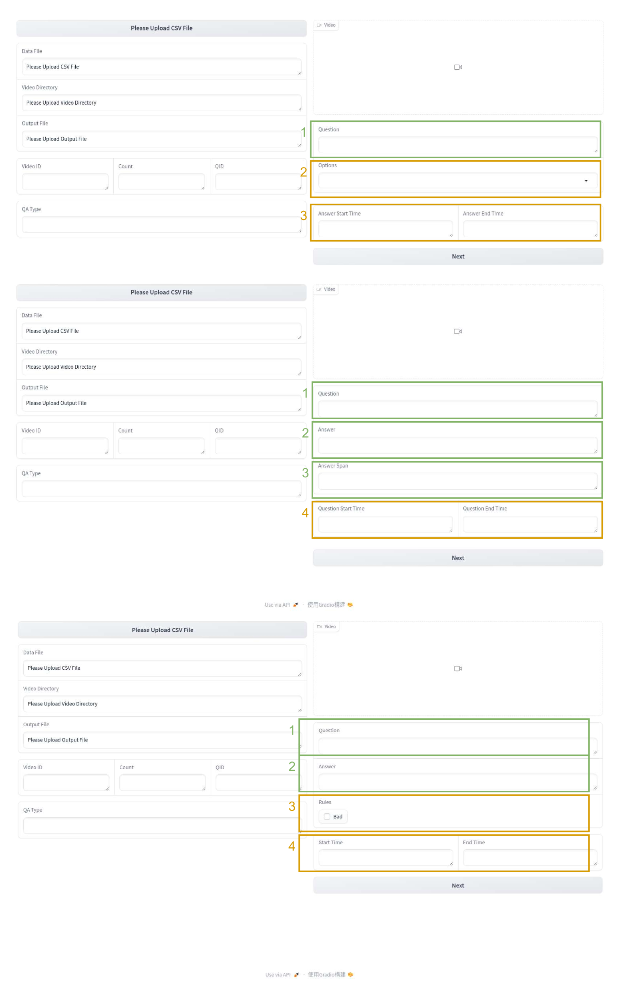
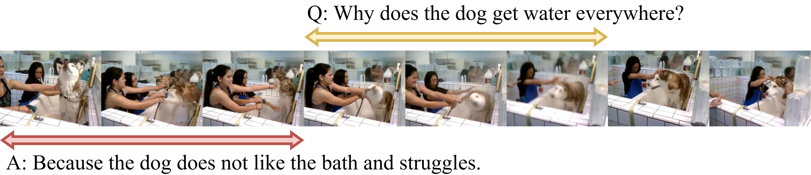
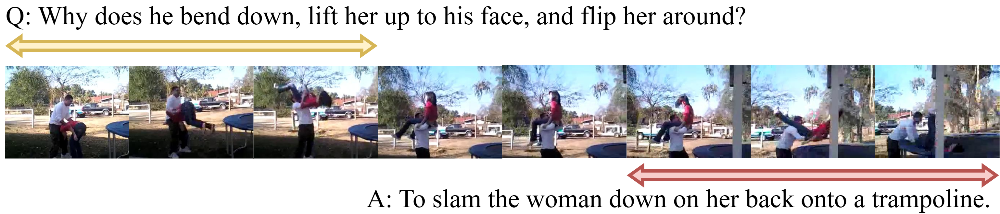

# ReXTime：视频跨时间推理的基准套件

发布时间：2024年06月27日

`Agent

这篇论文主要介绍了ReXTime基准，这是一个专门设计来测试AI模型在视频事件中进行时间推理能力的基准。它特别关注跨时间推理，即模拟人类在问题和答案出现在不同视频片段时的理解方式。这种高级推理涉及对视频片段间因果关系的深刻理解，对多模态大型语言模型来说是一个挑战。论文中提到，他们开发了一套自动化系统来生成时间推理的问题与答案，并建立了一个包含多个样本的训练数据集。这个工作更偏向于Agent的范畴，因为它涉及创建和评估能够进行复杂时间推理的AI模型，这些模型可以被视为智能Agent，能够在特定任务（如视频理解）中执行复杂的推理和决策。` `视频分析` `人工智能`

> ReXTime: A Benchmark Suite for Reasoning-Across-Time in Videos

# 摘要

> 我们推出了ReXTime基准，专门设计来考验AI模型在视频事件中进行时间推理的能力。ReXTime特别关注跨时间推理，即模拟人类在问题和答案出现在不同视频片段时的理解方式。这种高级推理，涉及对视频片段间因果关系的深刻理解，对最尖端的多模态大型语言模型也是一大挑战。为此，我们开发了一套自动化系统，用于生成时间推理的问题与答案，大幅减少了对人工标注的依赖。我们的基准包含921个精挑细选的验证样本和2,143个测试样本，均由人工精心校对以确保其准确性和相关性。评估结果表明，尽管前沿的大型语言模型在性能上超越了学术模型，但与人类相比，它们在准确性上仍有14.3%的差距。此外，我们的系统还生成了一个包含9,695个样本的训练数据集，无需人工介入，实证研究显示，通过微调可以显著提升跨时间推理的能力。

> We introduce ReXTime, a benchmark designed to rigorously test AI models' ability to perform temporal reasoning within video events. Specifically, ReXTime focuses on reasoning across time, i.e. human-like understanding when the question and its corresponding answer occur in different video segments. This form of reasoning, requiring advanced understanding of cause-and-effect relationships across video segments, poses significant challenges to even the frontier multimodal large language models. To facilitate this evaluation, we develop an automated pipeline for generating temporal reasoning question-answer pairs, significantly reducing the need for labor-intensive manual annotations. Our benchmark includes 921 carefully vetted validation samples and 2,143 test samples, each manually curated for accuracy and relevance. Evaluation results show that while frontier large language models outperform academic models, they still lag behind human performance by a significant 14.3% accuracy gap. Additionally, our pipeline creates a training dataset of 9,695 machine generated samples without manual effort, which empirical studies suggest can enhance the across-time reasoning via fine-tuning.

[Arxiv](https://arxiv.org/abs/2406.19392)