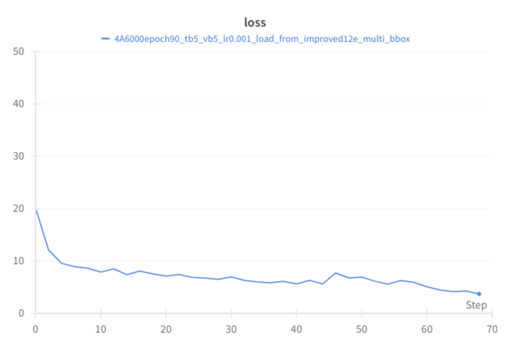

# 任意位置阅读助手：采用树形透镜定位技术的布局感知图形用户界面屏幕阅读方案

发布时间：2024年06月27日

`Agent

理由：这篇论文介绍了一种名为“透镜树”（ToL）的代理，专门设计用于屏幕点读任务（SPR）。该代理通过创新的ToL接地机制，能够处理输入的点坐标和GUI截图，构建出层次布局树，并解读指定区域的内容以及元素间的布局与空间关系。这种专门针对特定任务（SPR）的代理设计和实现，以及其在实际GUI理解任务中的应用，符合Agent类别的定义。` `人机交互` `辅助技术`

> Read Anywhere Pointed: Layout-aware GUI Screen Reading with Tree-of-Lens Grounding

# 摘要

> 图形用户界面（GUIs）是我们与数字设备互动的关键。近期，针对各种GUI理解任务的模型构建工作日益增多，但一个重要的任务——基于用户指定点的屏幕阅读（我们称之为屏幕点读任务，SPR）却被忽视。目前，这一任务主要依赖于刚性的辅助工具，亟需借助多模态大型语言模型（MLLMs）的新技术。本文提出了一种名为“透镜树”（ToL）的代理，它采用创新的ToL接地机制，专门针对SPR任务。通过输入点坐标和GUI截图，ToL代理构建出层次布局树，不仅能解读指定区域的内容，还能清晰展示元素间的布局与空间关系。这种布局信息的精确解读，使ToL代理在众多屏幕阅读工具中独树一帜。我们在新设的SPR基准上，对比了ToL代理与其他模型，涵盖了移动、网页及操作系统中的GUIs。此外，ToL代理在移动GUI导航任务中的应用，也证明了其在识别执行路径中错误动作方面的有效性。更多代码和数据，请访问：screen-point-and-read.github.io。

> Graphical User Interfaces (GUIs) are central to our interaction with digital devices. Recently, growing efforts have been made to build models for various GUI understanding tasks. However, these efforts largely overlook an important GUI-referring task: screen reading based on user-indicated points, which we name the Screen Point-and-Read (SPR) task. This task is predominantly handled by rigid accessible screen reading tools, in great need of new models driven by advancements in Multimodal Large Language Models (MLLMs). In this paper, we propose a Tree-of-Lens (ToL) agent, utilizing a novel ToL grounding mechanism, to address the SPR task. Based on the input point coordinate and the corresponding GUI screenshot, our ToL agent constructs a Hierarchical Layout Tree. Based on the tree, our ToL agent not only comprehends the content of the indicated area but also articulates the layout and spatial relationships between elements. Such layout information is crucial for accurately interpreting information on the screen, distinguishing our ToL agent from other screen reading tools. We also thoroughly evaluate the ToL agent against other baselines on a newly proposed SPR benchmark, which includes GUIs from mobile, web, and operating systems. Last but not least, we test the ToL agent on mobile GUI navigation tasks, demonstrating its utility in identifying incorrect actions along the path of agent execution trajectories. Code and data: screen-point-and-read.github.io

[Arxiv](https://arxiv.org/abs/2406.19263)