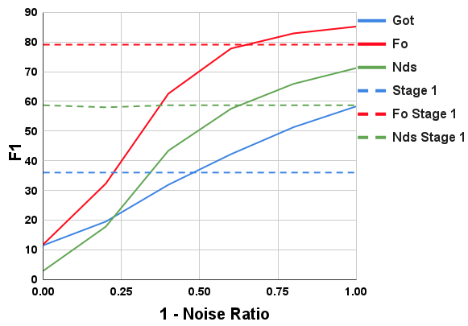
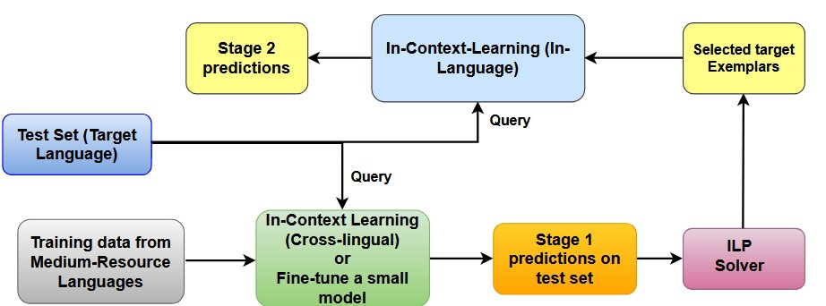
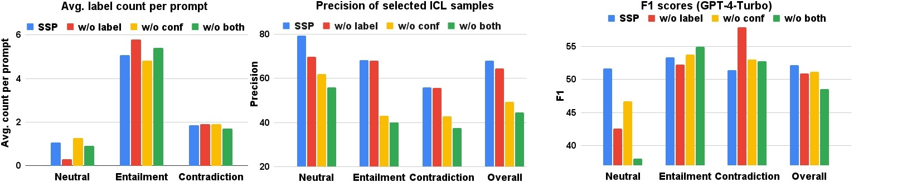
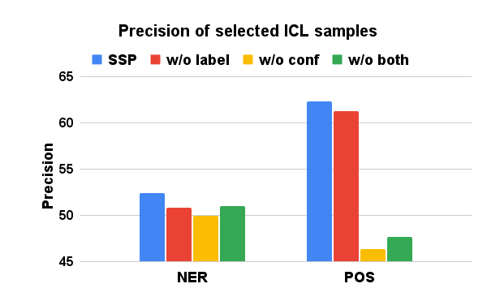
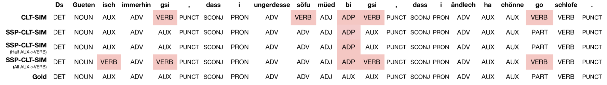
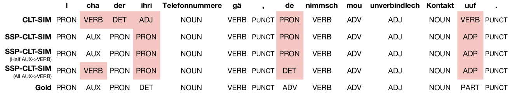
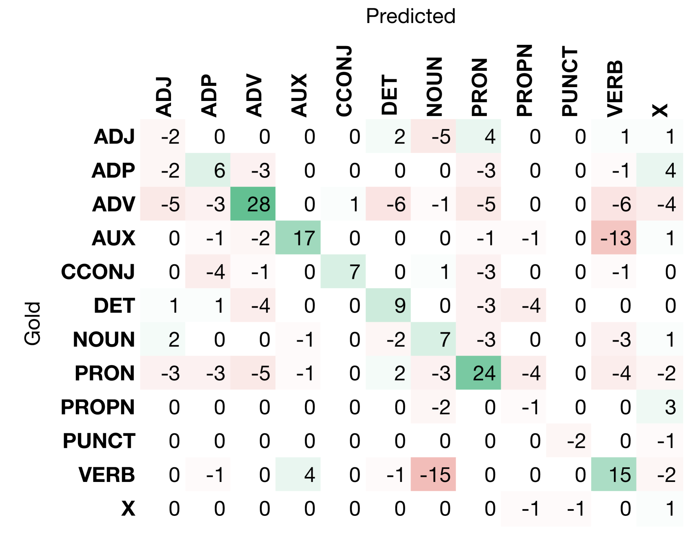

# SSP：借助大型语言模型，自监督提示助力低资源语言的跨语言迁移

发布时间：2024年06月27日

`LLM应用

理由：这篇论文主要探讨了超大型语言模型（LLMs）在低资源语言（LRLs）NLP任务中的应用，特别是在零标记跨语言转移（0-CLT）场景下的应用。论文提出了一种新的情境学习策略——自监督提示（SSP），并展示了其在特定场景下的有效性。这表明论文关注的是LLMs在实际应用中的效能和改进，因此属于LLM应用分类。` `跨语言学习`

> SSP: Self-Supervised Prompting for Cross-Lingual Transfer to Low-Resource Languages using Large Language Models

# 摘要

> 近期，超大型语言模型（LLMs）在英语NLP任务上通过情境学习（ICL）表现出色，但在其他语言中的潜力尚未充分挖掘。我们探索了LLMs在低资源语言（LRLs）NLP任务中的效能，特别是在零标记跨语言转移（0-CLT）场景下，即目标语言缺乏标记训练数据，但可利用相关中资源语言（MRLs）的训练数据及目标语言的未标记测试数据。为此，我们提出了自监督提示（SSP），一种专为0-CLT定制的ICL新策略。SSP的核心在于，当情境示例源自目标语言（即便标签稍有噪声）时，LLMs能提供更精确的标签。由于0-CLT中目标语言无训练数据，SSP分两步实施：首先，利用源MRL数据对目标语言测试数据进行噪声标记；随后，这些噪声数据点作为ICL的示例，以提升标记准确性。我们的SSP实现还创新性地采用了基于整数线性规划（ILP）的示例选择，兼顾相似度、预测信心与标签覆盖。实验涵盖三个任务、十一种LRLs（分属三个地区），结果显示SSP在0-CLT场景下显著超越了现有的SOTA微调和提示基线。

> Recently, very large language models (LLMs) have shown exceptional performance on several English NLP tasks with just in-context learning (ICL), but their utility in other languages is still underexplored. We investigate their effectiveness for NLP tasks in low-resource languages (LRLs), especially in the setting of zero-labelled cross-lingual transfer (0-CLT), where no labelled training data for the target language is available -- however training data from one or more related medium-resource languages (MRLs) is utilized, alongside the available unlabeled test data for a target language. We introduce Self-Supervised Prompting (SSP), a novel ICL approach tailored for the 0-CLT setting.
  SSP is based on the key observation that LLMs output more accurate labels if in-context exemplars are from the target language (even if their labels are slightly noisy). To operationalize this, since target language training data is not available in 0-CLT, SSP operates in two stages. In Stage I, using source MRL training data, target language's test data is noisily labeled. In Stage II, these noisy test data points are used as exemplars in ICL for further improved labelling. Additionally, our implementation of SSP uses a novel Integer Linear Programming (ILP)-based exemplar selection that balances similarity, prediction confidence (when available) and label coverage. Experiments on three tasks and eleven LRLs (from three regions) demonstrate that SSP strongly outperforms existing SOTA fine-tuned and prompting-based baselines in 0-CLT setup.

[Arxiv](https://arxiv.org/abs/2406.18880)