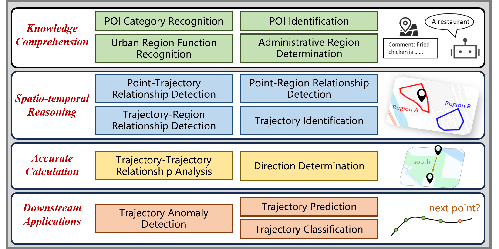
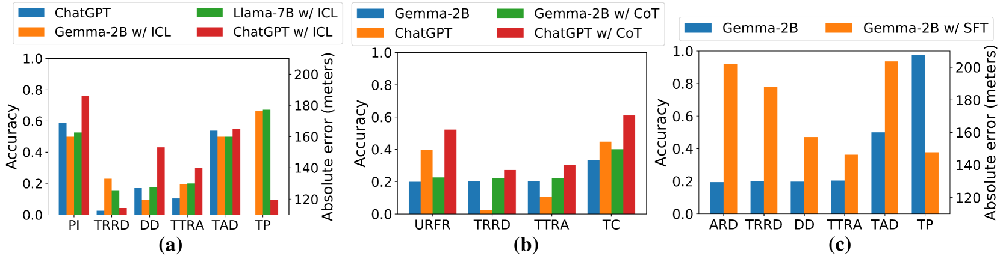

# STBench：探究大型语言模型在时空分析领域的实力

发布时间：2024年06月27日

`LLM应用

这篇论文主要探讨了大型语言模型（LLMs）在处理时空数据方面的能力，并通过创建STBench基准数据集来评估这些模型在知识理解、时空推理、精确计算及应用实践等方面的表现。这种研究属于对LLMs在特定应用场景下的性能评估和优化，因此归类为LLM应用。` `时空数据挖掘` `基准测试`

> STBench: Assessing the Ability of Large Language Models in Spatio-Temporal Analysis

# 摘要

> 大型语言模型（LLMs）的迅猛发展为时空数据挖掘方法的革新带来了希望。然而，目前对LLMs时空理解能力的评估工作存在局限，往往忽视了最新模型的纳入或仅侧重于记忆知识的评估。为此，本文深入分析了LLMs在处理时空数据方面的四大能力：知识理解、时空推理、精确计算及应用实践，并针对每一维度设计了问答任务，创建了包含13项任务、60,000多对问答的STBench基准数据集。我们评估了包括GPT-4o、Gemma和Mistral在内的13种LLMs，发现它们在知识理解和时空推理上表现卓越，而通过上下文学习、思维链提示和微调，其他任务的性能亦有望提升。STBench的代码和数据集已公开于https://github.com/LwbXc/STBench。

> The rapid evolution of large language models (LLMs) holds promise for reforming the methodology of spatio-temporal data mining. However, current works for evaluating the spatio-temporal understanding capability of LLMs are somewhat limited and biased. These works either fail to incorporate the latest language models or only focus on assessing the memorized spatio-temporal knowledge. To address this gap, this paper dissects LLMs' capability of spatio-temporal data into four distinct dimensions: knowledge comprehension, spatio-temporal reasoning, accurate computation, and downstream applications. We curate several natural language question-answer tasks for each category and build the benchmark dataset, namely STBench, containing 13 distinct tasks and over 60,000 QA pairs. Moreover, we have assessed the capabilities of 13 LLMs, such as GPT-4o, Gemma and Mistral. Experimental results reveal that existing LLMs show remarkable performance on knowledge comprehension and spatio-temporal reasoning tasks, with potential for further enhancement on other tasks through in-context learning, chain-of-though prompting, and fine-tuning. The code and datasets of STBench are released on https://github.com/LwbXc/STBench.

[Arxiv](https://arxiv.org/abs/2406.19065)