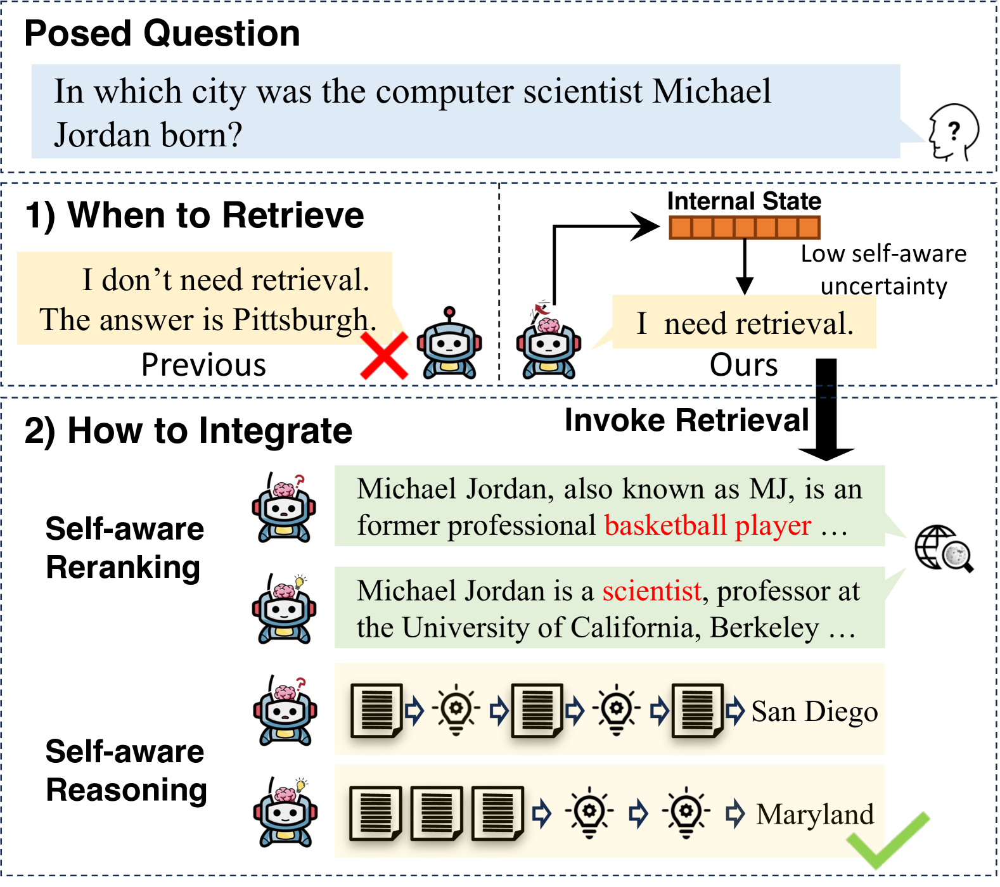
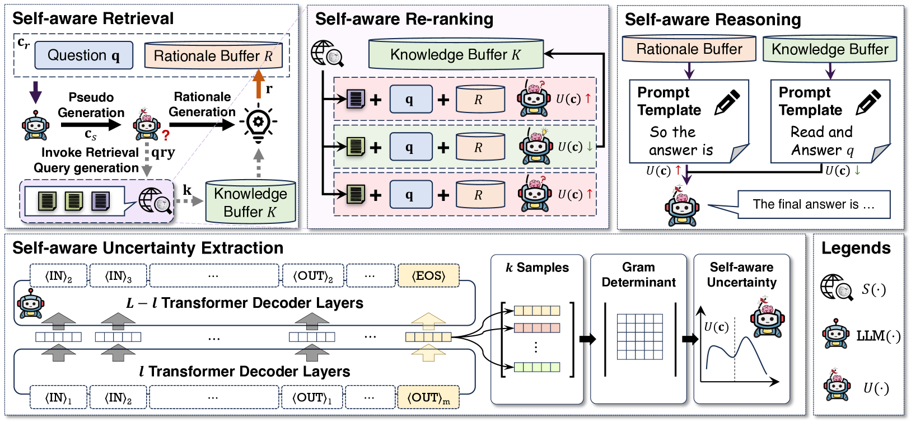
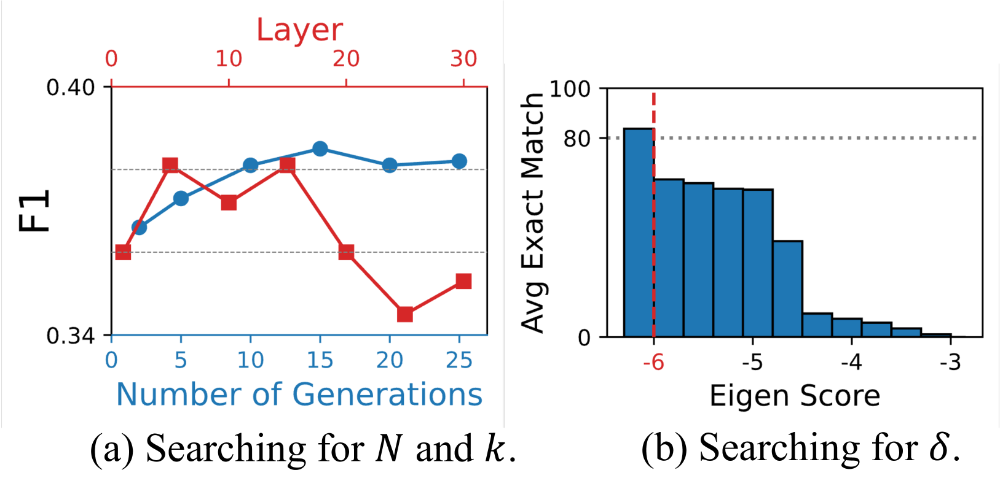

# SeaKR：自适应知识检索增强生成，实现智能知识检索与应用

发布时间：2024年06月27日

`RAG

理由：这篇论文介绍了一种名为“自感知知识检索（SeaKR）”的新型自适应RAG模型，该模型能够从大型语言模型内部捕捉其自我感知的不确定性，并据此进行知识检索和信息优先级排序。这种技术专注于改进RAG模型的性能，特别是在处理不确定性时的表现。因此，它属于RAG分类，因为它主要关注的是RAG模型的改进和应用。` `问答系统`

> SeaKR: Self-aware Knowledge Retrieval for Adaptive Retrieval Augmented Generation

# 摘要

> 本文创新性地提出了自感知知识检索（SeaKR），一种能够从大型语言模型内部捕捉其自我感知不确定性的自适应RAG模型。当模型在生成任务中表现出不确定性时，SeaKR会启动知识检索，并根据模型的不确定性程度对检索到的信息进行优先级排序，确保最有助于降低不确定性的信息被优先使用。此外，SeaKR还能根据任务的复杂性，智能选择合适的推理策略。实验证明，无论是面对复杂还是简单的问答任务，SeaKR均超越了现有的自适应RAG技术。我们已将相关代码公开于https://github.com/THU-KEG/SeaKR，供大家参考。

> This paper introduces Self-aware Knowledge Retrieval (SeaKR), a novel adaptive RAG model that extracts self-aware uncertainty of LLMs from their internal states. SeaKR activates retrieval when the LLMs present high self-aware uncertainty for generation. To effectively integrate retrieved knowledge snippets, SeaKR re-ranks them based on LLM's self-aware uncertainty to preserve the snippet that reduces their uncertainty to the utmost. To facilitate solving complex tasks that require multiple retrievals, SeaKR utilizes their self-aware uncertainty to choose among different reasoning strategies. Our experiments on both complex and simple Question Answering datasets show that SeaKR outperforms existing adaptive RAG methods. We release our code at https://github.com/THU-KEG/SeaKR.

[Arxiv](https://arxiv.org/abs/2406.19215)